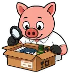
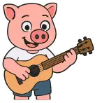
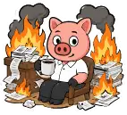
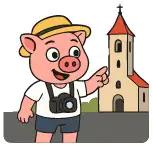
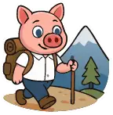

# Повторный аудит OG-стикеров

> Review-only. Повторный полный проход после merge PR #346. Frontmatter статей в этом PR не меняется.

- Snapshot `main`: `1a78e998975498f4b98ce93ce03055b48f82d7a1`
- Семантика стикеров: `Antiokh/rslive.ru`, `astro/config/sticker-semantics.mjs` (актуальный `main` на момент ревью).
- Всего маршрутов: **293**
- MD/MDX-страниц: **291**
- Engine-owned маршрутов без MD/MDX: **2**
- Страниц без явного `ogSticker`: **1** — `/lifestyle/culture/crafts/`
- Согласованных предложений после ревью: **14**

## Согласованные предложения после ревью

| Текущий стикер | Страница и объяснение | Согласованный стикер |
|---|---|---|
|  <code>giant-book</code> | `/edu/`  **Образование**  Корень раздела — образование в широком смысле. `book-reader` канонически допускает общее образование, тогда как `giant-book` остаётся слишком общим. |  <code>book-reader</code> |
|  <code>giant-book</code> | `/edu/school/daily-life/`  **Школьный режим и быт**  Страница целиком про школьный быт; `schoolchild` точнее общего учебного `giant-book` и согласуется с корнем школьного раздела. |  <code>schoolchild</code> |
|  <code>giant-book</code> | `/edu/school/enrollment/`  **Зачисление ребёнка в школу**  Зачисление ребёнка в школу — конкретная школьная процедура; `schoolchild` точнее общего `giant-book`. |  <code>schoolchild</code> |
|  <code>giant-book</code> | `/edu/school/international/`  **Школы с несербскими программами**  Это справочник именно школ и школьных программ; `schoolchild` точнее общего `giant-book`. |  <code>schoolchild</code> |
|  <code>giant-book</code> | `/edu/school/resources/`  **Школьные ресурсы**  Ресурсы, экзамены, учебники и школьные процедуры относятся к школьной теме; `schoolchild` точнее общего `giant-book`. |  <code>schoolchild</code> |
|  <code>giant-book</code> | `/edu/school/secondary-admission/`  **Поступление в среднюю школу**  Поступление в среднюю школу — конкретная школьная тема; `schoolchild` точнее общего `giant-book`. |  <code>schoolchild</code> |
|  <code>calculation</code> | `/gov/taxes/borovak/`  **Госпошлины за РВП**  Главная задача страницы — сформировать и оплатить госпошлины по реквизитам. `uplatnica` точнее общего налогового `calculation`. |  <code>uplatnica</code> |
|  <code>calculation</code> | `/gov/taxes/codes/`  **Платёжные коды квитанций**  Страница посвящена полям и кодам платёжной квитанции; `uplatnica` — прямое тематическое соответствие. |  <code>uplatnica</code> |
|  <code>calculation</code> | `/gov/taxes/marketplace/`  **Покупки в онлайн-магазинах**  Статья про покупки в интернет-магазинах, посылки, AliExpress/Temu и ввозные платежи. `delivery-unpacking` канонически предназначен для маркетплейсов и посылок. |  <code>delivery-unpacking</code> |
|  <code>calculation</code> | `/gov/taxes/residency/`  **Подтверждение налогового резидентства Сербии**  ПОР-1 — официальная справка о налоговом резидентстве. Здесь важнее получение документа, чем расчёт налога; `paperwork` точнее `calculation`. |  <code>paperwork</code> |
|  <code>calculation</code> | `/gov/taxes/tax-free/`  **Tax Free: возврат НДС при выезде из Сербии**  Страница про возврат НДС за покупки при выезде. `checkout` визуально ближе к покупке и возврату Tax Free, чем общий расчётный стикер. |  <code>checkout</code> |
|  <code>wizard</code> | `/gov/uverenje_boravak/`  **Уверење о боравку**  Это официальная справка МВД о статусе проживания. `paperwork` точнее нейтральной административной процедуры, чем ироничный `wizard`. |  <code>paperwork</code> |
|  <code>kafana</code> | `/map/ruskadusa/`  **Русская душа**  Страница — карта русского культурного наследия в Сербии. `russian-flag` точнее темы русского сообщества/наследия, чем ресторанно-культурная `kafana`. |  <code>russian-flag</code> |
|  <code>id</code> | `/med/oms/`  **ОМС для официально работающих в Сербии**  Основная тема — обязательное медицинское страхование и доступ к государственной медицине. `doctor` точнее общего `id`, который переакцентирует пластиковую карту. |  <code>doctor</code> |

Остальные предложения повторного прохода сняты: для них сохраняется текущий `ogSticker`.
## Что после повторной проверки оставлено как есть

- `giant-book` на чувствительных исторических страницах (`NATO`, `Oluja`, `Srebrenica` и общий исторический раздел) оставлен как нейтральный вариант: более тематичные мемные стикеры добавляли бы лишнюю оценочную окраску.
- `/lifestyle/culture/crafts/` — единственная страница на runtime fallback. В текущем каноническом наборе нет чистого стикера именно для ремесла/мастерской, поэтому новый slug не выдумывается.
- Сохраняются явные редакционные решения предыдущего ревью: `/arrival/beli-karton/` → `wizard`, `/arrival/business/doo/` → `don-carleone`, `/arrival/zdravlje/` → `medical-morpheus`, `/integration/social/` → `heisenberg`.

## Полный текущий инвентарь + согласованные предложения

| Текущий стикер | Страница | Согласованный стикер |
|---|---|---|
|  <code>logo</code> | `/`  **Добродошли!**  Энциклопедия о переезде, легализации, адаптации и жизни в Сербии для русскоязычных иммигрантов. |  <code>logo</code> |
|  <code>bara-luzha</code> | `/404/`  **404**  Страница не найдена |  <code>bara-luzha</code> |
|  <code>logo</code> | `/about/`  **О проекте RSLive**  История «Инструкции по Сербии»: зачем появилась RSLive, как менялась энциклопедия и какие принципы сохранились. |  <code>logo</code> |
|  <code>logo</code> | `/about/advertising/`  **Реклама и кураторство**  Как RSLive относится к рекламе, платным размещениям и кураторству статей профильными специалистами и компаниями. |  <code>logo</code> |
|  <code>smartphone</code> | `/about/app/`  **Приложение и офлайн-режим**  Как установить RSLive, читать материалы без интернета, экономно обновлять и удалять сохранённую копию. |  <code>smartphone</code> |
|  <code>internet-research</code> | `/about/editorial-policy/`  **Редакционная политика**  Правила проверки, обновления и исправления материалов портала RSLive. |  <code>internet-research</code> |
|  <code>investigation</code> | `/about/privacy/`  **Политика конфиденциальности**  Как RSLive хранит настройки и офлайн-данные, использует файлы cookie и какие технические сведения могут получать сервисы аналитики. |  <code>investigation</code> |
|  <code>petar</code> | `/about/stickers/`  **Стикеры RSLive**  Стикерпак с хрюшкой — маскотом «Инструкции по Сербии»: где его установить и как иллюстрации используются в проекте. |  <code>petar</code> |
|  <code>hide-the-pain-harold</code> | `/adaptation/`  **С вами всё хорошо**  Адаптация в новой стране — это длительный и многослойный процесс, включающий культурные, социальные и психологические изменения. Многие переживания эмиграции нормальны и не означают, что с человеком «что-то не так». |  <code>hide-the-pain-harold</code> |
|  <code>child</code> | `/adaptation/birth/`  **Рождение ребёнка в Сербии**  Навигация по беременности, родам, больничному, декрету, медицинскому наблюдению, патронажу и документам ребёнка в Сербии. |  <code>child</code> |
|  <code>id</code> | `/adaptation/birth/after/`  **После родов: патронаж, врач и документы ребёнка**  Что сделать после выписки из роддома в Сербии: патронажная сестра, педиатр, медицинская страховка, eBeba и регистрация ребёнка иностранных родителей. |  <code>id</code> |
|  <code>parenting</code> | `/adaptation/birth/care/`  **Уход за ребенком**  Педиатры, детская медицина, уход за новорождённым, прикорм, магазины детских товаров, аптеки и полезные ресурсы для родителей в Сербии. |  <code>parenting</code> |
|  <code>doctor</code> | `/adaptation/birth/clinics/`  **Роды в Сербии: выбор роддома и экстренная помощь**  Как выбрать государственный или частный роддом в Сербии, поступить планово или экстренно, подготовить документы, партнёрские роды и выписку. |  <code>doctor</code> |
|  <code>payment-card</code> | `/adaptation/birth/maternity/`  **Больничный, декрет и выплаты в Сербии**  Трудничко боловање, porodiljsko odsustvo, отпуск по уходу, декретные выплаты, родительское и детское пособия в Сербии. |  <code>payment-card</code> |
|  <code>doctor</code> | `/adaptation/birth/med/`  **Беременность и медицинское наблюдение**  Как вести беременность в Сербии через государственную, частную или смешанную систему: выбранный гинеколог, обследования, страховка, больничный и подготовка документов. |  <code>doctor</code> |
|  <code>letter-list</code> | `/adaptation/birth/prepare/`  **Подготовка к родам и послеродовой уход**  Школы для беременных, контроль беременности, анализы, психофизическая подготовка к родам и восстановление после рождения ребёнка в Сербии. |  <code>letter-list</code> |
|  <code>eid</code> | `/adaptation/cef/`  **ЭЦП, картицы, читач, челик**  Чтение данных с сербских личных карт, водительских прав и здравственной картицы через смарт-кард-ридер, а также получение и использование ЭЦП на личной карте. |  <code>eid</code> |
|  <code>queue</code> | `/adaptation/communication/`  **Как общаться в учреждениях Сербии**  Практический этикет и сербские фразы для банков, МВД, налоговой и других учреждений: как войти в кабинет, уточнить очередь, напомнить о записи и вежливо настоять на проверке. |  <code>queue</code> |
|  <code>smartphone</code> | `/adaptation/consentid/`  **Приложение ConsentID**  ConsentID — официальное мобильное приложение для подтверждения личности и входа в государственные онлайн-сервисы Сербии через eID. |  <code>smartphone</code> |
|  <code>id</code> | `/adaptation/ebs_jmbg_pib/`  **JMBG, EBS и PIB**  JMBG, EBS и PIB — основные идентификационные номера в Сербии: для граждан, иностранцев и налогоплательщиков. |  <code>id</code> |
|  <code>eid</code> | `/adaptation/eid/`  **Портал eID**  Как устроен сербский eID: регистрация иностранца, уровни входа, EBS, ConsentID, квалифицированный сертификат и облачная электронная подпись. |  <code>eid</code> |
|  <code>exchange</code> | `/adaptation/menjacnice/`  **Менячницы**  Список обменных пунктов в Белграде и Нови-Саде в курсами валют. Обменом валют занимаются банки и обменные пункты. В банках курс обычно довольно невыгодный, для Белграда общее правило — чем ближе к Теразиjе, тем курс выгоднее. |  <code>exchange</code> |
|  <code>psychology</code> | `/adaptation/psy/`  **Психологическая помощь при эмиграции**  Психологическая помощь при эмиграции: адаптация, культурный шок, бесплатные и волонтёрские службы в Сербии, поиск специалистов и упражнения для снижения тревоги. |  <code>psychology</code> |
|  <code>russian-flag</code> | `/adaptation/russians/`  **Русское комьюнити в Сербии**  Подборка русскоязычных сообществ, каналов, групп, некоммерческих организаций и каталогов специалистов в Сербии. |  <code>russian-flag</code> |
|  <code>calculation</code> | `/adaptation/russians/count/`  **Демография диаспоры**  Статистика РВП, ПМЖ, гражданства и распределения россиян по городам Сербии. |  <code>calculation</code> |
|  <code>passport</code> | `/adaptation/russians/embassy/`  **Посольство России в Сербии**  Посольство и консульский отдел России в Белграде, почётное консульство в Нови-Саде, запись на приём, уведомление о сербском ПМЖ и истребование документов. |  <code>passport</code> |
|  <code>balalajka</code> | `/adaptation/russians/ksors/`  **КСОРС Сербии и входящие организации**  История, структура, деятельность и публичные связи Координационного совета организаций российских соотечественников в Сербии, а также список входящих обществ и известных проектов. |  <code>balalajka</code> |
|  <code>russian-flag</code> | `/adaptation/russians/national-council/`  **Национальный совет русского национального меньшинства в Сербии**  Что такое русское национальное меньшинство в Сербии, как устроен его Национальный совет, кто его избирает и какими полномочиями он обладает. |  <code>russian-flag</code> |
|  <code>russian-flag</code> | `/adaptation/russians/officials/`  **Официальные лица**  В Сербии проживает значительное количество русскоязычных граждан, объединённых в различные организации и сообщества. Ниже представлены основные структуры, а также их ключевые представители. Посольство России в Сербии игр |  <code>russian-flag</code> |
|  <code>guitar</code> | `/adaptation/russians/russian-house/`  **Русский дом в Белграде**  История, правовой статус, деятельность, программы и публичные споры вокруг Российского центра науки и культуры «Русский дом» в Белграде. |  <code>guitar</code> |
|  <code>srpski-teacher</code> | `/adaptation/srpski/`  **Изучение сербского языка**  Ресурсы для изучения сербского языка: кириллица и латиница, бесплатные курсы, приложения, подкасты, радио, аудиокниги, музыка, фильмы и ложные друзья переводчика. |  <code>srpski-teacher</code> |
|  <code>looking-for-salary</code> | `/adaptation/work/`  **Работа и бизнес**  Основные варианты трудоустройства и ведения бизнеса в Сербии: поиск работы, право иностранца на работу, трудовое законодательство, предпринимательство и D.O.O. |  <code>looking-for-salary</code> |
| — | `/addressbook/`  **Адресная книга**  Engine-owned route  Справочник адресов, контактов и организаций в Сербии. | — |
| — | `/addressbook/add/`  **Добавить контакт в адресную книгу**  Engine-owned route  Форма добавления контакта в справочник RSLive. | — |
|  <code>tractor</code> | `/arrival/`  **Первые шаги после переезда**  Что сделать после прибытия в Сербию: оформить регистрацию, открыть счёт, подключить связь, решить вопросы страховки, автомобиля, работы и налогов. |  <code>tractor</code> |
|  <code>atm-fee</code> | `/arrival/bank/`  **Банки и финансы**  Открытие банковского счета в Сербии: обычные и базовые счета, требования НБС к иностранцам, документы, практическая доступность, страхование вкладов и жалобы банку. |  <code>atm-fee</code> |
|  <code>atm-fee</code> | `/arrival/bank/adriatic/`  **Adriatic Banka**  Adriatic Banka в Сербии: нерезидентские счета, актуальная практика открытия, документы, карты, мобильный банк, SEPA, SWIFT и практические особенности. |  <code>atm-fee</code> |
|  <code>atm-fee</code> | `/arrival/bank/alta/`  **Alta Banka**  Alta Banka в Сербии: открытие счёта иностранцу, актуальные тарифы, карты, мобильный банк, SWIFT и требования после изменений НБС 2026 года. |  <code>atm-fee</code> |
|  <code>atm-fee</code> | `/arrival/bank/apibanka/`  **API Banka**  API Banka в Сербии: нерезидентские счета, актуальная практика открытия, документы, карты, тарифы, SWIFT и практические ограничения. |  <code>atm-fee</code> |
|  <code>atm-fee</code> | `/arrival/bank/posted/`  **Банка Поштанска штедионица**  Poštanska Štedionica: практические особенности счетов иностранцев, EBS после изменений НБС 2026 года, карты, мобильный банк, валютные операции и SWIFT. |  <code>atm-fee</code> |
|  <code>atm-fee</code> | `/arrival/bank/raiffeisen/`  **Raiffeisen Banka**  Raiffeisen Banka Serbia: счета для иностранцев, актуальные тарифы, карты, мобильный банк, SEPA/SWIFT и требования после изменений НБС 2026 года. |  <code>atm-fee</code> |
|  <code>atm-fee</code> | `/arrival/banks/`  **banks** |  <code>atm-fee</code> |
|  <code>wizard</code> | `/arrival/beli-karton/`  **Белый картон: регистрация иностранца в Сербии**  Как регистрируется пребывание иностранца в Сербии: полиция, eUprava и eTurista, электронное подтверждение, бумажный белый картон и регистрация после нового въезда. |  <code>wizard</code> |
|  <code>passport</code> | `/arrival/boravak/`  **РВП и ВНЖ в Сербии**  Разрешение на временное проживание в Сербии: основания, подача, продление, смена основания, утрата карточки и отличие РВП от ВНЖ. |  <code>passport</code> |
|  <code>map</code> | `/arrival/boravak/change-address/`  **Смена адреса при РВП**  Как сообщить МВД о новом адресе проживания иностранца с временным проживанием или единым разрешением в Сербии. |  <code>map</code> |
|  <code>passport</code> | `/arrival/boravak/change/`  **Смена основания и отказ от РВП**  Как перейти на другое основание временного проживания в Сербии или добровольно прекратить действующее РВП: закон, процедуры МВД и практические ограничения. |  <code>passport</code> |
|  <code>trophy</code> | `/arrival/boravak/talent/`  **РВП по основанию «Талант»**  Основание «Талант» позволяет получить разрешение на временное пребывание в Сербии при наличии решения о профессиональном признании иностранного диплома. |  <code>trophy</code> |
|  <code>volunteer-help</code> | `/arrival/boravak/volontiranje/`  **РВП по волонтёрству**  РВП по волонтёрству в Сербии: требования к договору и организатору, право на работу, риски для ПМЖ и проверенные альтернативные программы. |  <code>volunteer-help</code> |
|  <code>volunteer-help</code> | `/arrival/boravak/volontiranje/adra-serbia/`  **ADRA Serbia: волонтёрские программы**  Проверяемые сведения об ADRA Serbia: юридические лица, программы European Solidarity Corps, руководство и финансовая отчётность. |  <code>volunteer-help</code> |
|  <code>volunteer-help</code> | `/arrival/boravak/volontiranje/caritas-sabac/`  **Caritas Šabac: волонтёрские программы**  Проверяемые сведения о Caritas Šabac: регистрация организатором волонтёрства, программа Caschi bianchi, руководство и финансовая отчётность. |  <code>volunteer-help</code> |
|  <code>volunteer-ecology</code> | `/arrival/boravak/volontiranje/mladi-istrazivaci-srbije/`  **Mladi istraživači Srbije: долгосрочное волонтёрство**  Проверяемые сведения о Mladi istraživači Srbije и Volonterski servis Srbije: ESC, долгосрочные проекты, руководство и финансовая отчётность. |  <code>volunteer-ecology</code> |
|  <code>volunteer-help</code> | `/arrival/boravak/volontiranje/nof/`  **Novosadski omladinski forum: волонтёрские программы**  Проверяемые сведения о Novosadski omladinski forum: регистрация организатором волонтёрства, юридическое лицо, руководство, программы и финансовая отчётность. |  <code>volunteer-help</code> |
|  <code>volunteer-help</code> | `/arrival/boravak/volontiranje/russian-diaspora/`  **«Русская диаспора в Сербии»: документы, взносы и публичные данные**  Справка об объединении RUSKA DIJASPORA U SRBIJI: регистрация, устройство, членство, волонтёрская программа, финансы, результаты проверки открытых источников и публичный конфликт. |  <code>volunteer-help</code> |
|  <code>volunteer-help</code> | `/arrival/boravak/volontiranje/udruzenje-svetlost/`  **Udruženje Svetlost: волонтёрские программы**  Проверяемые сведения об Udruženje Svetlost в Шабаце: программы European Solidarity Corps, руководство и финансовая отчётность. |  <code>volunteer-help</code> |
|  <code>volunteer-help</code> | `/arrival/boravak/volontiranje/volonterski-centar-vojvodine/`  **Volonterski centar Vojvodine: международное волонтёрство**  Проверяемые сведения о Volonterski centar Vojvodine: программы SCI, ESC, Service Civique и Weltwärts, руководство и финансовая отчётность. |  <code>volunteer-help</code> |
|  <code>businessman</code> | `/arrival/business/`  **Бизнес в Сербии**  Практическая навигация по регистрации, налогам, сотрудникам, господдержке стартапов, eBolovanje, финансовой отчётности, защите коммерческой тайны, банковскому счёту и специальному режиму сдачи жилья туристам в Сербии. |  <code>businessman</code> |
|  <code>payment-card</code> | `/arrival/business/acquiring/`  **Эквайринг и приём платежей**  Способы приёма онлайн-платежей для сербской компании: банковский эквайринг, платёжные провайдеры и международные агрегаторы. |  <code>payment-card</code> |
|  <code>letter-list</code> | `/arrival/business/close/`  **Закрытие предпринимателя**  Как временно приостановить или окончательно закрыть preduzetnik в Сербии: APR, налоги, ePorezi, LPA, CROSO/RFZO, банк, миграционный статус и практические сбои. |  <code>letter-list</code> |
|  <code>letter-list</code> | `/arrival/business/codes/`  **Коды деятельности**  ---- struct table ---- schema: business_codes cols: * csv: 0 class: business_codes ---- Список на сербском с комментариями Fo - Освобожден от налога на кассовый аппарат Fs - Освобождение от обязанности обложения кассовог |  <code>letter-list</code> |
|  <code>don-carleone</code> | `/arrival/business/doo/`  **Открытие общества с ограниченной ответственностью (D.O.O.)**  Как открыть D.O.O. в Сербии: пошаговая регистрация через АПР, документы, налоги, пошлины, банковский счёт, ПИБ, НДС и обязательства компании. |  <code>don-carleone</code> |
|  <code>businessman</code> | `/arrival/business/e-comm/`  **Электронная коммерция в Сербии**  ! Статья описывает инфраструктуру электронной коммерции в Сербии: платежи, логистику и нормативную базу. ----- В Сербии действует система **IPS (Instant Payment System)**, разработанная Национальным банком Сербии. Особен |  <code>businessman</code> |
|  <code>businessman</code> | `/arrival/business/efaktura/`  **eFaktura и SEF**  Практическая инструкция по Системе электронных фактур Сербии (SEF): кто обязан использовать eFaktura, как проверить контрагента, получить доступ и не перепутать электронную фактуру с фискальным чеком. |  <code>businessman</code> |
|  <code>payment-card</code> | `/arrival/business/eko/`  **Эко-такса (эко-налог)**  Эко-такса в Сербии: кто подаёт Obrazac 1, срок до 30 апреля, как паушальцу заполнить заявление через LPA и ConsentID. |  <code>payment-card</code> |
|  <code>payment-card</code> | `/arrival/business/inflow/`  **Приём платежей от юрлиц**  ! Сербия предоставляет привлекательные условия для ведения бизнеса иностранными резидентами, включая русскоязычных предпринимателей. Однако существуют обязательные процедуры, которые важно соблюдать при получении оплаты  |  <code>payment-card</code> |
|  <code>letter-list</code> | `/arrival/business/prvsdoo/`  **ИП или ООО? Плюсы, минусы и особенности**  Сравнение индивидуального предпринимателя и общества с ограниченной ответственностью в Сербии: ответственность, регистрация, налоги, бухгалтерия, НДС и выбор формы бизнеса. |  <code>letter-list</code> |
|  <code>approve</code> | `/arrival/business/register/`  **Регистрация бизнеса в Сербии**  Регистрация предпринимателя или компании в Сербии: APR, идентификаторы, бизнес-счёт, налоги, электронные сервисы и первые действия после регистрации. |  <code>approve</code> |
|  <code>letter-list</code> | `/arrival/business/types/`  **Формы ведения бизнеса в Сербии**  Как выбрать форму бизнеса в Сербии: preduzetnik, paušal, DOO, OD, KD, AD, zadruga, филиал или представительство иностранной компании, лимиты и НДС. |  <code>letter-list</code> |
|  <code>delivery</code> | `/arrival/carry/`  **Перевозки Россия – Сербия**  ! Использование частных компаний, осуществляющих перевозку, может быть выгодным для больших грузов. Многие компании предлагают услугу «от двери до двери» и берут на себя таможенное оформление. Сроки доставки варьируются  |  <code>delivery</code> |
|  <code>freelancer</code> | `/arrival/freelance/`  **Фриланс**  Налогообложение доходов фрилансера в Сербии: кто использует портал Frilenseri, сроки квартальной декларации, две модели 2026 года и связь с правом иностранца на работу. |  <code>freelancer</code> |
|  <code>id</code> | `/arrival/jedinstvena-dozvola/`  **Единое разрешение на проживание и работу**  Когда иностранцу в Сербии требуется jedinstvena dozvola, кто может работать без неё, что загружать в основные поля заявления, как пройти тест рынка труда и сменить работодателя. |  <code>id</code> |
|  <code>looking-for-salary</code> | `/arrival/jobs/`  **Поиск работы в Сербии**  Вакансии, сайты и сообщества, проверка работодателя, резюме, отклик, собеседование и подготовка к офферу в Сербии. |  <code>looking-for-salary</code> |
|  <code>smartphone</code> | `/arrival/mobile/`  **Мобильная связь и интернет**  Как подключить мобильную связь и домашний интернет в Сербии: SIM/eSIM, документы иностранца, провайдеры, подключение без РВП, договор, переезд, расторжение и жалобы. |  <code>smartphone</code> |
|  <code>diploma</code> | `/arrival/nostrifikacija/`  **Профессиональное признание (нострификация) диплома**  Процедура признания иностранного диплома в Сербии: stručno priznavanje strane visokoškolske isprave. Пошаговая инструкция, документы, сроки, оплата и отдельный профессиональный допуск для медиков. |  <code>diploma</code> |
|  <code>carina-customs</code> | `/arrival/post/`  **Почта, международные посылки и таможня**  Как правильно указать адрес в Сербии, получить или отправить посылку, проверить таможенные начисления и отличить сборы таможни от услуг почты и курьера. |  <code>carina-customs</code> |
|  <code>javni-prevoz</code> | `/arrival/prevoz/`  **Общественный транспорт и поезда в Сербии**  Практический гид по транспорту в Белграде и Нови-Саде и поездам Srbijavoz: бесплатный проезд, аэропорт, официальное такси, Beograd Plus, NSMART, тарифы и покупка билетов. |  <code>javni-prevoz</code> |
|  <code>auto</code> | `/arrival/rentacar/`  **Аренда авто**  Аренда автомобиля в Сербии: прокатчики, каршеринг, ride-hailing, парковка и практические условия использования сервисов. |  <code>auto</code> |
|  <code>shopping-lidl</code> | `/arrival/shops/`  **Покупка товаров первой необходимости**  Супермаркеты, рынки, маркетплейсы, мебель, техника, доставка и самовывоз в Сербии. |  <code>shopping-lidl</code> |
|  <code>travel</code> | `/arrival/visarun/`  **Визаран**  Визаран в Сербии: 30-дневный безвиз для граждан России и Беларуси, маршруты через Боснию и Черногорию, пересечение границы, белый картон и риски жизни без РВП. |  <code>travel</code> |
|  <code>medical-morpheus</code> | `/arrival/zdravlje/`  **Здравоохранение и медицинское страхование в Сербии**  Как подключиться к RFZO, зарегистрировать себя и членов семьи через CROSO, получить здравствену картицу, выбрать врача, оформить ДМС и вернуть расходы. |  <code>medical-morpheus</code> |
|  <code>id</code> | `/beli-karton/`  **Форма белого картона**  Онлайн-форма для заполнения и печати белого картона — регистрации места пребывания иностранца в Сербии. |  <code>id</code> |
|  <code>logo</code> | `/blog/chto_izmenilos_v_rslive_za_mesjac/`  **RSLive за месяц: новые статьи, новый редакционный стандарт и два контрибьютора**  Что изменилось в RSLive с 4 июля по 4 августа 2026 года: новые инструкции, переработанные разделы, обновления движка и редакционной политики. |  <code>logo</code> |
|  <code>logo</code> | `/blog/dobro_pozhalovat_v_instrukciju_po_serbii/`  **Добро пожаловать в \"Инструкцию по Сербии\"**  Зачем создана «Инструкция по Сербии», откуда берётся информация и как энциклопедия помогает с переездом, адаптацией и жизнью в стране. |  <code>logo</code> |
|  <code>payment-card</code> | `/blog/gde_dorozhe_v_rossii_ili_v_serbii/`  **Где дороже: в России или в Сербии?**  Сравнение расходов в Сербии и России: аренда, коммунальные услуги, продукты, транспорт, медицина и досуг с оговоркой о различиях между городами. |  <code>payment-card</code> |
|  <code>internet-research</code> | `/blog/javljaetsja_li_serbija_bezopasnoj_stranoj/`  **Является ли Сербия безопасной страной?**  Обзор безопасности в Сербии: преступность, коррупция, бытовые риски и общая атмосфера для жителей, туристов и иностранцев. |  <code>internet-research</code> |
|  <code>move-stuff</code> | `/blog/javljaetsja_li_serbija_xoroshej_stranoj_dlja_pereezda/`  **Является ли Сербия хорошей страной для переезда?**  Плюсы и минусы переезда в Сербию: стоимость жизни, легализация, отношение к иностранцам, рынок труда, инфраструктура и административные процедуры. |  <code>move-stuff</code> |
|  <code>internet-research</code> | `/blog/kak_otnosjatsja_k_lgbt_v_serbii/`  **Как относятся к ЛГБТ в Сербии?**  Правовой статус и повседневная ситуация ЛГБТ-людей в Сербии: защита от дискриминации, однополые отношения, общественное мнение и Белградский прайд. |  <code>internet-research</code> |
|  <code>internet-research</code> | `/blog/kak_v_serbii_otnosjatsja_k_russkim/`  **Как в Сербии относятся к русским?**  Как в Сербии воспринимают россиян: исторические и культурные связи, бытовое отношение, политика, русская миграция и возможные точки напряжения. |  <code>internet-research</code> |
|  <code>calculation</code> | `/blog/kakaja_srednjaja_zarplata_v_serbii/`  **Какая средняя зарплата в Сербии?**  Средняя и медианная зарплата в Сербии по данным за август 2024 года, разница между показателями и влияние инфляции на реальные доходы. |  <code>calculation</code> |
|  <code>internet-research</code> | `/blog/kogda_serbija_budet_v_es/`  **Когда Сербия будет в ЕС?**  Где находится Сербия на пути в ЕС: переговоры о вступлении, ключевые условия, общественное мнение и отсутствие официальной даты членства. |  <code>internet-research</code> |
|  <code>internet-research</code> | `/blog/kogo_podderzhala_serbija_v_vojne_s_ukrainoj/`  **Кого поддержала Сербия в войне с Украиной?**  Позиция Сербии в войне России и Украины: поддержка территориальной целостности Украины, голосования в ООН, неприсоединение к санкциям ЕС против России и отношения с обеими странами. |  <code>internet-research</code> |
|  <code>its-ok-on-fire</code> | `/blog/osnovnye_nalogovye_objazatelstva_do_konca_goda_v_serbii/`  **Основные налоговые обязательства до конца года в Сербии**  Календарь основных налоговых сроков в Сербии на декабрь 2024 года: НДС, взносы, авансовые платежи, акцизы и отдельные декларации. |  <code>its-ok-on-fire</code> |
|  <code>tractor</code> | `/blog/pochemu_russkie_edut_v_serbiju/`  **Почему русские едут в Сербию?**  Почему россияне выбирают Сербию для переезда: визовый режим, легализация, бизнес, культурная близость, климат и русскоязычное сообщество. |  <code>tractor</code> |
|  <code>internet-research</code> | `/blog/pochemu_serbija_byla_pod_sankcijami/`  **Почему Сербия была под санкциями?**  Почему ООН ввела санкции против Союзной Республики Югославии в 1992 году, как они были связаны с войной в Боснии и чем этот эпизод отличается от конфликта в Косово 1999 года. |  <code>internet-research</code> |
|  <code>internet-research</code> | `/blog/pochemu_serbija_ljubit_rossiju/`  **Почему Сербия любит Россию?**  Почему у части сербского общества сохраняется симпатия к России: история отношений, православие, Косово, культурные связи и современная внешняя политика. |  <code>internet-research</code> |
|  <code>move-stuff</code> | `/blog/pochemu_serbija_luchshaja_strana_dlja_immigracii_russkix/`  **Почему Сербия — лучшая страна для иммиграции русских?**  Аргументы в пользу переезда россиян в Сербию: культурная близость, стоимость жизни, легализация, работа, русскоязычное сообщество, природа и климат. |  <code>move-stuff</code> |
|  <code>investments-stock</code> | `/blog/serbija_samaja_dinamichno_rastuschaja_ehkonomika_evropy/`  **Сербия — самая динамично растущая экономика Европы по росту ВВП**  Разбор публикации IPESE о росте ВВП Сербии: темпы роста с 2018 года, вклад строительства, инфляция, зарплаты, занятость и инфраструктурные инвестиции. |  <code>investments-stock</code> |
|  <code>child</code> | `/children/`  **Дети**  Короткая навигация по материалам о рождении детей, детских садах и школе в Сербии. |  <code>child</code> |
|  <code>child</code> | `/children/birth/`  **Рождение ребёнка**  Навигация по беременности, родам, декрету, патронажу, уходу и документам ребёнка в Сербии. |  <code>child</code> |
|  <code>child</code> | `/children/kindergarten/`  **Детские сады**  Детский сад и обязательная подготовительная программа перед школой в Сербии: возраст, длительность, запись, eVrtić, дополнительная поддержка и что делать иностранной семье. |  <code>child</code> |
|  <code>schoolchild</code> | `/children/school/`  **Среднее образование**  Навигационная страница к материалам о школе и зачислении ребёнка в Сербии. |  <code>schoolchild</code> |
|  <code>auto</code> | `/drive/`  **Авто- мото- вело-**  Покупка и регистрация автомобиля, водительские документы, использование личного транспорта и страхование машин на иностранных номерах в Сербии. |  <code>auto</code> |
|  <code>auto</code> | `/drive/buy/`  **Покупка автомобиля**  Как искать и покупать автомобиль в Сербии: частный продавец или дилер, покупка иностранцем, импорт и основные риски при выборе машины. |  <code>auto</code> |
|  <code>auto</code> | `/drive/parking/`  **Парковка в Сербии**  Как устроена уличная парковка в Сербии: зоны, SMS и приложения, льготные парковочные карты для жителей Белграда и Нови-Сада и почему правила нужно проверять по конкретному городу. |  <code>auto</code> |
|  <code>auto</code> | `/drive/register_auto/`  **Регистрация автомобиля**  Как зарегистрировать автомобиль в Сербии: смена владельца после покупки, первая регистрация, импорт, ежегодное продление, документы, страховка и сроки для иностранцев. |  <code>auto</code> |
|  <code>giant-book</code> | `/edu/`  **Образование**  Система образования Сербии и процедуры признания иностранных школьных документов и дипломов: ENIC/NARIC, академическое и профессиональное признание.  **Почему предлагается замена:** Корень раздела — образование в широком смысле. `book-reader` канонически допускает общее образование, тогда как `giant-book` остаётся слишком общим. |  <code>book-reader</code> |
|  <code>schoolchild</code> | `/edu/school/`  **Школьное образование**  Как устроены основная и средняя школа в Сербии, куда поступать иностранному ребёнку, как работает IOP и где найти инструкции по зачислению, экзаменам, языку и школьному быту. |  <code>schoolchild</code> |
|  <code>giant-book</code> | `/edu/school/daily-life/`  **Школьный режим и быт**  Смены, каникулы, пропуски, eDnevnik, школьные документы, форма, питание, принадлежности и другие бытовые детали сербской школы.  **Почему предлагается замена:** Страница целиком про школьный быт; `schoolchild` точнее общего учебного `giant-book` и согласуется с корнем школьного раздела. |  <code>schoolchild</code> |
|  <code>giant-book</code> | `/edu/school/enrollment/`  **Зачисление ребёнка в школу**  Как иностранному ребёнку поступить в основную или среднюю школу в Сербии: первый класс, перевод в течение года, признание иностранных школьных документов и выбор класса.  **Почему предлагается замена:** Зачисление ребёнка в школу — конкретная школьная процедура; `schoolchild` точнее общего `giant-book`. |  <code>schoolchild</code> |
|  <code>giant-book</code> | `/edu/school/international/`  **Школы с несербскими программами**  Русские, английские, немецкая, французская и международные школы Белграда: программа, язык, сербская верификация и что проверять перед поступлением.  **Почему предлагается замена:** Это справочник именно школ и школьных программ; `schoolchild` точнее общего `giant-book`. |  <code>schoolchild</code> |
|  <code>alphabets-mess</code> | `/edu/school/languages/`  **Языки и адаптация в школе**  Сербский для иностранного ребёнка, иностранные языки в сербских школах, русский как второй язык и практическая адаптация после переезда. |  <code>alphabets-mess</code> |
|  <code>giant-book</code> | `/edu/school/resources/`  **Школьные ресурсы**  Официальные сведения о школах, подготовка к малой матуре, олимпиады, учебники и порядок действий при буллинге, насилии и дискриминации.  **Почему предлагается замена:** Ресурсы, экзамены, учебники и школьные процедуры относятся к школьной теме; `schoolchild` точнее общего `giant-book`. |  <code>schoolchild</code> |
|  <code>giant-book</code> | `/edu/school/secondary-admission/`  **Поступление в среднюю школу**  Малая матура, баллы за 6–8 классы, lista želja, специализированные экзамены и отдельный порядок поступления для детей с иностранными школьными документами.  **Почему предлагается замена:** Поступление в среднюю школу — конкретная школьная тема; `schoolchild` точнее общего `giant-book`. |  <code>schoolchild</code> |
|  <code>student-graduation</code> | `/edu/university/`  **Высшее образование в Сербии**  Как иностранцу поступить в вуз Сербии: права абитуриента, аккредитованные университеты и академии, платное и бесплатное обучение, программы на английском, признание документов, стипендии и РВП по учёбе. |  <code>student-graduation</code> |
|  <code>giant-book</code> | `/en/`  **RSLive in English**  Selected RSLive materials in English: information about the project, practical guides for Serbia, and reference articles about Russians in Serbia. |  <code>giant-book</code> |
|  <code>logo</code> | `/en/about/`  **About RSLive**  The history of RSLive: why the project appeared, how the encyclopedia changed, and which principles remained. |  <code>logo</code> |
|  <code>logo</code> | `/en/about/advertising/`  **Advertising and article curation**  How RSLive handles advertising, paid placement and article curation by subject-matter experts and organizations. |  <code>logo</code> |
|  <code>investigation</code> | `/en/about/privacy/`  **Privacy Policy**  How RSLive uses cookies, local browser storage and offline data, and what technical data may be processed by analytics services. |  <code>investigation</code> |
|  <code>petar</code> | `/en/about/stickers/`  **RSLive stickers**  The pig mascot sticker pack: where to install it, how the illustrations are used on RSLive and how technical sticker names work. |  <code>petar</code> |
|  <code>eid</code> | `/en/foreigner-residence-registration/`  **How to register a foreigner's stay through eUprava**  A standalone guide for a property owner: eID, ConsentID, a qualified electronic certificate and electronic registration of a foreigner's stay through eUprava. |  <code>eid</code> |
|  <code>petar</code> | `/en/pig-peter/`  **Pig Peter and the RSLive mascot**  Where the Pig Peter meme came from, how it became associated with emigration and why the character appears in the RSLive identity. |  <code>petar</code> |
|  <code>russian-flag</code> | `/en/russians-in-serbia/`  **Russians in Serbia**  An overview of Russian migration, communities and institutions in Serbia, including KSORS, the National Council of the Russian National Minority and Russian House. |  <code>russian-flag</code> |
|  <code>calculation</code> | `/en/russians-in-serbia/demographics/`  **Demographics of Russians in Serbia**  Temporary residence, permanent residence, citizenship and geographic distribution of Russian citizens and residents who identify as Russian in Serbia. |  <code>calculation</code> |
|  <code>balalajka</code> | `/en/russians-in-serbia/ksors/`  **KSORS Serbia and its member organisations**  History, structure, activities and public connections of the Coordinating Council of Organisations of Russian Compatriots in Serbia and the organisations in its network. |  <code>balalajka</code> |
|  <code>russian-flag</code> | `/en/russians-in-serbia/national-council/`  **National Council of the Russian National Minority**  Legal status, powers, elections, leadership, financing and projects of the National Council of the Russian National Minority in Serbia. |  <code>russian-flag</code> |
|  <code>guitar</code> | `/en/russians-in-serbia/russian-house/`  **Russian House in Belgrade**  History, institutional status, programmes and public controversies surrounding the Russian Centre for Science and Culture in Belgrade. |  <code>guitar</code> |
|  <code>bureaucracy</code> | `/gov/`  **Государство и бюрократия**  Навигация по государственным органам, законам, полиции, справкам, налогам, электронным услугам и базовым действиям при чрезвычайной ситуации в Сербии. |  <code>bureaucracy</code> |
|  <code>wizard</code> | `/gov/consul_prime/`  **Сервисное бюро «Консул Прайм»**  ! Сервисное бюро «Консул Прайм» — международная компания, оказывающая помощь российским гражданам за рубежом в подготовке и оформлении документов для решения жизненных ситуаций. Сервисное бюро оказывает следующие услуги: |  <code>wizard</code> |
|  <code>letter-list</code> | `/gov/consumer-rights/`  **Защита прав потребителей в Сербии**  Как подать рекламацию продавцу, отказаться от дистанционной покупки, проверить туроператора и защитить права по туристическому пакету в Сербии. |  <code>letter-list</code> |
|  <code>judge-court</code> | `/gov/courts/`  **Суды Сербии**  Как устроены суды Сербии, как найти компетентный суд, куда жаловаться на затягивание дела и где ставят апостиль. |  <code>judge-court</code> |
|  <code>letter-list</code> | `/gov/family/`  **Брак и семейные документы в Сербии**  Как иностранцу заключить брак в Сербии, использовать семейные документы, признать развод, получить защиту при насилии и разобраться с Алиментационным фондом. |  <code>letter-list</code> |
|  <code>letter-list</code> | `/gov/law/`  **Законы Республики Сербия**  Официальные источники законодательства Сербии, eKonsultacije, регистрация объединения (udruženje), пожертвования, доступ к публичной информации и защита от дискриминации. |  <code>letter-list</code> |
|  <code>letter-list</code> | `/gov/law/labor/`  **Трудовое законодательство Сербии**  Трудовой договор, рабочее время, зарплата, отпуск, декрет, увольнение, защита прав и безопасность на работе в Сербии. |  <code>letter-list</code> |
|  <code>letter-list</code> | `/gov/law/labor/russia/`  **Трудовое право Сербии и России: главные отличия**  Практическое сравнение трудового законодательства Сербии и России: испытательный срок, срочный договор, зарплата, переработки, отпуск, декрет, увольнение и сроки защиты прав. |  <code>letter-list</code> |
|  <code>approve</code> | `/gov/law/license/`  **Лицензированная деятельность** |  <code>approve</code> |
|  <code>party</code> | `/gov/law/license/music/`  **Лицензирование музыки**  Как легально использовать музыку в кафе, баре, ресторане, магазине или другом публичном заведении в Сербии: SOKOJ, OFPS, PI, авторские и смежные права. |  <code>party</code> |
|  <code>bus</code> | `/gov/law/license/tourist/`  **Туристические агентства**  Реестр легальных туристических агентств: **https://pretraga2.apr.gov.rs/PretragaTuristickihAgencija** *Оригинал:* **Opšta uputstva** Туристическое агентство – это: Коммерческое общество, Предприниматель, Другое сербское ю |  <code>bus</code> |
|  <code>building-a-house</code> | `/gov/law/lost-house-documents/`  **Потеря документов на недвижимость в Сербии**  Что делать, если документы на дом в Сербии потеряны: как найти объект в кадастре, восстановить документы, проверить собственника и использовать актуальный режим Svoj na svome для неоформленной недвижимости. |  <code>building-a-house</code> |
|  <code>lawyer</code> | `/gov/lawyer/`  **Юристы и адвокаты**  Справочник русскоговорящих юристов и адвокатов в Сербии, правила расчёта стоимости услуг и порядок получения бесплатной юридической помощи. |  <code>lawyer</code> |
|  <code>notarius</code> | `/gov/notary/`  **Нотариус в Сербии: заверение документов и доверенности**  Как выбрать нотариальное действие в Сербии, заверить подпись или копию, оформить доверенность и подготовить документ для использования за границей. |  <code>notarius</code> |
|  <code>wizard</code> | `/gov/notguilty/`  **Справка об отсутствии судимости**  Чем отличаются справка МВД о (не)судимости и судебная справка об уголовном производстве в Сербии, как заказать документ через eUprava и что проверить иностранцу. |  <code>wizard</code> |
|  <code>lawyer</code> | `/gov/ombudsman/`  **Защитник граждан: жалоба на государственный орган**  Как иностранцу обратиться к Защитнику граждан Сербии, а когда вместо омбудсмана нужен административный спор в Управном суде. |  <code>lawyer</code> |
|  <code>calculation</code> | `/gov/taxes/`  **Налоги и пошлины**  Навигация по налогам Сербии: налоги бизнеса, личные налоги, имущество и активы, методика расчёта, ePorezi, LPA, переплаты и госпошлины. |  <code>calculation</code> |
|  <code>calculation</code> | `/gov/taxes/assets/`  **Имущество и активы**  Налоги на имущество и активы в Сербии: недвижимость, аренда, капитальный прирост, зарубежные активы и налоговые последствия их продажи или дохода. |  <code>calculation</code> |
|  <code>calculation</code> | `/gov/taxes/assets/capital-gains/`  **Капитальный прирост**  Налог на капитальный прирост в Сербии: продажа недвижимости, акций, долей, ценных бумаг и digital assets, ставка 15%, убытки и PPDG-3R. |  <code>calculation</code> |
|  <code>calculation</code> | `/gov/taxes/assets/foreign-assets/`  **Зарубежные активы**  Налоги для резидента Сербии с активами за рубежом: иностранные акции, брокерские счета, недвижимость, дивиденды, аренда, продажа и историческая форма IPP. |  <code>calculation</code> |
|  <code>calculation</code> | `/gov/taxes/assets/property/`  **Налог на недвижимость**  Налог на недвижимость в Сербии: местный porez na imovinu, квартальные платежи, решение, авансы, просрочка и отдельный налог с аренды. |  <code>calculation</code> |
|  <code>calculation</code> | `/gov/taxes/borovak/`  **Госпошлины за РВП**  Государственные сборы за разрешение на временное проживание и единое разрешение в Сербии, порядок формирования и оплаты реквизитов.  **Почему предлагается замена:** Главная задача страницы — сформировать и оплатить госпошлины по реквизитам. `uplatnica` точнее общего налогового `calculation`. |  <code>uplatnica</code> |
|  <code>calculation</code> | `/gov/taxes/business/`  **Налоги бизнеса**  Налоги предпринимателей и компаний в Сербии: paušal, knjigaš, lična zarada, DOO, PDV, дивиденды и основные декларации. |  <code>calculation</code> |
|  <code>calculation</code> | `/gov/taxes/business/dividends/`  **Дивиденды**  Как облагаются дивиденды в Сербии: выплаты из сербского DOO и иностранной компании, ставка 15%, PPP-PD, PP OPO и налоговый зачёт. |  <code>calculation</code> |
|  <code>calculation</code> | `/gov/taxes/business/doo/`  **Налоги DOO**  Как облагается DOO в Сербии: налог на прибыль 15%, налоговый баланс, IP Box, R&D-льготы, авансы, декларация PDP, выплаты директору и распределение прибыли. |  <code>calculation</code> |
|  <code>calculation</code> | `/gov/taxes/business/pdv/`  **PDV**  Как работает PDV в Сербии: порог 8 млн RSD, место реализации услуг, ставки 20% и 10%, цена с налогом, входной PDV, регистрация и связь с paušal. |  <code>calculation</code> |
|  <code>calculation</code> | `/gov/taxes/business/preduzetnik/`  **Налоги preduzetnik**  Как облагается предприниматель в Сербии: paušal, knjigaš, lična zarada, взносы, лимиты 6 и 8 млн RSD, выбор режима и основные декларации. |  <code>calculation</code> |
|  <code>calculation</code> | `/gov/taxes/calculation/`  **Как считаются налоги в Сербии**  Подробная методика расчёта основных налогов и взносов в Сербии: налоговая база, зарплата, paušal, knjigaš, lična zarada, фриланс, DOO, PDV и годовой налог. |  <code>calculation</code> |
|  <code>calculation</code> | `/gov/taxes/codes/`  **Платёжные коды квитанций**  ! При оплате налогов физическими лицами квитанция (уплатница) должна содержать обязательные реквизиты): **Имя плательщика** (уплатилац). Физические лица: Имя Фамилия, Город, Адрес регистрации Юридические лица: Название к  **Почему предлагается замена:** Страница посвящена полям и кодам платёжной квитанции; `uplatnica` — прямое тематическое соответствие. |  <code>uplatnica</code> |
|  <code>calculation</code> | `/gov/taxes/eco/`  **Экологический сбор**  Кто и когда подаёт декларацию по экологическому сбору в Сербии, сроки, оплата, регистрация и приостановка деятельности. |  <code>calculation</code> |
|  <code>calculation</code> | `/gov/taxes/eporezi/`  **Портал ePorezi**  Как войти в ePorezi, проверить налоговые счета, оплатить паушальные авансы по решению, исправить ошибочный или просроченный платёж и выдать полномочия бухгалтеру. |  <code>calculation</code> |
|  <code>calculation</code> | `/gov/taxes/marketplace/`  **Покупки в онлайн-магазинах**  ! При покупке товаров через интернет у юридического лица таможня освобождает почтовые посылки стоимостью до 50 евро. Когда посылку отправляет частное лицо, сумма, освобождённая от таможни, составляет 70 евро. В первые тр  **Почему предлагается замена:** Статья про покупки в интернет-магазинах, посылки, AliExpress/Temu и ввозные платежи. `delivery-unpacking` канонически предназначен для маркетплейсов и посылок. |  <code>delivery-unpacking</code> |
|  <code>calculation</code> | `/gov/taxes/overpayment/`  **Переплата и ошибочный налоговый платёж**  Как перенести или вернуть переплату и ошибочно уплаченный налог в Сербии через заявление ZPP. |  <code>calculation</code> |
|  <code>calculation</code> | `/gov/taxes/personal/`  **Личные налоги**  Личные налоги в Сербии: зарплата, фриланс, иностранные доходы, годовой налог на доход и самообложение физических лиц. |  <code>calculation</code> |
|  <code>calculation</code> | `/gov/taxes/personal/annual-income/`  **Годовой налог на доход**  Годовой налог на доход граждан в Сербии: порог, PP GPDG, ставки 10% и 15%, вычеты, льгота до 40 лет и срок подачи. |  <code>calculation</code> |
|  <code>calculation</code> | `/gov/taxes/personal/foreign-income/`  **Иностранные доходы**  Как налоговый резидент Сербии декларирует доходы из-за рубежа: зарплата, дивиденды, аренда, самообложение PP OPO, налоговый кредит и подтверждение иностранного налога. |  <code>calculation</code> |
|  <code>calculation</code> | `/gov/taxes/personal/freelance/`  **Налоги фрилансера**  Как считаются налоги фрилансера в Сербии: PP OPO-K, две квартальные модели, нормативные расходы, PIO, здравство, сроки и оплата после подачи декларации. |  <code>calculation</code> |
|  <code>calculation</code> | `/gov/taxes/personal/salary/`  **Налог с зарплаты**  Как в Сербии из bruto 1 получается net и bruto 2: налог 10%, необлагаемая сумма, взносы работника и работодателя, min/max базы. |  <code>calculation</code> |
|  <code>calculation</code> | `/gov/taxes/residency/`  **Подтверждение налогового резидентства Сербии**  Как получить подтверждение налогового резидентства Сербии ПОР-1 через Пореску управу: основания, документы, подача, цена и срок.  **Почему предлагается замена:** ПОР-1 — официальная справка о налоговом резидентстве. Здесь важнее получение документа, чем расчёт налога; `paperwork` точнее `calculation`. |  <code>paperwork</code> |
|  <code>calculation</code> | `/gov/taxes/tax-free/`  **Tax Free: возврат НДС при выезде из Сербии**  Как нерезиденту вернуть сербский НДС за товары: критерий права, порог 6000 RSD, срок вывоза, ZPPPDV, отметка таможни и возврат через продавца или оператора.  **Почему предлагается замена:** Страница про возврат НДС за покупки при выезде. `checkout` визуально ближе к покупке и возврату Tax Free, чем общий расчётный стикер. |  <code>checkout</code> |
|  <code>wizard</code> | `/gov/uverenje_boravak/`  **Уверење о боравку**  Что подтверждает uverenje o odobrenom privremenom boravku ili stalnom nastanjenju, когда справка может понадобиться, как получить её в MUP и оплатить пошлину через ePlati.  **Почему предлагается замена:** Это официальная справка МВД о статусе проживания. `paperwork` точнее нейтральной административной процедуры, чем ироничный `wizard`. |  <code>paperwork</code> |
|  <code>map</code> | `/graph/`  **Схема миграции в Сербию**  Краткая навигация по основным сценариям и тематическим разделам энциклопедии. |  <code>map</code> |
|  <code>seljak</code> | `/integration/`  **4. Интеграция**  Долгосрочная жизнь в Сербии: постоянное проживание, гражданство, недвижимость, электронные госуслуги, водительские документы и социальные вопросы. |  <code>seljak</code> |
|  <code>wizard</code> | `/integration/apostil/`  **Апостиль на документы**  Когда для документов в Сербии нужен апостиль, когда действует освобождение от легализации, что происходит с документами Россия–Сербия и куда обращаться за Apostille в Сербии. |  <code>wizard</code> |
|  <code>auto</code> | `/integration/autoobuka/`  **Получение водительских прав категории «В»**  Процесс получения сербских водительских прав категории «В» обычно занимает около четырех месяцев. Первым шагом является выбор автошколы. Для записи требуется загранпаспорт с ВНЖ Сербии и сумма в размере как минимум 110 0 |  <code>auto</code> |
|  <code>businessman</code> | `/integration/dresscode/`  **Дресс-код государственных учреждений**  Как одеться для посещения суда, МВД и других учреждений Сербии: где требования закреплены официально, а где лучше ориентироваться на практический деловой стиль. |  <code>businessman</code> |
|  <code>id</code> | `/integration/driver_license/`  **Замена водительских прав РФ на сербские**  Порядок замены российского водительского удостоверения на сербское: документы, медкомиссия, пошлины, сроки, ссылки на МУП и нормативные акты. |  <code>id</code> |
|  <code>eid</code> | `/integration/euprava/`  **Портал eUprava (сербские Госуслуги)**  eUprava — государственный портал электронных услуг Сербии: eID, ConsentID, eSanduče, онлайн-заявления, электронные документы и квалифицированная подпись. |  <code>eid</code> |
|  <code>montage</code> | `/integration/house/`  **Покупка дома в Сербии**  Практический чек-лист для проверки дома в Сербии перед покупкой: конструкция, сырость, коммуникации, кадастр, легализация, земля, окружение и юридические риски. |  <code>montage</code> |
|  <code>investments-stock</code> | `/integration/investment/`  **Инвестирование в Сербии**  Обзор инвестиционных направлений в Сербии: недвижимость, IT, производство, сельское хозяйство, фондовый рынок и стартапы. Налоги, ограничения для иностранцев, риски и официальные источники. |  <code>investments-stock</code> |
|  <code>letter-list</code> | `/integration/law_changes_2024/`  **Изменения миграционного законодательства в 2023–2024 годах**  Какие изменения правил пребывания и работы иностранцев действительно вступили в силу в Сербии в 2024 году, а какие предложения о гражданстве не стали законом. |  <code>letter-list</code> |
|  <code>citizenship</code> | `/integration/passport/`  **Гражданство и паспорт**  Основные основания приёма в гражданство Сербии, требования общего порядка и брака, а также путь к получению паспорта Сербии. |  <code>citizenship</code> |
|  <code>eid</code> | `/integration/prijavastranca/`  **Регистрация иностранца через eUprava**  Руководство для владельцев жилья: как зарегистрировать иностранца онлайн через услугу eUprava «Пријава боравишта странца» и получить подтверждение регистрации. |  <code>eid</code> |
|  <code>house-keys</code> | `/integration/properties/`  **Недвижимость в Сербии**  Обзор рынка недвижимости в Сербии: кто может покупать, как проходит сделка, какие расходы учитывать, как проверить объект и какие риски есть у иностранцев. |  <code>house-keys</code> |
|  <code>heisenberg</code> | `/integration/social/`  **Меры социальной поддержки**  Обзор социальной поддержки в Сербии: здравоохранение, образование, семейные и денежные выплаты, городские льготы, временная защита и пенсии, включая российско-сербский стаж. |  <code>heisenberg</code> |
|  <code>passport</code> | `/integration/stalni/`  **Постоянное проживание**  Условия получения ВНЖ в Сербии — stalno nastanjenje: три года проживания, точный момент подачи, запись, проверка адреса, документы, рассмотрение и получение карточки. |  <code>passport</code> |
|  <code>move-stuff</code> | `/integration/stalni/change-address/`  **Смена места жительства при ВНЖ**  Как иностранцу с постоянным проживанием изменить зарегистрированное место жительства в Сербии. |  <code>move-stuff</code> |
|  <code>travel</code> | `/integration/visas/`  **Визы в другие страны**  Как проверить визовый режим для граждан России и подать заявление на визу из Сербии. |  <code>travel</code> |
|  <code>logo</code> | `/intro/`  **Инструкция по Сербии**  ** Все задачи** Данная вики-страница предназначена помочь вам в переезде в Сербию. Она содержит информацию по эмиграции, адаптации и интеграции русскоязычных иммигрантов. Собранная информация доступна и понятна тем, кто  |  <code>logo</code> |
|  <code>white-coat-snob</code> | `/lifestyle/`  **Образ жизни**  Раздел о повседневной жизни в Сербии: культура, общение, привычки, досуг, быт и адаптация. |  <code>white-coat-snob</code> |
|  <code>kafa-coffee</code> | `/lifestyle/coffee-bakeries-desserts/`  **Кофе, пекарни и десерты в Белграде**  Как различать pekara, poslastičarnica, specialty coffee, gelato и knedle в Белграде и какие действующие места подходят для знакомства с каждым форматом. |  <code>kafa-coffee</code> |
|  <code>kafana</code> | `/lifestyle/culture/`  **Культура и традиции**  Сербские семейные и общественные традиции, культурный контекст и практические правила общения. |  <code>kafana</code> |
|  <code>white-coat-snob</code> | `/lifestyle/culture/belgrade-neighborhoods/`  **Архитектура Белграда: четыре прогулки по районам**  Как читать архитектуру Белграда через четыре маршрута: исторический центр и Дорчол, старый Земун, Сеняк–Топчидер–Дединье и модернистский Новый Белград. |  <code>white-coat-snob</code> |
|  <code>book-reader</code> | `/lifestyle/culture/books/`  **Книги, библиотеки и книжная жизнь в Сербии**  Где покупать и брать книги на русском, сербском и других языках в Сербии: книжные магазины, библиотеки, читательские билеты для иностранцев, COBISS, издательства, букинистика, ярмарки, читательские клубы и электронные коллекции. |  <code>book-reader</code> |
|  <code>fallback → giant-book</code> | `/lifestyle/culture/crafts/`  **Старые ремёсла Белграда: где увидеть мастерские и чему можно научиться**  Где в Белграде найти действующие традиционные мастерские, проверить сертифицированных мастеров и записаться на музейные курсы ремёсел. |  <code>giant-book</code> |
|  <code>calendar</code> | `/lifestyle/culture/events/`  **Культурные события Белграда: где искать афишу**  Где проверять актуальные выставки, театр, кино, концерты и фестивали Белграда: официальные календари учреждений, TOB, KCB, театры, филармония, Bitef и Дни европейского наследия. |  <code>calendar</code> |
|  <code>godfather</code> | `/lifestyle/culture/kum/`  **Кумовство (Кумство)**  **Кумовство** (серб. Кумство) — важная социальная и культурная традиция, распространённая среди южнославянских народов, особенно в Сербии, Черногории, Боснии и Герцеговине. Она заключается в установлении особых духовных  |  <code>godfather</code> |
|  <code>guitar</code> | `/lifestyle/culture/museums/`  **Музеи Белграда: что смотреть и куда идти**  Практический гид по музеям Белграда: Национальный музей, современное искусство, Югославия, этнография, Никола Тесла, техника, Африка, еврейская история и филиалы Музея города. |  <code>guitar</code> |
|  <code>fireworks</code> | `/lifestyle/culture/slava/`  **Слава — главный праздник**  **Слава** — уникальная православная традиция, характерная для сербской культуры, представляющая собой празднование дня памяти святого покровителя семьи или рода. Эта традиция имеет глубокие исторические, культурные и рел |  <code>fireworks</code> |
|  <code>volunteer-ecology</code> | `/lifestyle/ecology/`  **Экология и экологическое волонтёрство**  Где искать экологические акции в Сербии: уборки, природоохранное волонтёрство, волонтёрские лагеря и экологические организации. |  <code>volunteer-ecology</code> |
|  <code>volunteer-ecology</code> | `/lifestyle/ecology/recycling/`  **Сортировка и переработка отходов**  Как обращаться с отходами в Сербии: обычный мусор, бумага, пластик, стекло, батарейки, электроника и крупногабаритные вещи; практический порядок для Белграда. |  <code>volunteer-ecology</code> |
|  <code>russian-food</code> | `/lifestyle/familiar-foods/`  **Привычные продукты в Сербии: чем заменить и где купить**  Где в Сербии искать творог, гречку, селёдку, бородинский хлеб, чёрный чай с добавками, сгущёнку, квас, пельмени и другие привычные продукты. |  <code>russian-food</code> |
|  <code>map</code> | `/lifestyle/fishing/`  **Любительская рыбалка в Сербии**  Как легально рыбачить в Сербии: где действует годовое разрешение, чем отличаются дневные и многодневные разрешения, цены 2026 года, охраняемые территории и учёт улова. |  <code>map</code> |
|  <code>karaoke</code> | `/lifestyle/fun/`  **Развлечения**  Где искать развлечения и мероприятия в Белграде и Сербии: русскоязычные афиши, Telegram-каналы, официальные городские источники, концерты, фестивали, выставки и другие события. |  <code>karaoke</code> |
|  <code>party</code> | `/lifestyle/fun/dance/`  **Танцы**  ! В Сербии очень активное сообщество социальных танцев. Наиболее популярными являются латиноамериканские танцы: Бачата Сальса Танго Кизомба Есть школы, преподающие помимо этих танцев менее популярные танцевальные направл |  <code>party</code> |
|  <code>swimming</code> | `/lifestyle/fun/pools/`  **Бесплатные бассейны в Белграде**  Как получить бесплатную сезонную карту на открытые бассейны Белграда в 2026 году, кому она доступна, где оформить и на каких бассейнах действует. |  <code>swimming</code> |
|  <code>giant-book</code> | `/lifestyle/history/`  **История Сербии**  Подробная история Сербии от ранних славян и средневекового государства Неманичей до Югославии и современной Республики Сербия. В статье также собраны музеи Белграда и Нови-Сада, маршруты по историческим местам и российско-сербские исторические пересечения. |  <code>giant-book</code> |
|  <code>giant-book</code> | `/lifestyle/history/nato/`  **Бомбардировки Югославии НАТО (1999)**  Как бомбардировки Югославии НАТО в 1999 году воспринимаются в Сербии. Почему эта тема остаётся живой, как сербы помнят 78 дней авиаударов, что означают руины Генштаба в Белграде, почему в Сербии до сих пор болезненно относятся к НАТО и какие легенды, символы и мемы появились вокруг событий 1999 года. |  <code>giant-book</code> |
|  <code>giant-book</code> | `/lifestyle/history/oluja/`  **Операция «Олуја»**  Почему операция «Олуја» остаётся одной из самых болезненных тем в современной сербской памяти. Контекст распада Югославии, массовый исход сербов из Краины, отношение к событиям в Сербии и Хорватии, а также практический культурный контекст для русскоязычных эмигрантов. |  <code>giant-book</code> |
|  <code>map</code> | `/lifestyle/history/raska/`  **Добро пожаловать в «Рашку»**  Почему русскоязычное уничижительное слово «Рашка» в Сербии звучит особенно неуместно: что такое Рашка в сербской истории и какие исторические темы не стоит превращать в шутку. |  <code>map</code> |
|  <code>giant-book</code> | `/lifestyle/history/srebrenica/`  **Сребреница**  Как события в Сребренице обычно воспринимаются в Сербии. Сербский общественный взгляд на войну в Боснии, память о жертвах, отношение к международным судам и практический контекст для русскоязычных эмигрантов. |  <code>giant-book</code> |
|  <code>giant-book</code> | `/lifestyle/history/yugoslavia/`  **Югославия и её распад**  Как Югославия и её распад воспринимаются в Сербии. Почему многие сербы ностальгируют по СФРЮ, почему распад страны считают национальной катастрофой, как с этим связаны Косово, Краина, Республика Сербская, санкции 1990-х и бомбардировки НАТО. |  <code>giant-book</code> |
|  <code>fireworks</code> | `/lifestyle/holidays/`  **Государственные праздники и нерабочие дни**  Какие праздники в Сербии являются нерабочими, что происходит при попадании праздника на воскресенье, какие религиозные дни дают право не работать и что проверять перед визитом в учреждение. |  <code>fireworks</code> |
|  <code>checkout</code> | `/lifestyle/local-goods/`  **Что привезти из Сербии: местные ремёсла и продукты**  Не рекламная подборка магазинов, а справочник местных ремёсел и продуктов Сербии: что за традиция стоит за вещью и как не перепутать номинацию UNESCO с уже внесённым наследием. |  <code>checkout</code> |
|  <code>willy-wonka</code> | `/lifestyle/proscons/`  **Плюсы и минусы жизни в Сербии**  Плюсы и минусы жизни в Сербии по отзывам русскоязычных переехавших: легализация, жильё, цены, работа, язык, медицина, бюрократия, комьюнити и быт. |  <code>willy-wonka</code> |
|  <code>spiderman-not-me-scam</code> | `/lifestyle/second-hand/`  **Покупка и продажа б/у вещей в Сербии**  Где покупать и продавать подержанные вещи в Сербии: KupujemProdajem, Limundo, Kupindo, Halo Oglasi, MojTrg, русскоязычные чаты и правила безопасных сделок. |  <code>spiderman-not-me-scam</code> |
|  <code>pecenje</code> | `/lifestyle/serbian-food/`  **Сербская еда: что заказывать и как читать меню**  Практический словарь сербской кухни: burek, gibanica, komplet lepinja, kajmak, ajvar, ćevapi, pljeskavica, pršuta, knedle и региональные различия. |  <code>pecenje</code> |
|  <code>bus</code> | `/lifestyle/travel/`  **Путешествия по Сербии**  Маршруты по городам, историческим памятникам, национальным паркам и регионам Сербии: как спланировать поездку и что учитывать в дороге. |  <code>bus</code> |
|  <code>bus</code> | `/lifestyle/travel/banje/`  **Бани Сербии: куда ехать за термами и спокойным отдыхом**  Практический обзор сербских бань как туристических направлений: где находятся, чем отличаются по инфраструктуре и с чем совместить поездку. |  <code>bus</code> |
|  <code>calendar</code> | `/lifestyle/travel/events-calendar/`  **Календарь крупных событий в Сербии**  Практический календарь крупных событий Сербии с официальными источниками: подтверждённые даты 2026 года, будущие события и случаи, когда ежегодный фестиваль в стране не проводится. |  <code>calendar</code> |
|  <code>bus</code> | `/lifestyle/travel/fortresses/`  **Крепости Сербии: куда ехать и с чем совмещать**  Практический обзор крепостей Сербии с привязкой к городам и региональным маршрутам: что можно посмотреть по пути и где проверять текущий доступ. |  <code>bus</code> |
|  <code>travelling</code> | `/lifestyle/travel/fruska-gora-sremski-karlovci/`  **Фрушка-гора и Сремски-Карловци**  Практический маршрут по Сремским-Карловцам и национальному парку Фрушка-гора: исторический центр, Стражилово, официальные пешеходные трассы, GPX и варианты с автомобилем и без него. |  <code>travelling</code> |
|  <code>hiking</code> | `/lifestyle/travel/ovcar-kablar-cacak/`  **Овчарско-Кабларское ущелье и Чачак**  Практический маршрут по Чачаку и Овчарско-Кабларскому ущелью: безопасный выбор троп, параметры PSS, монастыри, Овчар-Баня и варианты на один или два дня. |  <code>hiking</code> |
|  <code>bus</code> | `/lifestyle/travel/resava/`  **Ресава: Манасия, Ресавская пещера и Лисине**  Практический маршрут по региону Ресава: монастырь Манасия, Ресавская пещера, водопад Лисине и отдельный второй день на Белянице. |  <code>bus</code> |
|  <code>hiking</code> | `/lifestyle/travel/rtanj/`  **Ртань: маршруты на вершину Шиляк**  Практический гайд по подъёму на Ртань: две официально описанные трассы PSS, длина, набор высоты, вода, GPX и подготовка к маршруту. |  <code>hiking</code> |
|  <code>bus</code> | `/lifestyle/travel/short-nature-trips/`  **Короткие природные поездки по Сербии**  Практический список природных поездок второго эшелона: Завойское озеро, Петницкая пещера, Вуян, озёра Бела-Црквы, Сирогойно, Шарганская осмица и Мокра-Гора. |  <code>bus</code> |
|  <code>travelling</code> | `/lifestyle/travel/south-banate/`  **Южный Банат: Вршац, Бела-Црква и Делиблатская песчара**  Маршрут по Южному Банату на один или два дня: Вршац, Вршачки-Брег, озёра Бела-Црквы и правила поездки в Делиблатскую песчару после пожаров 2026 года. |  <code>travelling</code> |
|  <code>bus</code> | `/lifestyle/travel/stari-ras-novi-pazar/`  **Стари-Рас, Нови-Пазар и Пештер**  Практический маршрут по Нови-Пазару, памятникам Стари-Рас и Сопочаны и Пештерскому плато: что смотреть, как распределить время и почему этот регион важен для истории Сербии. |  <code>bus</code> |
|  <code>travelling</code> | `/lifestyle/travel/vojvodina-cities/`  **Города Воеводины на один день**  Практические маршруты на один день по Вршацу, Кикинде, Зренянину, Суботице и Сремским-Карловцам: компактный порядок прогулки и что не стоит пытаться вместить в тот же день. |  <code>travelling</code> |
|  <code>bus</code> | `/lifestyle/travel/wine-regions/`  **Винные регионы Сербии: как планировать дегустации**  Практический обзор винных регионов Сербии: где искать Prokupac, Tamjanika и Smederevka, как записываться в винодельни и почему дегустацию нельзя совмещать с вождением. |  <code>bus</code> |
|  <code>cold-weather</code> | `/lifestyle/travel/winter-serbia/`  **Зимняя Сербия: куда ехать за снегом и лыжами**  Как выбирать зимний курорт в Сербии по фактической работе трасс: Копаоник, Торник на Златиборе, Дивчибаре и другие центры без обещаний снега по календарю. |  <code>cold-weather</code> |
|  <code>mir-trud-maj</code> | `/lifestyle/travel/yugoslav-spomenici/`  **Споменики Югославии: мемориальная архитектура Сербии**  Проверяемый каталог мемориальной архитектуры XX века в Сербии: автор, дата, чему посвящён объект, текущий статус и как планировать посещение. |  <code>mir-trud-maj</code> |
|  <code>menu-restorant</code> | `/lifestyle/world-cuisines-belgrade/`  **Кухни мира в Белграде: где знакомиться с разными гастрономическими традициями**  Проверяемый справочник по кухням мира в Белграде: мексиканская, китайская, японская, ближневосточная, индийская и итальянская кухня с примерами действующих заведений и конкретных блюд. |  <code>menu-restorant</code> |
|  <code>map</code> | `/list/`  **Дерево разделов, тем и статей**  Навигация по основным разделам и материалам «Инструкции по Сербии». |  <code>map</code> |
|  <code>joker</code> | `/m25/`  **Русская масленица**  ! 🔥 Русская Масленица в Белграде! 🔥 **до масленицы ⏱️** Приложение с масляничными песнями и играми: https://masljanica.glide.page/ **14 марта 2027 года** мы снова устраиваем самую народную, аутентичную и атмосферную Ма |  <code>joker</code> |
|  <code>joker</code> | `/m26/`  **m26** |  <code>joker</code> |
|  <code>map</code> | `/map/`  **Карты**  Картографические сервисы и полезные пользовательские карты по Сербии: PlanPlus, Google Карты, Яндекс Карты и подборки мест. |  <code>map</code> |
|  <code>map</code> | `/map/banje/`  **Бани и термальные курорты Сербии**  Интерактивная карта бань, термальных и климатических курортов Сербии: формат места, официальный источник и переход во внешнюю карту. |  <code>map</code> |
|  <code>map</code> | `/map/blacklist/`  **Черный список квартир**  Карта квартир в Сербии с негативным опытом аренды по отзывам сообщества Relocate Help Black List. |  <code>map</code> |
|  <code>kafana</code> | `/map/cuisine/`  **Национальные кухни Белграда**  Карта и списки ресторанов разных национальных кухонь в Белграде. |  <code>kafana</code> |
|  <code>disco</code> | `/map/dance/`  **Танцевальные залы**  Карта танцевальных залов в Сербии. |  <code>disco</code> |
|  <code>russian-food</code> | `/map/familiar-foods/`  **Где искать привычные продукты в Белграде**  Карта магазинов Белграда, где искать гречку, селёдку, квас, пельмени, бородинский хлеб, чай и другие привычные продукты. |  <code>russian-food</code> |
|  <code>gas-smoke-gray</code> | `/map/nosmoke/`  **Некурящие заведения**  Карта некурящих заведений в Белграде. |  <code>gas-smoke-gray</code> |
|  <code>map</code> | `/map/prevodioci/`  **Судебные переводчики**  Русско-сербские судебные переводчики (sudski tumač) в Сербии с правом заверения перевода документов. |  <code>map</code> |
|  <code>passport</code> | `/map/ruska_ambasada/`  **Посольство России в Сербии: адреса и карты**  Адреса и карты посольства и консульского отдела России в Белграде и почётного консульства в Нови-Саде. |  <code>passport</code> |
|  <code>kafana</code> | `/map/ruskadusa/`  **Русская душа**  Карта русского культурного наследия в Сербии с исторической справкой.  **Почему предлагается замена:** Страница — карта русского культурного наследия в Сербии. `russian-flag` точнее темы русского сообщества/наследия, чем ресторанно-культурная `kafana`. |  <code>russian-flag</code> |
|  <code>russian-flag</code> | `/map/smallrf/`  **Русские заведения в Белграде**  Карта русских заведений в Белграде: кафе, рестораны и сервисы. |  <code>russian-flag</code> |
|  <code>judge-court</code> | `/map/sud/`  **Первый основной суд в Белграде**  Адрес и карты Первого основного суда в Белграде. |  <code>judge-court</code> |
|  <code>passport</code> | `/map/upravazastrance/`  **Адреса отделений по делам иностранцев**  Контакты и адреса подразделений МВД Сербии, принимающих заявления иностранцев: Белград, Нови-Сад, Ниш, Суботица и другие города. |  <code>passport</code> |
|  <code>doctor</code> | `/med/`  **Медицина и экстренная помощь**  Куда обращаться за медицинской помощью в Сербии: Дом здоровья, специалисты, больницы, скорая помощь, дежурные учреждения, экстренная помощь в Нови-Саде, возврат расходов, защита прав пациента и путь иностранного медика к профессиональному допуску. |  <code>doctor</code> |
|  <code>doctor</code> | `/med/blood-donation/`  **Донорство крови в Сербии**  Кто может сдавать кровь в Сербии, какие документы нужны иностранцу, как проходит процедура, где сдавать кровь в Белграде и Нови-Саде и какое оплачиваемое отсутствие положено работнику. |  <code>doctor</code> |
|  <code>doctor</code> | `/med/dms/`  **ДМС в Сербии**  Сравнение индивидуального ДМС Dunav, Wiener, DDOR, Triglav и UNIQA для граждан России: доступность, доплаты, каренца, refundacija, беременность и роды. |  <code>doctor</code> |
|  <code>doctor</code> | `/med/dms/ddor/`  **DDOR: ДМС для граждан России**  ДМС DDOR Zdravo da ste в Сербии: доступность гражданам России, лимиты, participacija, каренца, refundacija, беременность и роды. |  <code>doctor</code> |
|  <code>doctor</code> | `/med/dms/dunav/`  **Dunav: ДМС для граждан России**  Индивидуальное ДМС Dunav в Сербии: доступность гражданам России, документы, 15% участия, запись, refundacija, беременность и роды. |  <code>doctor</code> |
|  <code>doctor</code> | `/med/dms/triglav/`  **Triglav: ДМС для граждан России**  Индивидуальное и семейное ДМС Triglav в Сербии: документы нерезидента, лимиты, согласование визитов, 70% refundacija, беременность и роды. |  <code>doctor</code> |
|  <code>doctor</code> | `/med/dms/uniqa/`  **UNIQA: ДМС для граждан России**  Индивидуальное ДМС UNIQA в Сербии: доступность гражданам России, MedUNIQA, актуальность условий, refundacija, беременность и роды. |  <code>doctor</code> |
|  <code>doctor</code> | `/med/dms/wiener/`  **Wiener: ДМС для граждан России**  ДМС Wiener Städtische в Сербии: доступность гражданам России, условия на русском, лимиты, авторизация, refundacija, беременность и роды. |  <code>doctor</code> |
|  <code>doctor</code> | `/med/doctors/`  **Русскоязычные врачи**  Русскоязычные врачи и медицинские специалисты в Сербии с фильтрацией по специальности и месту приёма. |  <code>doctor</code> |
|  <code>doctor</code> | `/med/doctors/phrases/`  **Фразы для похода к врачу**  Русско-сербский разговорник для записи на приём, описания симптомов, вопросов врача и базовых рекомендаций. |  <code>doctor</code> |
|  <code>medical-morpheus</code> | `/med/familiar-medicines/`  **Привычные лекарства в Сербии: что искать в аптеке**  Как искать в Сербии знакомые парацетамол, ибупрофен, No-Spa, Strepsils, ACC и другие лекарства: действующее вещество, сербское написание и проверка через ALIMS. |  <code>medical-morpheus</code> |
|  <code>medical-morpheus</code> | `/med/medications/`  **Лекарства и рецепты в Сербии**  Как покупать лекарства в Сербии: рецептурные и безрецептурные препараты, российские рецепты, поиск аналогов, ALIMS, дежурные аптеки, контролируемые препараты и незарегистрированные лекарства. |  <code>medical-morpheus</code> |
|  <code>id</code> | `/med/oms/`  **ОМС для официально работающих в Сербии**  Как официально трудоустроенному иностранцу зарегистрироваться в системе обязательного медицинского страхования Сербии, получить здравствену картицу и оформить страховку супругу и детям.  **Почему предлагается замена:** Основная тема — обязательное медицинское страхование и доступ к государственной медицине. `doctor` точнее общего `id`, который переакцентирует пластиковую карту. |  <code>doctor</code> |
|  <code>serbian-flag</code> | `/move/`  **Общие сведения о Сербии**  Краткая справка о Сербии: государственное устройство, символы, валюта, климат, праздники, въезд, таможня, транспорт, безопасность, дорожное движение, местные законы и медицина. |  <code>serbian-flag</code> |
|  <code>russia-is-hearing</code> | `/move/army/`  **Воинская обязанность в Сербии**  Как устроена воинская обязанность в Сербии: обязательный призыв, добровольная служба, военный учёт, резерв и что важно знать иностранцам и двойным гражданам. |  <code>russia-is-hearing</code> |
|  <code>exchange</code> | `/move/exchange/`  **Обмен валюты**  Где менять валюту в Сербии, как работают банки и менjačnice, что делать с рублями, какие лимиты действуют при ввозе и вывозе наличных и почему p2p-обмен несёт повышенные риски. |  <code>exchange</code> |
|  <code>atm-fee</code> | `/move/finance/`  **Финансовые вопросы**  Как подготовить деньги к переезду в Сербию: карты, переводы из России, Unistream, PostCash, CoronaPay, Сбербанк C2C, криптовалюты, UnionPay, SEPA и обмен валюты. |  <code>atm-fee</code> |
|  <code>small-font-contract</code> | `/move/housing/`  **Поиск жилья**  Где искать жильё в Сербии, как проверить собственника и риелтора, договориться о комиссии и разобраться в параметрах объявлений. |  <code>small-font-contract</code> |
|  <code>uplatnica</code> | `/move/housing/electricity/`  **Электроэнергия: тарифы, зоны и счётчик**  Как читать счёт за электричество в Сербии: зелёная, синяя и красная зоны, высокий и низкий тариф, показания счётчика, EPS Uvid u račun и скидки. |  <code>uplatnica</code> |
|  <code>house-keys</code> | `/move/housing/handover/`  **Приём и возврат арендованной квартиры**  Что зафиксировать при заселении и выезде из квартиры в Сербии: письменный договор, акт, опись, счётчики, текущий баланс коммунальных счетов, ремонт, визиты владельца и возврат депозита. |  <code>house-keys</code> |
|  <code>jebote</code> | `/move/housing/quiet-hours/`  **Тишина и kućni red**  Как работают правила тишины в многоквартирных домах Сербии: местный kućni red, часы отдыха в Белграде, ремонт, вечеринки, бытовая техника и жалобы. |  <code>jebote</code> |
|  <code>uplatnica</code> | `/move/housing/utilities/`  **Коммунальные услуги и счета**  Как устроены коммунальные счета при аренде жилья в Сербии: EPS, белградский Infostan, вода, отопление, показания счётчиков, задолженность и передача квартиры. |  <code>uplatnica</code> |
|  <code>paperwork</code> | `/move/legal/`  **Легализация документов**  Как подготовить иностранный документ для использования в Сербии: проверить легализацию или апостиль, перевод, заверенную копию и отдельное признание документа. |  <code>paperwork</code> |
|  <code>willy-wonka</code> | `/move/myths/`  **Мифы о жизни в Сербии: что правда, а что преувеличено?**  Разбираем, что в Сербии происходит с водой и воздухом, как работают бойлеры, доставка и интернет, сколько стоят привычные вещи и какие бытовые утверждения преувеличены. |  <code>willy-wonka</code> |
|  <code>auto</code> | `/move/pdd/`  **ПДД и автомобильные правила Сербии: отличия от России**  Практическое руководство для водителей из России: чем сербские ПДД, контроль средней скорости, обязательное оборудование, страховка, зимняя резина, буксировка и оформление ДТП отличаются от российских правил. |  <code>auto</code> |
|  <code>pets</code> | `/move/pets/`  **Переезд и поездки с домашними животными**  Условия ввоза собак, кошек, хорьков, птиц и других питомцев в Сербию, документы для некоммерческого перемещения и правила поездки из Сербии в Европейский союз. |  <code>pets</code> |
|  <code>move-stuff</code> | `/move/prepare/`  **Чек-лист перед переездом**  ! Составить список ближайших госструктур и экстренных телефонов. Сделать загранпаспорт. Сделать нотариальные переводы важных документов, в том числе дипломов об образовании. Поставить апостиль на необходимые документы. О |  <code>move-stuff</code> |
|  <code>russia-is-hearing</code> | `/move/risks/`  **Риски для уехавших из РФ**  Арест имущества, уголовная конфискация, спецсчета, налоговые риски и судебная практика по делам против граждан РФ, находящихся за границей. |  <code>russia-is-hearing</code> |
|  <code>plane</code> | `/move/travel/`  **Как добраться до Сербии**  Практическое сравнение прямых и стыковочных перелётов, сухопутных маршрутов, поездки на автомобиле и прав авиапассажиров в Сербии. |  <code>plane</code> |
|  <code>plane</code> | `/move/travel/turkey/`  **Пересадка через Турцию: IST, SAW и прилёт в Белград**  Офлайн-инструкция для перелёта в Сербию через Стамбул: IST, SAW и BEG, багаж, смена аэропорта, резервные маршруты, Wi-Fi, оплата, ночёвка и турецкие фразы. |  <code>plane</code> |
|  <code>passport</code> | `/move/visa/`  **Визы и документы**  Граждане России и Беларуси могут посещать Сербию без визы на срок до 30 дней в течение одного заезда. После этого можно выехать из страны и снова въехать, чтобы обнулить безвизовый срок — это называется визаран. |  <code>passport</code> |
|  <code>travel</code> | `/move/visa/other-countries/`  **Визы других стран из Сербии**  Как оформлять визы других стран, живя в Сербии: консульская компетенция, Шенген, EES и ETIAS, страховка, банковские справки, ограничения паспорта и ссылки на подробные гайды. |  <code>travel</code> |
|  <code>giant-book</code> | `/ru/`  **start** |  <code>giant-book</code> |
|  <code>internet-research</code> | `/sources/`  **Источники**  ---- struct global ---- schema: sources cols: * csv: 0 max: 1000 ---- ---- Как парсить Telegram Добавить источник action script fetch_title_add_sqlite.php Thanks \"Данные добавлены, обновите страницу.\" fieldset \"Адрес сай |  <code>internet-research</code> |
|  <code>giant-book</code> | `/sr/`  **RSLive на српском**  Изабрани материјали RSLive на српском: о пројекту, практична упутства и енциклопедијски прегледи Руса и руских организација у Србији. |  <code>giant-book</code> |
|  <code>logo</code> | `/sr/about/`  **О RSLive**  Историја RSLive: зашто је пројекат настао, како се енциклопедија мењала и који су принципи остали исти. |  <code>logo</code> |
|  <code>logo</code> | `/sr/about/advertising/`  **Оглашавање и кураторство чланака**  Како RSLive приступа оглашавању, плаћеном позиционирању и кураторству чланака од стране стручњака и организација. |  <code>logo</code> |
|  <code>investigation</code> | `/sr/about/privacy/`  **Политика приватности**  Како RSLive користи cookies, локално складиштење и офлајн податке у прегледачу и које техничке податке могу обрађивати аналитички сервиси. |  <code>investigation</code> |
|  <code>petar</code> | `/sr/about/stickers/`  **RSLive стикери**  Стикерпак са прасетом — маскотом RSLive: где га инсталирати, како се илустрације користе на сајту и како раде техничка имена стикера. |  <code>petar</code> |
|  <code>petar</code> | `/sr/prase-petar/`  **Прасе Петар и маскота RSLive**  Одакле потиче мем Прасе Петар, како је постао симбол емиграције и зашто је RSLive од њега направио маскоту Петра Отишића. |  <code>petar</code> |
|  <code>eid</code> | `/sr/prijava-boravista-stranca/`  **Како пријавити боравиште странца преко еУправе**  Самостално упутство за власника стана или куће: eID, ConsentID, квалификовани електронски сертификат и електронска пријава боравишта странца преко портала еУправа. |  <code>eid</code> |
|  <code>small-font-contract</code> | `/sr/provera-stana-pre-najma/`  **Контролна листа за преглед стана пре закупа**  Екран који страни станар може да покаже власнику или агенту приликом разгледања: власништво, уговор, депозит, рачуни, стање стана, правила коришћења, пријава странца и услови исељења. |  <code>small-font-contract</code> |
|  <code>russian-flag</code> | `/sr/rusi-u-srbiji/`  **Руси у Србији**  Преглед руске миграције, заједница и институција у Србији: КСОРС, Национални савет руске националне мањине и Руски дом. |  <code>russian-flag</code> |
|  <code>calculation</code> | `/sr/rusi-u-srbiji/demografija/`  **Демографија Руса у Србији**  Привремени боравак, стално настањење, стицање држављанства и територијална расподела држављана Русије и становника који се изјашњавају као Руси. |  <code>calculation</code> |
|  <code>balalajka</code> | `/sr/rusi-u-srbiji/ksors/`  **КСОРС Србије и организације у његовој мрежи**  Историја, структура, активности и јавне везе Координационог савета организација руских сународника у Србији и преглед организација које окупља. |  <code>balalajka</code> |
|  <code>russian-flag</code> | `/sr/rusi-u-srbiji/nacionalni-savet/`  **Национални савет руске националне мањине**  Правни статус, овлашћења, избори, руководство, финансирање и пројекти Националног савета руске националне мањине у Србији. |  <code>russian-flag</code> |
|  <code>guitar</code> | `/sr/rusi-u-srbiji/ruski-dom/`  **Руски дом у Београду**  Историја, правни и институционални статус, програми и јавне полемике о Руском центру за науку и културу у Београду. |  <code>guitar</code> |
|  <code>giant-book</code> | `/sr/user/petro/`  **petro** |  <code>giant-book</code> |
|  <code>uplatnica</code> | `/uplatnica/`  **Форма платёжки (Uplatnica)**  Генератор сербской платёжной квитанции Uplatnica с QR-кодом для печати и оплаты. |  <code>uplatnica</code> |

## Распределение текущих стикеров

| Slug | Страниц |
|---|---:|
| `calculation` | 28 |
| `giant-book` | 16 |
| `doctor` | 12 |
| `letter-list` | 11 |
| `logo` | 10 |
| `internet-research` | 9 |
| `map` | 9 |
| `atm-fee` | 8 |
| `bus` | 8 |
| `russian-flag` | 8 |
| `auto` | 7 |
| `passport` | 7 |
| `volunteer-help` | 7 |
| `eid` | 6 |
| `id` | 6 |
| `payment-card` | 5 |
| `petar` | 5 |
| `wizard` | 5 |
| `businessman` | 4 |
| `child` | 4 |
| `guitar` | 4 |
| `move-stuff` | 4 |
| `balalajka` | 3 |
| `investigation` | 3 |
| `kafana` | 3 |
| `medical-morpheus` | 3 |
| `smartphone` | 3 |
| `travel` | 3 |
| `travelling` | 3 |
| `uplatnica` | 3 |
| `volunteer-ecology` | 3 |
| `approve` | 2 |
| `calendar` | 2 |
| `exchange` | 2 |
| `fireworks` | 2 |
| `hiking` | 2 |
| `house-keys` | 2 |
| `investments-stock` | 2 |
| `joker` | 2 |
| `judge-court` | 2 |
| `lawyer` | 2 |
| `looking-for-salary` | 2 |
| `party` | 2 |
| `plane` | 2 |
| `russia-is-hearing` | 2 |
| `russian-food` | 2 |
| `schoolchild` | 2 |
| `small-font-contract` | 2 |
| `tractor` | 2 |
| `white-coat-snob` | 2 |
| `willy-wonka` | 2 |
| `alphabets-mess` | 1 |
| `bara-luzha` | 1 |
| `book-reader` | 1 |
| `building-a-house` | 1 |
| `bureaucracy` | 1 |
| `carina-customs` | 1 |
| `checkout` | 1 |
| `citizenship` | 1 |
| `cold-weather` | 1 |
| `delivery` | 1 |
| `diploma` | 1 |
| `disco` | 1 |
| `don-carleone` | 1 |
| `freelancer` | 1 |
| `gas-smoke-gray` | 1 |
| `godfather` | 1 |
| `heisenberg` | 1 |
| `hide-the-pain-harold` | 1 |
| `its-ok-on-fire` | 1 |
| `javni-prevoz` | 1 |
| `jebote` | 1 |
| `kafa-coffee` | 1 |
| `karaoke` | 1 |
| `menu-restorant` | 1 |
| `mir-trud-maj` | 1 |
| `montage` | 1 |
| `notarius` | 1 |
| `paperwork` | 1 |
| `parenting` | 1 |
| `pecenje` | 1 |
| `pets` | 1 |
| `psychology` | 1 |
| `queue` | 1 |
| `seljak` | 1 |
| `serbian-flag` | 1 |
| `shopping-lidl` | 1 |
| `spiderman-not-me-scam` | 1 |
| `srpski-teacher` | 1 |
| `student-graduation` | 1 |
| `swimming` | 1 |
| `trophy` | 1 |

## Как комментировать

Согласованы только строки из раздела выше. Остальные страницы сохраняют текущий `ogSticker`. Этот файл остаётся review-only; статьи в этом PR не меняются.
