# Аудит OG-стикеров

> Review-only: этот файл фиксирует предложения. Frontmatter статей в этом PR не меняется.

- Snapshot content: `4a5c853bc9445225af4964dcf57c3f0fef33c788`
- Маршрутов в `CONTENT_INDEX.yml`: **292**
- Если у MD/MDX нет `ogSticker`, движок использует fallback `giant-book.svg`.
- `blogerka` по канонической семантике — сатирический образ Instagram-блогеров/монетизации аудитории; это не нейтральный маркер раздела «Блог».

## Предложения, отличающиеся от текущего OG

| Текущий стикер | Страница и объяснение | Предлагаемый стикер |
|---|---|---|
|  <code>fallback → giant-book</code> | `/404/`  По ревью для тупикового 404 используем `bara-luzha`: юмористическая «лужа» лучше передаёт ситуацию «пришли не туда», чем общий fallback. | 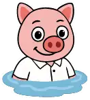 <code>bara-luzha</code> |
|  <code>fallback → giant-book</code> | `/about/advertising/`  Страница о рекламе внутри RSLive; `logo` связывает OG с самим проектом и лучше безликой книги-fallback. | 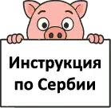 <code>logo</code> |
|  <code>letter-list</code> | `/about/app/`  Страница посвящена приложению; `smartphone` точнее общего списка. |  <code>smartphone</code> |
|  <code>letter-list</code> | `/about/privacy/`  Для политики конфиденциальности выбран `investigation` как образ проверки и работы с данными. |  <code>investigation</code> |
|  <code>id</code> | `/adaptation/birth/clinics/`  Страница про медицинские учреждения; `doctor` точнее идентификационного `id`. |  <code>doctor</code> |
|  <code>id</code> | `/adaptation/birth/med/`  Медицинское наблюдение беременности — прямая медицинская тема; `doctor` точнее `id`. |  <code>doctor</code> |
|  <code>smartphone</code> | `/adaptation/cef/`  Страница про электронную идентификацию, ЭЦП и работу с электронными картицами; `eid` точнее текущего `smartphone`. |  <code>eid</code> |
|  <code>internet-research</code> | `/adaptation/russians/count/`  Здесь главное — численность, статистика и динамика; `calculation` со счётами точнее исследовательского общего стикера. | 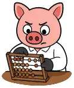 <code>calculation</code> |
|  <code>id</code> | `/adaptation/russians/embassy/`  Посольство и консульский раздел тесно связаны с паспортными и консульскими документами; `passport` точнее `id`. |  <code>passport</code> |
|  <code>giant-book</code> | `/adaptation/russians/ksors/`  Для КСОРС по ревью выбран `balalajka` как узнаваемый культурный русский образ вместо безличного административного стикера. | 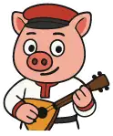 <code>balalajka</code> |
|  <code>letter-list</code> | `/adaptation/russians/national-council/`  Национальный совет русского меньшинства относится к разделу о русском сообществе; используем `russian-flag`. | 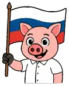 <code>russian-flag</code> |
|  <code>id</code> | `/adaptation/russians/officials/`  Страница о представителях и структурах русского сообщества; по общему решению раздела используем `russian-flag`. |  <code>russian-flag</code> |
| 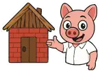 <code>solid-house</code> | `/adaptation/russians/russian-house/`  Страница относится к инфраструктуре русского сообщества в Сербии; по общему решению раздела используем `russian-flag`. |  <code>russian-flag</code> |
|  <code>passport</code> | `/arrival/`  Корень «первых шагов после переезда» получает `tractor`: это намеренная визуальная метафора самого переезда и прибытия. | 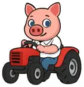 <code>tractor</code> |
|  <code>payment-card</code> | `/arrival/bank/`  Для банковского блока выбран `atm-fee` как характерный банковский стикер вместо общей платёжной карты. | 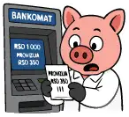 <code>atm-fee</code> |
|  <code>payment-card</code> | `/arrival/bank/adriatic/`  Для страницы банка выбран общий банковский стикер раздела `atm-fee`. |  <code>atm-fee</code> |
|  <code>payment-card</code> | `/arrival/bank/alta/`  Для страницы банка выбран общий банковский стикер раздела `atm-fee`. |  <code>atm-fee</code> |
|  <code>payment-card</code> | `/arrival/bank/apibanka/`  Для страницы банка выбран общий банковский стикер раздела `atm-fee`. |  <code>atm-fee</code> |
|  <code>payment-card</code> | `/arrival/bank/posted/`  Для страницы банка выбран общий банковский стикер раздела `atm-fee`. |  <code>atm-fee</code> |
|  <code>payment-card</code> | `/arrival/bank/raiffeisen/`  Для страницы банка выбран общий банковский стикер раздела `atm-fee`. |  <code>atm-fee</code> |
|  <code>payment-card</code> | `/arrival/banks/`  Для банковского справочника выбран `atm-fee` как общий банковский образ. |  <code>atm-fee</code> |
|  <code>id</code> | `/arrival/beli-karton/`  Для белого картона выбран `wizard`: намеренно ироничный образ «магии документов» для бюрократической процедуры. |  <code>wizard</code> |
|  <code>passport</code> | `/arrival/boravak/volontiranje/`  Общий раздел о волонтёрском основании РВП маркируем `volunteer-help` как основной стикер волонтёрской помощи. | 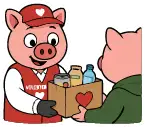 <code>volunteer-help</code> |
|  <code>letter-list</code> | `/arrival/boravak/volontiranje/adra-serbia/`  ADRA занимается гуманитарной помощью, поддержкой уязвимых групп и общественными проектами; используем `volunteer-help`. |  <code>volunteer-help</code> |
|  <code>letter-list</code> | `/arrival/boravak/volontiranje/caritas-sabac/`  Caritas Šabac работает в социальной защите и гуманитарной помощи; `volunteer-help` прямо соответствует характеру программ. |  <code>volunteer-help</code> |
|  <code>letter-list</code> | `/arrival/boravak/volontiranje/mladi-istrazivaci-srbije/`  Mladi istraživači Srbije прямо работает с экологическим образованием и волонтёрскими проектами; здесь точнее `volunteer-ecology`. |  <code>volunteer-ecology</code> |
|  <code>letter-list</code> | `/arrival/boravak/volontiranje/nof/`  NOF — молодёжная волонтёрская организация; для общего общественного волонтёрства подходит `volunteer-help`. |  <code>volunteer-help</code> |
|  <code>internet-research</code> | `/arrival/boravak/volontiranje/russian-diaspora/`  Несмотря на русскую тематику организации, страница в этом подразделе прежде всего разбирает волонтёрскую программу; используем `volunteer-help`. |  <code>volunteer-help</code> |
|  <code>letter-list</code> | `/arrival/boravak/volontiranje/udruzenje-svetlost/`  Svetlost занимается молодёжью, социальной интеграцией и общественными программами; используем общий `volunteer-help`. |  <code>volunteer-help</code> |
|  <code>letter-list</code> | `/arrival/boravak/volontiranje/volonterski-centar-vojvodine/`  VCV организует местные акции, лагеря и международные обмены; это общее волонтёрство, поэтому `volunteer-help`. |  <code>volunteer-help</code> |
|  <code>fallback → giant-book</code> | `/arrival/business/codes/`  Это справочник кодов деятельности; `letter-list` соответствует структуре и содержанию лучше fallback. |  <code>letter-list</code> |
|  <code>looking-for-salary</code> | `/arrival/business/doo/`  Для DOO по ревью выбран `don-carleone`: характерный иронический корпоративный образ вместо нейтрального `businessman`. | 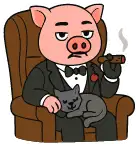 <code>don-carleone</code> |
|  <code>fallback → giant-book</code> | `/arrival/business/e-comm/`  Электронная коммерция — бизнес-инфраструктура; `businessman` лучше generic fallback. |  <code>businessman</code> |
|  <code>looking-for-salary</code> | `/arrival/business/efaktura/`  SEF/eFaktura — операционная часть бизнеса; `businessman` точнее стикера про зарплату. |  <code>businessman</code> |
|  <code>looking-for-salary</code> | `/arrival/freelance/`  Есть прямой канонический стикер `freelancer`; он точнее текущего общего образа работы и зарплаты. |  <code>freelancer</code> |
|  <code>approve</code> | `/arrival/jedinstvena-dozvola/`  Единое разрешение — документ/карточка статуса и права на работу; по ревью используем `id` вместо общего `approve`. |  <code>id</code> |
| 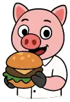 <code>burger</code> | `/arrival/shops/`  Страница о магазинах и повседневных покупках; `shopping-lidl` — канонический shopping-сюжет. | 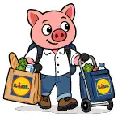 <code>shopping-lidl</code> |
|  <code>id</code> | `/arrival/zdravlje/`  По ревью для раздела здравоохранения используем `medical-morpheus` как яркий медицинский образ вместо идентификационного `id`. |  <code>medical-morpheus</code> |
| 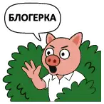 <code>blogerka</code> | `/blog/chto_izmenilos_v_rslive_za_mesjac/`  Материал об изменениях самого проекта; `logo` является прямой семантической привязкой. |  <code>logo</code> |
|  <code>blogerka</code> | `/blog/dobro_pozhalovat_v_instrukciju_po_serbii/`  Материал о самом RSLive; `logo` описывает проект, а `blogerka` — сатиру на блогеров. |  <code>logo</code> |
|  <code>blogerka</code> | `/blog/gde_dorozhe_v_rossii_ili_v_serbii/`  Сравнение расходов и стоимости жизни; финансовый OG соответствует предмету. |  <code>payment-card</code> |
|  <code>blogerka</code> | `/blog/javljaetsja_li_serbija_bezopasnoj_stranoj/`  Страница сопоставляет данные о безопасности и рисках; исследовательский OG точнее. |  <code>internet-research</code> |
|  <code>blogerka</code> | `/blog/javljaetsja_li_serbija_xoroshej_stranoj_dlja_pereezda/`  Материал оценивает практические условия переезда; миграционный OG соответствует теме. | 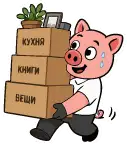 <code>move-stuff</code> |
|  <code>blogerka</code> | `/blog/kak_otnosjatsja_k_lgbt_v_serbii/`  Фактологический обзор права и общественных данных; нужен нейтральный исследовательский OG. |  <code>internet-research</code> |
|  <code>blogerka</code> | `/blog/kak_v_serbii_otnosjatsja_k_russkim/`  Обзор исторических, социальных и политических факторов; исследовательский OG без сатирического оттенка. |  <code>internet-research</code> |
|  <code>blogerka</code> | `/blog/kakaja_srednjaja_zarplata_v_serbii/`  Статья построена вокруг цифр и расчётов зарплаты; `calculation` со счётами визуально передаёт это точнее `looking-for-salary`. |  <code>calculation</code> |
|  <code>blogerka</code> | `/blog/kogda_serbija_budet_v_es/`  Фактологический разбор переговоров и условий вступления; нейтральный исследовательский OG. |  <code>internet-research</code> |
|  <code>blogerka</code> | `/blog/kogo_podderzhala_serbija_v_vojne_s_ukrainoj/`  Фактологический разбор внешнеполитических решений; нейтральный исследовательский OG. |  <code>internet-research</code> |
|  <code>blogerka</code> | `/blog/osnovnye_nalogovye_objazatelstva_do_konca_goda_v_serbii/`  Ключевой смысл — календарные налоговые сроки до конца года. |  <code>calendar</code> |
|  <code>blogerka</code> | `/blog/pochemu_russkie_edut_v_serbiju/`  Для материала о переезде россиян выбран `tractor` как более характерная визуальная метафора миграции, чем общий `move-stuff`. |  <code>tractor</code> |
|  <code>blogerka</code> | `/blog/pochemu_serbija_byla_pod_sankcijami/`  Историко-политический справочный материал; нейтральный исследовательский OG. |  <code>internet-research</code> |
|  <code>blogerka</code> | `/blog/pochemu_serbija_ljubit_rossiju/`  Историко-социальный разбор; исследовательская метафора точнее сатирической «блогерки». |  <code>internet-research</code> |
|  <code>blogerka</code> | `/blog/pochemu_serbija_luchshaja_strana_dlja_immigracii_russkix/`  Основной предмет — иммиграция и переезд; `move-stuff` соответствует содержанию без блогерской сатиры. |  <code>move-stuff</code> |
|  <code>blogerka</code> | `/blog/serbija_samaja_dinamichno_rastuschaja_ehkonomika_evropy/`  Экономический рост и показатели; инвестиционно-экономическая метафора точнее. |  <code>investments-stock</code> |
|  <code>giant-book</code> | `/children/`  Раздел целиком о детях; `child` прямее общего `giant-book`. |  <code>child</code> |
|  <code>fallback → giant-book</code> | `/children/birth/`  Рождение ребёнка — прямой сюжет `child`; сейчас страница уходит в generic fallback. |  <code>child</code> |
|  <code>giant-book</code> | `/children/school/`  Школьный раздел; `schoolchild` точнее общего `giant-book`. |  <code>schoolchild</code> |
|  <code>fallback → giant-book</code> | `/en/about/advertising/`  Английская версия страницы о рекламе RSLive; `logo` логично связывает её с проектом. |  <code>logo</code> |
|  <code>letter-list</code> | `/en/about/privacy/`  English privacy page follows the Russian sticker choice: `investigation`. |  <code>investigation</code> |
|  <code>smartphone</code> | `/en/foreigner-residence-registration/`  English version of the same eUprava/eID procedure is aligned with the Serbian page and uses `eid`. |  <code>eid</code> |
|  <code>party</code> | `/en/russians-in-serbia/`  Энциклопедический раздел о русских в Сербии; `russian-flag` точнее `party`, который означает вечеринку. |  <code>russian-flag</code> |
|  <code>internet-research</code> | `/en/russians-in-serbia/demographics/`  English counterpart of `/adaptation/russians/count/` follows the Russian review choice: `calculation`. |  <code>calculation</code> |
|  <code>giant-book</code> | `/en/russians-in-serbia/ksors/`  English KSORS page follows the Russian KSORS review choice: `balalajka`. |  <code>balalajka</code> |
|  <code>letter-list</code> | `/en/russians-in-serbia/national-council/`  English National Council page follows the Russian review choice: `russian-flag`. |  <code>russian-flag</code> |
|  <code>solid-house</code> | `/en/russians-in-serbia/russian-house/`  English Russian House page follows the Russian review choice: `russian-flag`. |  <code>russian-flag</code> |
|  <code>plane</code> | `/gov/law/license/tourist/`  Для туристической лицензии по ревью используем `bus`: туристический транспорт даёт более узнаваемый отраслевой образ. | 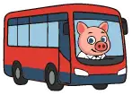 <code>bus</code> |
|  <code>id</code> | `/gov/notguilty/`  Для справки о несудимости выбран `wizard`: намеренно ироничный образ бюрократической «магии документов». |  <code>wizard</code> |
|  <code>letter-list</code> | `/gov/ombudsman/`  Омбудсман защищает права граждан и разбирает обращения; по ревью используем юридический стикер `lawyer`. |  <code>lawyer</code> |
|  <code>payment-card</code> | `/gov/taxes/`  По ревью весь раздел `/gov/taxes/*` маркируем `calculation`: поросёнок со счётами становится единым визуальным образом налогов, расчётов и обязательств. |  <code>calculation</code> |
|  <code>payment-card</code> | `/gov/taxes/assets/`  По ревью весь раздел `/gov/taxes/*` маркируем `calculation`: поросёнок со счётами становится единым визуальным образом налогов, расчётов и обязательств. |  <code>calculation</code> |
|  <code>payment-card</code> | `/gov/taxes/assets/capital-gains/`  По ревью весь раздел `/gov/taxes/*` маркируем `calculation`: поросёнок со счётами становится единым визуальным образом налогов, расчётов и обязательств. |  <code>calculation</code> |
|  <code>payment-card</code> | `/gov/taxes/assets/foreign-assets/`  По ревью весь раздел `/gov/taxes/*` маркируем `calculation`: поросёнок со счётами становится единым визуальным образом налогов, расчётов и обязательств. |  <code>calculation</code> |
|  <code>payment-card</code> | `/gov/taxes/assets/property/`  По ревью весь раздел `/gov/taxes/*` маркируем `calculation`: поросёнок со счётами становится единым визуальным образом налогов, расчётов и обязательств. |  <code>calculation</code> |
|  <code>payment-card</code> | `/gov/taxes/borovak/`  По ревью весь раздел `/gov/taxes/*` маркируем `calculation`: поросёнок со счётами становится единым визуальным образом налогов, расчётов и обязательств. |  <code>calculation</code> |
|  <code>payment-card</code> | `/gov/taxes/business/`  По ревью весь раздел `/gov/taxes/*` маркируем `calculation`: поросёнок со счётами становится единым визуальным образом налогов, расчётов и обязательств. |  <code>calculation</code> |
|  <code>payment-card</code> | `/gov/taxes/business/dividends/`  По ревью весь раздел `/gov/taxes/*` маркируем `calculation`: поросёнок со счётами становится единым визуальным образом налогов, расчётов и обязательств. |  <code>calculation</code> |
|  <code>payment-card</code> | `/gov/taxes/business/doo/`  По ревью весь раздел `/gov/taxes/*` маркируем `calculation`: поросёнок со счётами становится единым визуальным образом налогов, расчётов и обязательств. |  <code>calculation</code> |
|  <code>payment-card</code> | `/gov/taxes/business/pdv/`  По ревью весь раздел `/gov/taxes/*` маркируем `calculation`: поросёнок со счётами становится единым визуальным образом налогов, расчётов и обязательств. |  <code>calculation</code> |
|  <code>payment-card</code> | `/gov/taxes/business/preduzetnik/`  По ревью весь раздел `/gov/taxes/*` маркируем `calculation`: поросёнок со счётами становится единым визуальным образом налогов, расчётов и обязательств. |  <code>calculation</code> |
|  <code>payment-card</code> | `/gov/taxes/calculation/`  По ревью весь раздел `/gov/taxes/*` маркируем `calculation`: поросёнок со счётами становится единым визуальным образом налогов, расчётов и обязательств. |  <code>calculation</code> |
|  <code>uplatnica</code> | `/gov/taxes/codes/`  По ревью весь раздел `/gov/taxes/*` маркируем `calculation`: поросёнок со счётами становится единым визуальным образом налогов, расчётов и обязательств. |  <code>calculation</code> |
|  <code>payment-card</code> | `/gov/taxes/eco/`  По ревью весь раздел `/gov/taxes/*` маркируем `calculation`: поросёнок со счётами становится единым визуальным образом налогов, расчётов и обязательств. |  <code>calculation</code> |
|  <code>payment-card</code> | `/gov/taxes/eporezi/`  По ревью весь раздел `/gov/taxes/*` маркируем `calculation`: поросёнок со счётами становится единым визуальным образом налогов, расчётов и обязательств. |  <code>calculation</code> |
|  <code>payment-card</code> | `/gov/taxes/marketplace/`  По ревью весь раздел `/gov/taxes/*` маркируем `calculation`: поросёнок со счётами становится единым визуальным образом налогов, расчётов и обязательств. |  <code>calculation</code> |
|  <code>payment-card</code> | `/gov/taxes/overpayment/`  По ревью весь раздел `/gov/taxes/*` маркируем `calculation`: поросёнок со счётами становится единым визуальным образом налогов, расчётов и обязательств. |  <code>calculation</code> |
|  <code>payment-card</code> | `/gov/taxes/personal/`  По ревью весь раздел `/gov/taxes/*` маркируем `calculation`: поросёнок со счётами становится единым визуальным образом налогов, расчётов и обязательств. |  <code>calculation</code> |
|  <code>payment-card</code> | `/gov/taxes/personal/annual-income/`  По ревью весь раздел `/gov/taxes/*` маркируем `calculation`: поросёнок со счётами становится единым визуальным образом налогов, расчётов и обязательств. |  <code>calculation</code> |
|  <code>payment-card</code> | `/gov/taxes/personal/foreign-income/`  По ревью весь раздел `/gov/taxes/*` маркируем `calculation`: поросёнок со счётами становится единым визуальным образом налогов, расчётов и обязательств. |  <code>calculation</code> |
|  <code>payment-card</code> | `/gov/taxes/personal/freelance/`  По ревью весь раздел `/gov/taxes/*` маркируем `calculation`: поросёнок со счётами становится единым визуальным образом налогов, расчётов и обязательств. |  <code>calculation</code> |
|  <code>payment-card</code> | `/gov/taxes/personal/salary/`  По ревью весь раздел `/gov/taxes/*` маркируем `calculation`: поросёнок со счётами становится единым визуальным образом налогов, расчётов и обязательств. |  <code>calculation</code> |
|  <code>payment-card</code> | `/gov/taxes/residency/`  По ревью весь раздел `/gov/taxes/*` маркируем `calculation`: поросёнок со счётами становится единым визуальным образом налогов, расчётов и обязательств. |  <code>calculation</code> |
|  <code>payment-card</code> | `/gov/taxes/tax-free/`  По ревью весь раздел `/gov/taxes/*` маркируем `calculation`: поросёнок со счётами становится единым визуальным образом налогов, расчётов и обязательств. |  <code>calculation</code> |
|  <code>id</code> | `/gov/uverenje_boravak/`  Для уверения о боравку выбран `wizard`: документальная процедура получает тот же ироничный образ «магии справок». |  <code>wizard</code> |
|  <code>passport</code> | `/integration/`  Корень раздела интеграции по ревью получает `seljak` — намеренный локальный сербский образ вместо нейтрального административного. | 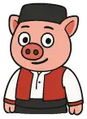 <code>seljak</code> |
|  <code>letter-list</code> | `/integration/apostil/`  Апостиль — ещё одна формальная документальная процедура; по ревью используем `wizard` как образ «магии документов». |  <code>wizard</code> |
|  <code>letter-list</code> | `/integration/dresscode/`  Для делового дресс-кода выбран `businessman` — хрюшка в костюме прямо соответствует теме одежды для деловой среды. |  <code>businessman</code> |
| 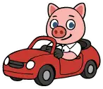 <code>auto</code> | `/integration/driver_license/`  Водительское удостоверение — идентификационный документ; по ревью используем `id`. |  <code>id</code> |
|  <code>smartphone</code> | `/integration/euprava/`  eUprava — электронные государственные услуги и идентификация; `eid` даёт прямую цифровую административную привязку. |  <code>eid</code> |
|  <code>passport</code> | `/integration/passport/`  Страница посвящена гражданству и сербскому паспорту; используем канонический `citizenship`. | 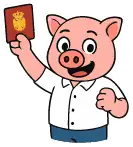 <code>citizenship</code> |
|  <code>smartphone</code> | `/integration/prijavastranca/`  Онлайн-регистрация иностранца идёт через электронный государственный сервис; по ревью используем `eid`. |  <code>eid</code> |
|  <code>letter-list</code> | `/integration/social/`  Раздел посвящён социальной поддержке и пенсионному обеспечению; `penzioner` — канонический стикер для пенсий и соцобеспечения. |  <code>penzioner</code> |
| 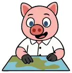 <code>map</code> | `/integration/stalni/change-address/`  Для смены адреса ПМЖ по ревью выбран `move-stuff`: стикер с вещами и коробками передаёт сам переезд на новый адрес. |  <code>move-stuff</code> |
|  <code>passport</code> | `/integration/visas/`  Для визового раздела по ревью выбран `travel` как прямой образ поездок и визовых перемещений. |  <code>travel</code> |
| 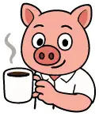 <code>kafa-coffee</code> | `/lifestyle/`  Для корня раздела «Жизнь» по ревью выбран `white-coat-snob` как характерный редакционный образ lifestyle-раздела. | 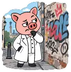 <code>white-coat-snob</code> |
|  <code>fallback → giant-book</code> | `/lifestyle/coffee-bakeries-desserts/`  Кофейни, пекарни и десерты; `kafa-coffee` даёт прямой тематический образ вместо fallback. |  <code>kafa-coffee</code> |
|  <code>fallback → giant-book</code> | `/lifestyle/culture/belgrade-neighborhoods/`  Для районов Белграда по ревью выбран `white-coat-snob` как городской lifestyle-образ вместо общей карты. |  <code>white-coat-snob</code> |
|  <code>fallback → giant-book</code> | `/lifestyle/culture/books/`  Книги и чтение; `book-reader` — прямой канонический сюжет. |  <code>book-reader</code> |
|  <code>fallback → giant-book</code> | `/lifestyle/culture/events/`  Культурные события завязаны на даты; `calendar` точнее fallback. |  <code>calendar</code> |
|  <code>fallback → giant-book</code> | `/lifestyle/culture/museums/`  Музеи — культурно-образовательная тема; `book-reader` ближе generic fallback. |  <code>book-reader</code> |
| 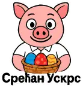 <code>uskrs</code> | `/lifestyle/culture/slava/`  Для славы по ревью выбран `fireworks`: праздничный образ вместо пасхального стикера. | 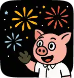 <code>fireworks</code> |
|  <code>fallback → giant-book</code> | `/lifestyle/ecology/recycling/`  Переработка — экологическая тема; `volunteer-ecology` точнее generic fallback. |  <code>volunteer-ecology</code> |
|  <code>fallback → giant-book</code> | `/lifestyle/familiar-foods/`  Привычные русскоязычной аудитории продукты напрямую соответствуют `russian-food`. | 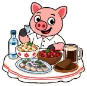 <code>russian-food</code> |
|  <code>party</code> | `/lifestyle/fun/`  Для общего раздела развлечений по ревью выбран `karaoke` как более характерный образ досуга. |  <code>karaoke</code> |
|  <code>fallback → giant-book</code> | `/lifestyle/holidays/`  Для общего раздела праздников выбран `fireworks` как прямой праздничный образ. |  <code>fireworks</code> |
|  <code>fallback → giant-book</code> | `/lifestyle/local-goods/`  Страница о покупке местных товаров; `checkout` обозначает покупки без привязки к конкретной сети. |  <code>checkout</code> |
|  <code>fallback → giant-book</code> | `/lifestyle/serbian-food/`  Сербская еда; `pecenje` — узнаваемый канонический гастрономический образ. | 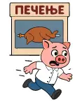 <code>pecenje</code> |
|  <code>map</code> | `/lifestyle/travel/`  Для корня раздела путешествий по Сербии выбран канонический `travel`. |  <code>travel</code> |
|  <code>map</code> | `/lifestyle/travel/banje/`  Для поездок по сербским баням по ревью выбран `bara-luzha` — намеренно шуточный водный образ. |  <code>bara-luzha</code> |
|  <code>fallback → giant-book</code> | `/lifestyle/travel/events-calendar/`  Это календарь событий; `calendar` точнее fallback. |  <code>calendar</code> |
|  <code>map</code> | `/lifestyle/travel/fortresses/`  Для туристического маршрута по крепостям выбран `sava-selfie`: поросёнок с фотоаппаратом у достопримечательности используется как общий образ поездок по местам Сербии. |  <code>sava-selfie</code> |
|  <code>map</code> | `/lifestyle/travel/fruska-gora-sremski-karlovci/`  Для конкретного туристического маршрута выбран `sava-selfie` как общий образ поездки по достопримечательностям Сербии. |  <code>sava-selfie</code> |
|  <code>map</code> | `/lifestyle/travel/ovcar-kablar-cacak/`  Для конкретного туристического маршрута выбран `sava-selfie` как общий образ поездки по достопримечательностям Сербии. |  <code>sava-selfie</code> |
|  <code>map</code> | `/lifestyle/travel/resava/`  Для конкретного туристического маршрута выбран `sava-selfie` как общий образ поездки по достопримечательностям Сербии. |  <code>sava-selfie</code> |
|  <code>map</code> | `/lifestyle/travel/rtanj/`  Для конкретного туристического маршрута выбран `sava-selfie` как общий образ поездки по достопримечательностям Сербии. |  <code>sava-selfie</code> |
|  <code>map</code> | `/lifestyle/travel/short-nature-trips/`  Для подборки коротких поездок выбран `sava-selfie` как общий образ туриста с фотоаппаратом. |  <code>sava-selfie</code> |
|  <code>map</code> | `/lifestyle/travel/south-banate/`  Для конкретного туристического маршрута выбран `sava-selfie` как общий образ поездки по достопримечательностям Сербии. |  <code>sava-selfie</code> |
|  <code>map</code> | `/lifestyle/travel/stari-ras-novi-pazar/`  Для конкретного туристического маршрута выбран `sava-selfie` как общий образ поездки по достопримечательностям Сербии. |  <code>sava-selfie</code> |
|  <code>map</code> | `/lifestyle/travel/vojvodina-cities/`  Для маршрута по городам Воеводины выбран `sava-selfie` как общий туристический образ. |  <code>sava-selfie</code> |
|  <code>map</code> | `/lifestyle/travel/wine-regions/`  Для маршрута по винным регионам выбран `sava-selfie` как общий образ туристической поездки. |  <code>sava-selfie</code> |
|  <code>map</code> | `/lifestyle/travel/winter-serbia/`  Для зимних поездок по Сербии выбран `cold-weather`, прямо соответствующий сезонной теме. | 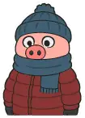 <code>cold-weather</code> |
|  <code>map</code> | `/lifestyle/travel/yugoslav-spomenici/`  Для спомеников Югославии выбран `mir-trud-maj`: стикер прямо отсылает к общему социалистическому прошлому. | 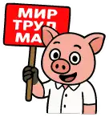 <code>mir-trud-maj</code> |
|  <code>fallback → giant-book</code> | `/lifestyle/world-cuisines-belgrade/`  Рестораны и кухни мира; `menu-restorant` передаёт ресторанную тему. | 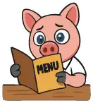 <code>menu-restorant</code> |
|  <code>pecenje</code> | `/m25/`  Для страницы `/m25/` по ревью выбран `joker`. | 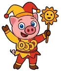 <code>joker</code> |
|  <code>giant-book</code> | `/m26/`  Для страницы `/m26/` по ревью выбран `joker`. |  <code>joker</code> |
|  <code>fallback → giant-book</code> | `/map/cuisine/`  Для карты заведений и кухонь используем `kafana`: поросёнок в кафане сразу задаёт гастрономический контекст лучше generic `map`. | 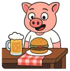 <code>kafana</code> |
|  <code>party</code> | `/map/dance/`  Для карты танцевальных мест выбран `disco` — канонический стикер с диско-тематикой. |  <code>disco</code> |
|  <code>fallback → giant-book</code> | `/map/familiar-foods/`  Хотя это карта, её предмет — привычные русские продукты; тематический `russian-food` полезнее generic `map`. |  <code>russian-food</code> |
| 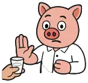 <code>no-drinking</code> | `/map/nosmoke/`  `no-drinking` семантически про алкоголь; канонический `gas-smoke-gray` прямо предназначен для дыма и некурящих мест. | 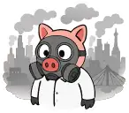 <code>gas-smoke-gray</code> |
|  <code>id</code> | `/map/ruska_ambasada/`  Для карты российского посольства выбран `passport` как паспортно-консульский образ. |  <code>passport</code> |
|  <code>map</code> | `/map/smallrf/`  Для карты мест русского сообщества выбран `russian-flag`. |  <code>russian-flag</code> |
|  <code>id</code> | `/med/`  Корневой медицинский раздел; `doctor` точнее идентификационного `id`. |  <code>doctor</code> |
|  <code>id</code> | `/med/blood-donation/`  Донорство крови — медицинская тема; `doctor` точнее `id`. |  <code>doctor</code> |
|  <code>payment-card</code> | `/med/dms/`  Для раздела ДМС выбран `doctor`: это медицинская страховка, поэтому медицинский образ точнее банковской карты. |  <code>doctor</code> |
|  <code>payment-card</code> | `/med/dms/ddor/`  Для страницы ДМС страховщика выбран `doctor` как общий медицинский образ раздела. |  <code>doctor</code> |
|  <code>payment-card</code> | `/med/dms/dunav/`  Для страницы ДМС страховщика выбран `doctor` как общий медицинский образ раздела. |  <code>doctor</code> |
|  <code>payment-card</code> | `/med/dms/triglav/`  Для страницы ДМС страховщика выбран `doctor` как общий медицинский образ раздела. |  <code>doctor</code> |
|  <code>payment-card</code> | `/med/dms/uniqa/`  Для страницы ДМС страховщика выбран `doctor` как общий медицинский образ раздела. |  <code>doctor</code> |
|  <code>payment-card</code> | `/med/dms/wiener/`  Для страницы ДМС страховщика выбран `doctor` как общий медицинский образ раздела. |  <code>doctor</code> |
|  <code>doctor</code> | `/med/familiar-medicines/`  Для страницы привычных лекарств выбран `medical-morpheus`: канонический стикер предназначен для медикаментов и выбора лечения. |  <code>medical-morpheus</code> |
|  <code>doctor</code> | `/med/medications/`  Для раздела лекарств выбран `medical-morpheus`: канонический стикер предназначен для медикаментов и выбора лечения. |  <code>medical-morpheus</code> |
|  <code>map</code> | `/move/`  Для корня раздела переезда выбран `serbian-flag` как прямой образ переезда именно в Сербию. | 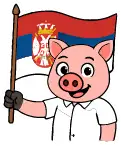 <code>serbian-flag</code> |
|  <code>letter-list</code> | `/move/army/`  Для страницы о военной обязанности и связанных вопросах выбран `russia-is-hearing` как тематический российский образ. |  <code>russia-is-hearing</code> |
|  <code>payment-card</code> | `/move/exchange/`  `exchange` прямо обозначает обмен валюты и обменные пункты; точнее общего `payment-card`. |  <code>exchange</code> |
|  <code>fallback → giant-book</code> | `/move/housing/electricity/`  Электричество в жилье связано с коммунальными начислениями и оплатой; `uplatnica` точнее generic fallback. |  <code>uplatnica</code> |
|  <code>fallback → giant-book</code> | `/move/housing/handover/`  Приём-передача жилья и ключей; `house-keys` — прямой сюжет. |  <code>house-keys</code> |
|  <code>fallback → giant-book</code> | `/move/housing/quiet-hours/`  Для статьи о кућном реду и тихих часах по ревью выбран `jebote` как характерный сербский бытовой образ. | 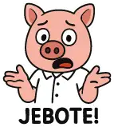 <code>jebote</code> |
|  <code>fallback → giant-book</code> | `/move/housing/utilities/`  Коммунальные услуги и счета; `uplatnica` точнее generic fallback. |  <code>uplatnica</code> |
|  <code>map</code> | `/move/myths/`  Для разбора мифов выбран `willy-wonka`: саркастический образ недоверия точнее общего исследовательского стикера. |  <code>willy-wonka</code> |
|  <code>internet-research</code> | `/move/risks/`  Для страницы «Риски для уехавших из РФ» выбран `russia-is-hearing` как тематический российский риск/наблюдение-образ. |  <code>russia-is-hearing</code> |
|  <code>passport</code> | `/move/visa/other-countries/`  Для виз в другие страны выбран `travel` как прямой образ международных поездок. |  <code>travel</code> |
|  <code>fallback → giant-book</code> | `/sources/`  Страница источников и проверки информации; `internet-research` — прямой канонический сюжет. |  <code>internet-research</code> |
|  <code>fallback → giant-book</code> | `/sr/about/advertising/`  Сербская версия страницы о рекламе RSLive; `logo` логично связывает её с проектом. |  <code>logo</code> |
|  <code>letter-list</code> | `/sr/about/privacy/`  Српска верзија политике приватности прати избор руске странице: `investigation`. |  <code>investigation</code> |
|  <code>smartphone</code> | `/sr/prijava-boravista-stranca/`  Для сербской инструкции по электронной регистрации иностранца выбран `eid`: статья прямо построена вокруг eID, ConsentID и квалифицированного электронного сертификата. |  <code>eid</code> |
|  <code>party</code> | `/sr/rusi-u-srbiji/`  Энциклопедический раздел о русских в Сербии; `russian-flag` точнее `party`, который означает вечеринку. |  <code>russian-flag</code> |
|  <code>internet-research</code> | `/sr/rusi-u-srbiji/demografija/`  Српски пандан `/adaptation/russians/count/` прати руски избор: `calculation`. |  <code>calculation</code> |
|  <code>giant-book</code> | `/sr/rusi-u-srbiji/ksors/`  Српска страница КСОРС-а прати руски избор: `balalajka`. |  <code>balalajka</code> |
|  <code>letter-list</code> | `/sr/rusi-u-srbiji/nacionalni-savet/`  Српска страница Националног савета прати руски избор: `russian-flag`. |  <code>russian-flag</code> |
|  <code>solid-house</code> | `/sr/rusi-u-srbiji/ruski-dom/`  Српска страница Руског дома прати руски избор: `russian-flag`. |  <code>russian-flag</code> |

## Полный инвентарь

| Текущий стикер | Страница и объяснение | Предлагаемый стикер |
|---|---|---|
|  <code>logo</code> | `/`  Предлагается оставить: отдельного основания для замены по теме страницы и канонической семантике не найдено. |  <code>logo</code> |
|  <code>fallback → giant-book</code> | `/404/`  По ревью для тупикового 404 используем `bara-luzha`: юмористическая «лужа» лучше передаёт ситуацию «пришли не туда», чем общий fallback. |  <code>bara-luzha</code> |
|  <code>logo</code> | `/about/`  Предлагается оставить: отдельного основания для замены по теме страницы и канонической семантике не найдено. |  <code>logo</code> |
|  <code>fallback → giant-book</code> | `/about/advertising/`  Страница о рекламе внутри RSLive; `logo` связывает OG с самим проектом и лучше безликой книги-fallback. |  <code>logo</code> |
|  <code>letter-list</code> | `/about/app/`  Страница посвящена приложению; `smartphone` точнее общего списка. |  <code>smartphone</code> |
|  <code>internet-research</code> | `/about/editorial-policy/`  Предлагается оставить: отдельного основания для замены по теме страницы и канонической семантике не найдено. |  <code>internet-research</code> |
|  <code>letter-list</code> | `/about/privacy/`  Для политики конфиденциальности выбран `investigation` как образ проверки и работы с данными. |  <code>investigation</code> |
| 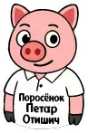 <code>petar</code> | `/about/stickers/`  Предлагается оставить: отдельного основания для замены по теме страницы и канонической семантике не найдено. |  <code>petar</code> |
| 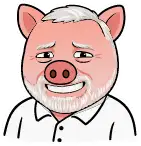 <code>hide-the-pain-harold</code> | `/adaptation/`  Предлагается оставить: отдельного основания для замены по теме страницы и канонической семантике не найдено. |  <code>hide-the-pain-harold</code> |
|  <code>child</code> | `/adaptation/birth/`  Предлагается оставить: отдельного основания для замены по теме страницы и канонической семантике не найдено. |  <code>child</code> |
|  <code>id</code> | `/adaptation/birth/after/`  Предлагается оставить: отдельного основания для замены по теме страницы и канонической семантике не найдено. |  <code>id</code> |
| 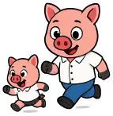 <code>parenting</code> | `/adaptation/birth/care/`  Предлагается оставить: отдельного основания для замены по теме страницы и канонической семантике не найдено. |  <code>parenting</code> |
|  <code>id</code> | `/adaptation/birth/clinics/`  Страница про медицинские учреждения; `doctor` точнее идентификационного `id`. |  <code>doctor</code> |
|  <code>payment-card</code> | `/adaptation/birth/maternity/`  Предлагается оставить: отдельного основания для замены по теме страницы и канонической семантике не найдено. |  <code>payment-card</code> |
|  <code>id</code> | `/adaptation/birth/med/`  Медицинское наблюдение беременности — прямая медицинская тема; `doctor` точнее `id`. |  <code>doctor</code> |
|  <code>letter-list</code> | `/adaptation/birth/prepare/`  Предлагается оставить: отдельного основания для замены по теме страницы и канонической семантике не найдено. |  <code>letter-list</code> |
|  <code>smartphone</code> | `/adaptation/cef/`  Страница про электронную идентификацию, ЭЦП и работу с электронными картицами; `eid` точнее текущего `smartphone`. |  <code>eid</code> |
| 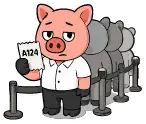 <code>queue</code> | `/adaptation/communication/`  Предлагается оставить: отдельного основания для замены по теме страницы и канонической семантике не найдено. |  <code>queue</code> |
|  <code>smartphone</code> | `/adaptation/consentid/`  Предлагается оставить: отдельного основания для замены по теме страницы и канонической семантике не найдено. |  <code>smartphone</code> |
|  <code>id</code> | `/adaptation/ebs_jmbg_pib/`  Предлагается оставить: отдельного основания для замены по теме страницы и канонической семантике не найдено. |  <code>id</code> |
|  <code>eid</code> | `/adaptation/eid/`  Предлагается оставить: отдельного основания для замены по теме страницы и канонической семантике не найдено. |  <code>eid</code> |
|  <code>exchange</code> | `/adaptation/menjacnice/`  Предлагается оставить: отдельного основания для замены по теме страницы и канонической семантике не найдено. |  <code>exchange</code> |
|  <code>psychology</code> | `/adaptation/psy/`  Предлагается оставить: отдельного основания для замены по теме страницы и канонической семантике не найдено. |  <code>psychology</code> |
|  <code>russian-flag</code> | `/adaptation/russians/`  Корневой раздел о русских в Сербии маркируем `russian-flag`; это прямой и единообразный образ для раздела. |  <code>russian-flag</code> |
|  <code>internet-research</code> | `/adaptation/russians/count/`  Здесь главное — численность, статистика и динамика; `calculation` со счётами точнее исследовательского общего стикера. |  <code>calculation</code> |
|  <code>id</code> | `/adaptation/russians/embassy/`  Посольство и консульский раздел тесно связаны с паспортными и консульскими документами; `passport` точнее `id`. |  <code>passport</code> |
|  <code>giant-book</code> | `/adaptation/russians/ksors/`  Для КСОРС по ревью выбран `balalajka` как узнаваемый культурный русский образ вместо безличного административного стикера. |  <code>balalajka</code> |
|  <code>letter-list</code> | `/adaptation/russians/national-council/`  Национальный совет русского меньшинства относится к разделу о русском сообществе; используем `russian-flag`. |  <code>russian-flag</code> |
|  <code>id</code> | `/adaptation/russians/officials/`  Страница о представителях и структурах русского сообщества; по общему решению раздела используем `russian-flag`. |  <code>russian-flag</code> |
|  <code>solid-house</code> | `/adaptation/russians/russian-house/`  Страница относится к инфраструктуре русского сообщества в Сербии; по общему решению раздела используем `russian-flag`. |  <code>russian-flag</code> |
|  <code>srpski-teacher</code> | `/adaptation/srpski/`  Предлагается оставить: отдельного основания для замены по теме страницы и канонической семантике не найдено. |  <code>srpski-teacher</code> |
|  <code>looking-for-salary</code> | `/adaptation/work/`  Предлагается оставить: отдельного основания для замены по теме страницы и канонической семантике не найдено. |  <code>looking-for-salary</code> |
| — engine-owned / без MDX frontmatter | `/addressbook/`  Предлагается оставить: отдельного основания для замены по теме страницы и канонической семантике не найдено. | — engine-owned / без MDX frontmatter |
| — engine-owned / без MDX frontmatter | `/addressbook/add/`  Предлагается оставить: отдельного основания для замены по теме страницы и канонической семантике не найдено. | — engine-owned / без MDX frontmatter |
|  <code>passport</code> | `/arrival/`  Корень «первых шагов после переезда» получает `tractor`: это намеренная визуальная метафора самого переезда и прибытия. |  <code>tractor</code> |
|  <code>payment-card</code> | `/arrival/bank/`  Для банковского блока выбран `atm-fee` как характерный банковский стикер вместо общей платёжной карты. |  <code>atm-fee</code> |
|  <code>payment-card</code> | `/arrival/bank/adriatic/`  Для страницы банка выбран общий банковский стикер раздела `atm-fee`. |  <code>atm-fee</code> |
|  <code>payment-card</code> | `/arrival/bank/alta/`  Для страницы банка выбран общий банковский стикер раздела `atm-fee`. |  <code>atm-fee</code> |
|  <code>payment-card</code> | `/arrival/bank/apibanka/`  Для страницы банка выбран общий банковский стикер раздела `atm-fee`. |  <code>atm-fee</code> |
|  <code>payment-card</code> | `/arrival/bank/posted/`  Для страницы банка выбран общий банковский стикер раздела `atm-fee`. |  <code>atm-fee</code> |
|  <code>payment-card</code> | `/arrival/bank/raiffeisen/`  Для страницы банка выбран общий банковский стикер раздела `atm-fee`. |  <code>atm-fee</code> |
|  <code>payment-card</code> | `/arrival/banks/`  Для банковского справочника выбран `atm-fee` как общий банковский образ. |  <code>atm-fee</code> |
|  <code>id</code> | `/arrival/beli-karton/`  Для белого картона выбран `wizard`: намеренно ироничный образ «магии документов» для бюрократической процедуры. |  <code>wizard</code> |
|  <code>passport</code> | `/arrival/boravak/`  Предлагается оставить: отдельного основания для замены по теме страницы и канонической семантике не найдено. |  <code>passport</code> |
|  <code>map</code> | `/arrival/boravak/change-address/`  Предлагается оставить: отдельного основания для замены по теме страницы и канонической семантике не найдено. |  <code>map</code> |
|  <code>passport</code> | `/arrival/boravak/change/`  Предлагается оставить: отдельного основания для замены по теме страницы и канонической семантике не найдено. |  <code>passport</code> |
|  <code>trophy</code> | `/arrival/boravak/talent/`  Предлагается оставить: отдельного основания для замены по теме страницы и канонической семантике не найдено. |  <code>trophy</code> |
|  <code>passport</code> | `/arrival/boravak/volontiranje/`  Общий раздел о волонтёрском основании РВП маркируем `volunteer-help` как основной стикер волонтёрской помощи. |  <code>volunteer-help</code> |
|  <code>letter-list</code> | `/arrival/boravak/volontiranje/adra-serbia/`  ADRA занимается гуманитарной помощью, поддержкой уязвимых групп и общественными проектами; используем `volunteer-help`. |  <code>volunteer-help</code> |
|  <code>letter-list</code> | `/arrival/boravak/volontiranje/caritas-sabac/`  Caritas Šabac работает в социальной защите и гуманитарной помощи; `volunteer-help` прямо соответствует характеру программ. |  <code>volunteer-help</code> |
|  <code>letter-list</code> | `/arrival/boravak/volontiranje/mladi-istrazivaci-srbije/`  Mladi istraživači Srbije прямо работает с экологическим образованием и волонтёрскими проектами; здесь точнее `volunteer-ecology`. |  <code>volunteer-ecology</code> |
|  <code>letter-list</code> | `/arrival/boravak/volontiranje/nof/`  NOF — молодёжная волонтёрская организация; для общего общественного волонтёрства подходит `volunteer-help`. |  <code>volunteer-help</code> |
|  <code>internet-research</code> | `/arrival/boravak/volontiranje/russian-diaspora/`  Несмотря на русскую тематику организации, страница в этом подразделе прежде всего разбирает волонтёрскую программу; используем `volunteer-help`. |  <code>volunteer-help</code> |
|  <code>letter-list</code> | `/arrival/boravak/volontiranje/udruzenje-svetlost/`  Svetlost занимается молодёжью, социальной интеграцией и общественными программами; используем общий `volunteer-help`. |  <code>volunteer-help</code> |
|  <code>letter-list</code> | `/arrival/boravak/volontiranje/volonterski-centar-vojvodine/`  VCV организует местные акции, лагеря и международные обмены; это общее волонтёрство, поэтому `volunteer-help`. |  <code>volunteer-help</code> |
|  <code>businessman</code> | `/arrival/business/`  Предлагается оставить: отдельного основания для замены по теме страницы и канонической семантике не найдено. |  <code>businessman</code> |
|  <code>payment-card</code> | `/arrival/business/acquiring/`  Предлагается оставить: отдельного основания для замены по теме страницы и канонической семантике не найдено. |  <code>payment-card</code> |
|  <code>letter-list</code> | `/arrival/business/close/`  Предлагается оставить: отдельного основания для замены по теме страницы и канонической семантике не найдено. |  <code>letter-list</code> |
|  <code>fallback → giant-book</code> | `/arrival/business/codes/`  Это справочник кодов деятельности; `letter-list` соответствует структуре и содержанию лучше fallback. |  <code>letter-list</code> |
|  <code>looking-for-salary</code> | `/arrival/business/doo/`  Для DOO по ревью выбран `don-carleone`: характерный иронический корпоративный образ вместо нейтрального `businessman`. |  <code>don-carleone</code> |
|  <code>fallback → giant-book</code> | `/arrival/business/e-comm/`  Электронная коммерция — бизнес-инфраструктура; `businessman` лучше generic fallback. |  <code>businessman</code> |
|  <code>looking-for-salary</code> | `/arrival/business/efaktura/`  SEF/eFaktura — операционная часть бизнеса; `businessman` точнее стикера про зарплату. |  <code>businessman</code> |
|  <code>payment-card</code> | `/arrival/business/eko/`  Предлагается оставить: отдельного основания для замены по теме страницы и канонической семантике не найдено. |  <code>payment-card</code> |
|  <code>payment-card</code> | `/arrival/business/inflow/`  Предлагается оставить: отдельного основания для замены по теме страницы и канонической семантике не найдено. |  <code>payment-card</code> |
|  <code>letter-list</code> | `/arrival/business/prvsdoo/`  Предлагается оставить: отдельного основания для замены по теме страницы и канонической семантике не найдено. |  <code>letter-list</code> |
|  <code>approve</code> | `/arrival/business/register/`  Предлагается оставить: отдельного основания для замены по теме страницы и канонической семантике не найдено. |  <code>approve</code> |
|  <code>letter-list</code> | `/arrival/business/types/`  Предлагается оставить: отдельного основания для замены по теме страницы и канонической семантике не найдено. |  <code>letter-list</code> |
|  <code>delivery</code> | `/arrival/carry/`  Предлагается оставить: отдельного основания для замены по теме страницы и канонической семантике не найдено. |  <code>delivery</code> |
|  <code>looking-for-salary</code> | `/arrival/freelance/`  Есть прямой канонический стикер `freelancer`; он точнее текущего общего образа работы и зарплаты. |  <code>freelancer</code> |
|  <code>approve</code> | `/arrival/jedinstvena-dozvola/`  Единое разрешение — документ/карточка статуса и права на работу; по ревью используем `id` вместо общего `approve`. |  <code>id</code> |
|  <code>looking-for-salary</code> | `/arrival/jobs/`  Предлагается оставить: отдельного основания для замены по теме страницы и канонической семантике не найдено. |  <code>looking-for-salary</code> |
|  <code>smartphone</code> | `/arrival/mobile/`  Предлагается оставить: отдельного основания для замены по теме страницы и канонической семантике не найдено. |  <code>smartphone</code> |
|  <code>diploma</code> | `/arrival/nostrifikacija/`  Предлагается оставить: отдельного основания для замены по теме страницы и канонической семантике не найдено. |  <code>diploma</code> |
|  <code>carina-customs</code> | `/arrival/post/`  Предлагается оставить: отдельного основания для замены по теме страницы и канонической семантике не найдено. |  <code>carina-customs</code> |
| 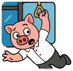 <code>javni-prevoz</code> | `/arrival/prevoz/`  Предлагается оставить: отдельного основания для замены по теме страницы и канонической семантике не найдено. |  <code>javni-prevoz</code> |
|  <code>auto</code> | `/arrival/rentacar/`  Предлагается оставить: отдельного основания для замены по теме страницы и канонической семантике не найдено. |  <code>auto</code> |
|  <code>burger</code> | `/arrival/shops/`  Страница о магазинах и повседневных покупках; `shopping-lidl` — канонический shopping-сюжет. |  <code>shopping-lidl</code> |
|  <code>travel</code> | `/arrival/visarun/`  Предлагается оставить: отдельного основания для замены по теме страницы и канонической семантике не найдено. |  <code>travel</code> |
|  <code>id</code> | `/arrival/zdravlje/`  По ревью для раздела здравоохранения используем `medical-morpheus` как яркий медицинский образ вместо идентификационного `id`. |  <code>medical-morpheus</code> |
|  <code>id</code> | `/beli-karton/`  Предлагается оставить: отдельного основания для замены по теме страницы и канонической семантике не найдено. |  <code>id</code> |
|  <code>blogerka</code> | `/blog/chto_izmenilos_v_rslive_za_mesjac/`  Материал об изменениях самого проекта; `logo` является прямой семантической привязкой. |  <code>logo</code> |
|  <code>blogerka</code> | `/blog/dobro_pozhalovat_v_instrukciju_po_serbii/`  Материал о самом RSLive; `logo` описывает проект, а `blogerka` — сатиру на блогеров. |  <code>logo</code> |
|  <code>blogerka</code> | `/blog/gde_dorozhe_v_rossii_ili_v_serbii/`  Сравнение расходов и стоимости жизни; финансовый OG соответствует предмету. |  <code>payment-card</code> |
|  <code>blogerka</code> | `/blog/javljaetsja_li_serbija_bezopasnoj_stranoj/`  Страница сопоставляет данные о безопасности и рисках; исследовательский OG точнее. |  <code>internet-research</code> |
|  <code>blogerka</code> | `/blog/javljaetsja_li_serbija_xoroshej_stranoj_dlja_pereezda/`  Материал оценивает практические условия переезда; миграционный OG соответствует теме. |  <code>move-stuff</code> |
|  <code>blogerka</code> | `/blog/kak_otnosjatsja_k_lgbt_v_serbii/`  Фактологический обзор права и общественных данных; нужен нейтральный исследовательский OG. |  <code>internet-research</code> |
|  <code>blogerka</code> | `/blog/kak_v_serbii_otnosjatsja_k_russkim/`  Обзор исторических, социальных и политических факторов; исследовательский OG без сатирического оттенка. |  <code>internet-research</code> |
|  <code>blogerka</code> | `/blog/kakaja_srednjaja_zarplata_v_serbii/`  Статья построена вокруг цифр и расчётов зарплаты; `calculation` со счётами визуально передаёт это точнее `looking-for-salary`. |  <code>calculation</code> |
|  <code>blogerka</code> | `/blog/kogda_serbija_budet_v_es/`  Фактологический разбор переговоров и условий вступления; нейтральный исследовательский OG. |  <code>internet-research</code> |
|  <code>blogerka</code> | `/blog/kogo_podderzhala_serbija_v_vojne_s_ukrainoj/`  Фактологический разбор внешнеполитических решений; нейтральный исследовательский OG. |  <code>internet-research</code> |
|  <code>blogerka</code> | `/blog/osnovnye_nalogovye_objazatelstva_do_konca_goda_v_serbii/`  Ключевой смысл — календарные налоговые сроки до конца года. |  <code>calendar</code> |
|  <code>blogerka</code> | `/blog/pochemu_russkie_edut_v_serbiju/`  Для материала о переезде россиян выбран `tractor` как более характерная визуальная метафора миграции, чем общий `move-stuff`. |  <code>tractor</code> |
|  <code>blogerka</code> | `/blog/pochemu_serbija_byla_pod_sankcijami/`  Историко-политический справочный материал; нейтральный исследовательский OG. |  <code>internet-research</code> |
|  <code>blogerka</code> | `/blog/pochemu_serbija_ljubit_rossiju/`  Историко-социальный разбор; исследовательская метафора точнее сатирической «блогерки». |  <code>internet-research</code> |
|  <code>blogerka</code> | `/blog/pochemu_serbija_luchshaja_strana_dlja_immigracii_russkix/`  Основной предмет — иммиграция и переезд; `move-stuff` соответствует содержанию без блогерской сатиры. |  <code>move-stuff</code> |
|  <code>blogerka</code> | `/blog/serbija_samaja_dinamichno_rastuschaja_ehkonomika_evropy/`  Экономический рост и показатели; инвестиционно-экономическая метафора точнее. |  <code>investments-stock</code> |
|  <code>giant-book</code> | `/children/`  Раздел целиком о детях; `child` прямее общего `giant-book`. |  <code>child</code> |
|  <code>fallback → giant-book</code> | `/children/birth/`  Рождение ребёнка — прямой сюжет `child`; сейчас страница уходит в generic fallback. |  <code>child</code> |
|  <code>child</code> | `/children/kindergarten/`  Предлагается оставить: отдельного основания для замены по теме страницы и канонической семантике не найдено. |  <code>child</code> |
|  <code>giant-book</code> | `/children/school/`  Школьный раздел; `schoolchild` точнее общего `giant-book`. |  <code>schoolchild</code> |
|  <code>auto</code> | `/drive/`  Предлагается оставить: отдельного основания для замены по теме страницы и канонической семантике не найдено. |  <code>auto</code> |
|  <code>auto</code> | `/drive/buy/`  Предлагается оставить: отдельного основания для замены по теме страницы и канонической семантике не найдено. |  <code>auto</code> |
|  <code>auto</code> | `/drive/parking/`  Предлагается оставить: отдельного основания для замены по теме страницы и канонической семантике не найдено. |  <code>auto</code> |
|  <code>auto</code> | `/drive/register_auto/`  Предлагается оставить: отдельного основания для замены по теме страницы и канонической семантике не найдено. |  <code>auto</code> |
|  <code>giant-book</code> | `/edu/`  Предлагается оставить: отдельного основания для замены по теме страницы и канонической семантике не найдено. |  <code>giant-book</code> |
|  <code>schoolchild</code> | `/edu/school/`  Предлагается оставить: отдельного основания для замены по теме страницы и канонической семантике не найдено. |  <code>schoolchild</code> |
|  <code>giant-book</code> | `/edu/school/daily-life/`  Предлагается оставить: отдельного основания для замены по теме страницы и канонической семантике не найдено. |  <code>giant-book</code> |
|  <code>giant-book</code> | `/edu/school/enrollment/`  Предлагается оставить: отдельного основания для замены по теме страницы и канонической семантике не найдено. |  <code>giant-book</code> |
|  <code>giant-book</code> | `/edu/school/international/`  Предлагается оставить: отдельного основания для замены по теме страницы и канонической семантике не найдено. |  <code>giant-book</code> |
| 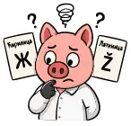 <code>alphabets-mess</code> | `/edu/school/languages/`  Предлагается оставить: отдельного основания для замены по теме страницы и канонической семантике не найдено. |  <code>alphabets-mess</code> |
|  <code>giant-book</code> | `/edu/school/resources/`  Предлагается оставить: отдельного основания для замены по теме страницы и канонической семантике не найдено. |  <code>giant-book</code> |
|  <code>giant-book</code> | `/edu/school/secondary-admission/`  Предлагается оставить: отдельного основания для замены по теме страницы и канонической семантике не найдено. |  <code>giant-book</code> |
|  <code>student-graduation</code> | `/edu/university/`  Предлагается оставить: отдельного основания для замены по теме страницы и канонической семантике не найдено. |  <code>student-graduation</code> |
|  <code>giant-book</code> | `/en/`  Предлагается оставить: отдельного основания для замены по теме страницы и канонической семантике не найдено. |  <code>giant-book</code> |
|  <code>logo</code> | `/en/about/`  Предлагается оставить: отдельного основания для замены по теме страницы и канонической семантике не найдено. |  <code>logo</code> |
|  <code>fallback → giant-book</code> | `/en/about/advertising/`  Английская версия страницы о рекламе RSLive; `logo` логично связывает её с проектом. |  <code>logo</code> |
|  <code>letter-list</code> | `/en/about/privacy/`  English privacy page follows the Russian sticker choice: `investigation`. |  <code>investigation</code> |
|  <code>petar</code> | `/en/about/stickers/`  Предлагается оставить: отдельного основания для замены по теме страницы и канонической семантике не найдено. |  <code>petar</code> |
|  <code>smartphone</code> | `/en/foreigner-residence-registration/`  English version of the same eUprava/eID procedure is aligned with the Serbian page and uses `eid`. |  <code>eid</code> |
|  <code>petar</code> | `/en/pig-peter/`  Предлагается оставить: отдельного основания для замены по теме страницы и канонической семантике не найдено. |  <code>petar</code> |
|  <code>party</code> | `/en/russians-in-serbia/`  Энциклопедический раздел о русских в Сербии; `russian-flag` точнее `party`, который означает вечеринку. |  <code>russian-flag</code> |
|  <code>internet-research</code> | `/en/russians-in-serbia/demographics/`  English counterpart of `/adaptation/russians/count/` follows the Russian review choice: `calculation`. |  <code>calculation</code> |
|  <code>giant-book</code> | `/en/russians-in-serbia/ksors/`  English KSORS page follows the Russian KSORS review choice: `balalajka`. |  <code>balalajka</code> |
|  <code>letter-list</code> | `/en/russians-in-serbia/national-council/`  English National Council page follows the Russian review choice: `russian-flag`. |  <code>russian-flag</code> |
|  <code>solid-house</code> | `/en/russians-in-serbia/russian-house/`  English Russian House page follows the Russian review choice: `russian-flag`. |  <code>russian-flag</code> |
|  <code>bureaucracy</code> | `/gov/`  Предлагается оставить: отдельного основания для замены по теме страницы и канонической семантике не найдено. |  <code>bureaucracy</code> |
|  <code>wizard</code> | `/gov/consul_prime/`  Предлагается оставить: отдельного основания для замены по теме страницы и канонической семантике не найдено. |  <code>wizard</code> |
|  <code>letter-list</code> | `/gov/consumer-rights/`  Предлагается оставить: отдельного основания для замены по теме страницы и канонической семантике не найдено. |  <code>letter-list</code> |
|  <code>judge-court</code> | `/gov/courts/`  Предлагается оставить: отдельного основания для замены по теме страницы и канонической семантике не найдено. |  <code>judge-court</code> |
|  <code>letter-list</code> | `/gov/family/`  Предлагается оставить: отдельного основания для замены по теме страницы и канонической семантике не найдено. |  <code>letter-list</code> |
|  <code>letter-list</code> | `/gov/law/`  Предлагается оставить: отдельного основания для замены по теме страницы и канонической семантике не найдено. |  <code>letter-list</code> |
|  <code>letter-list</code> | `/gov/law/labor/`  Предлагается оставить: отдельного основания для замены по теме страницы и канонической семантике не найдено. |  <code>letter-list</code> |
|  <code>letter-list</code> | `/gov/law/labor/russia/`  Предлагается оставить: отдельного основания для замены по теме страницы и канонической семантике не найдено. |  <code>letter-list</code> |
|  <code>approve</code> | `/gov/law/license/`  Предлагается оставить: отдельного основания для замены по теме страницы и канонической семантике не найдено. |  <code>approve</code> |
|  <code>party</code> | `/gov/law/license/music/`  Предлагается оставить: отдельного основания для замены по теме страницы и канонической семантике не найдено. |  <code>party</code> |
|  <code>plane</code> | `/gov/law/license/tourist/`  Для туристической лицензии по ревью используем `bus`: туристический транспорт даёт более узнаваемый отраслевой образ. |  <code>bus</code> |
|  <code>building-a-house</code> | `/gov/law/lost-house-documents/`  Предлагается оставить: отдельного основания для замены по теме страницы и канонической семантике не найдено. |  <code>building-a-house</code> |
|  <code>lawyer</code> | `/gov/lawyer/`  Предлагается оставить: отдельного основания для замены по теме страницы и канонической семантике не найдено. |  <code>lawyer</code> |
|  <code>notarius</code> | `/gov/notary/`  Предлагается оставить: отдельного основания для замены по теме страницы и канонической семантике не найдено. |  <code>notarius</code> |
|  <code>id</code> | `/gov/notguilty/`  Для справки о несудимости выбран `wizard`: намеренно ироничный образ бюрократической «магии документов». |  <code>wizard</code> |
|  <code>letter-list</code> | `/gov/ombudsman/`  Омбудсман защищает права граждан и разбирает обращения; по ревью используем юридический стикер `lawyer`. |  <code>lawyer</code> |
|  <code>payment-card</code> | `/gov/taxes/`  По ревью весь раздел `/gov/taxes/*` маркируем `calculation`: поросёнок со счётами становится единым визуальным образом налогов, расчётов и обязательств. |  <code>calculation</code> |
|  <code>payment-card</code> | `/gov/taxes/assets/`  По ревью весь раздел `/gov/taxes/*` маркируем `calculation`: поросёнок со счётами становится единым визуальным образом налогов, расчётов и обязательств. |  <code>calculation</code> |
|  <code>payment-card</code> | `/gov/taxes/assets/capital-gains/`  По ревью весь раздел `/gov/taxes/*` маркируем `calculation`: поросёнок со счётами становится единым визуальным образом налогов, расчётов и обязательств. |  <code>calculation</code> |
|  <code>payment-card</code> | `/gov/taxes/assets/foreign-assets/`  По ревью весь раздел `/gov/taxes/*` маркируем `calculation`: поросёнок со счётами становится единым визуальным образом налогов, расчётов и обязательств. |  <code>calculation</code> |
|  <code>payment-card</code> | `/gov/taxes/assets/property/`  По ревью весь раздел `/gov/taxes/*` маркируем `calculation`: поросёнок со счётами становится единым визуальным образом налогов, расчётов и обязательств. |  <code>calculation</code> |
|  <code>payment-card</code> | `/gov/taxes/borovak/`  По ревью весь раздел `/gov/taxes/*` маркируем `calculation`: поросёнок со счётами становится единым визуальным образом налогов, расчётов и обязательств. |  <code>calculation</code> |
|  <code>payment-card</code> | `/gov/taxes/business/`  По ревью весь раздел `/gov/taxes/*` маркируем `calculation`: поросёнок со счётами становится единым визуальным образом налогов, расчётов и обязательств. |  <code>calculation</code> |
|  <code>payment-card</code> | `/gov/taxes/business/dividends/`  По ревью весь раздел `/gov/taxes/*` маркируем `calculation`: поросёнок со счётами становится единым визуальным образом налогов, расчётов и обязательств. |  <code>calculation</code> |
|  <code>payment-card</code> | `/gov/taxes/business/doo/`  По ревью весь раздел `/gov/taxes/*` маркируем `calculation`: поросёнок со счётами становится единым визуальным образом налогов, расчётов и обязательств. |  <code>calculation</code> |
|  <code>payment-card</code> | `/gov/taxes/business/pdv/`  По ревью весь раздел `/gov/taxes/*` маркируем `calculation`: поросёнок со счётами становится единым визуальным образом налогов, расчётов и обязательств. |  <code>calculation</code> |
|  <code>payment-card</code> | `/gov/taxes/business/preduzetnik/`  По ревью весь раздел `/gov/taxes/*` маркируем `calculation`: поросёнок со счётами становится единым визуальным образом налогов, расчётов и обязательств. |  <code>calculation</code> |
|  <code>payment-card</code> | `/gov/taxes/calculation/`  По ревью весь раздел `/gov/taxes/*` маркируем `calculation`: поросёнок со счётами становится единым визуальным образом налогов, расчётов и обязательств. |  <code>calculation</code> |
|  <code>uplatnica</code> | `/gov/taxes/codes/`  По ревью весь раздел `/gov/taxes/*` маркируем `calculation`: поросёнок со счётами становится единым визуальным образом налогов, расчётов и обязательств. |  <code>calculation</code> |
|  <code>payment-card</code> | `/gov/taxes/eco/`  По ревью весь раздел `/gov/taxes/*` маркируем `calculation`: поросёнок со счётами становится единым визуальным образом налогов, расчётов и обязательств. |  <code>calculation</code> |
|  <code>payment-card</code> | `/gov/taxes/eporezi/`  По ревью весь раздел `/gov/taxes/*` маркируем `calculation`: поросёнок со счётами становится единым визуальным образом налогов, расчётов и обязательств. |  <code>calculation</code> |
|  <code>payment-card</code> | `/gov/taxes/marketplace/`  По ревью весь раздел `/gov/taxes/*` маркируем `calculation`: поросёнок со счётами становится единым визуальным образом налогов, расчётов и обязательств. |  <code>calculation</code> |
|  <code>payment-card</code> | `/gov/taxes/overpayment/`  По ревью весь раздел `/gov/taxes/*` маркируем `calculation`: поросёнок со счётами становится единым визуальным образом налогов, расчётов и обязательств. |  <code>calculation</code> |
|  <code>payment-card</code> | `/gov/taxes/personal/`  По ревью весь раздел `/gov/taxes/*` маркируем `calculation`: поросёнок со счётами становится единым визуальным образом налогов, расчётов и обязательств. |  <code>calculation</code> |
|  <code>payment-card</code> | `/gov/taxes/personal/annual-income/`  По ревью весь раздел `/gov/taxes/*` маркируем `calculation`: поросёнок со счётами становится единым визуальным образом налогов, расчётов и обязательств. |  <code>calculation</code> |
|  <code>payment-card</code> | `/gov/taxes/personal/foreign-income/`  По ревью весь раздел `/gov/taxes/*` маркируем `calculation`: поросёнок со счётами становится единым визуальным образом налогов, расчётов и обязательств. |  <code>calculation</code> |
|  <code>payment-card</code> | `/gov/taxes/personal/freelance/`  По ревью весь раздел `/gov/taxes/*` маркируем `calculation`: поросёнок со счётами становится единым визуальным образом налогов, расчётов и обязательств. |  <code>calculation</code> |
|  <code>payment-card</code> | `/gov/taxes/personal/salary/`  По ревью весь раздел `/gov/taxes/*` маркируем `calculation`: поросёнок со счётами становится единым визуальным образом налогов, расчётов и обязательств. |  <code>calculation</code> |
|  <code>payment-card</code> | `/gov/taxes/residency/`  По ревью весь раздел `/gov/taxes/*` маркируем `calculation`: поросёнок со счётами становится единым визуальным образом налогов, расчётов и обязательств. |  <code>calculation</code> |
|  <code>payment-card</code> | `/gov/taxes/tax-free/`  По ревью весь раздел `/gov/taxes/*` маркируем `calculation`: поросёнок со счётами становится единым визуальным образом налогов, расчётов и обязательств. |  <code>calculation</code> |
|  <code>id</code> | `/gov/uverenje_boravak/`  Для уверения о боравку выбран `wizard`: документальная процедура получает тот же ироничный образ «магии справок». |  <code>wizard</code> |
|  <code>map</code> | `/graph/`  Предлагается оставить: отдельного основания для замены по теме страницы и канонической семантике не найдено. |  <code>map</code> |
|  <code>passport</code> | `/integration/`  Корень раздела интеграции по ревью получает `seljak` — намеренный локальный сербский образ вместо нейтрального административного. |  <code>seljak</code> |
|  <code>letter-list</code> | `/integration/apostil/`  Апостиль — ещё одна формальная документальная процедура; по ревью используем `wizard` как образ «магии документов». |  <code>wizard</code> |
|  <code>auto</code> | `/integration/autoobuka/`  Предлагается оставить: отдельного основания для замены по теме страницы и канонической семантике не найдено. |  <code>auto</code> |
|  <code>letter-list</code> | `/integration/dresscode/`  Для делового дресс-кода выбран `businessman` — хрюшка в костюме прямо соответствует теме одежды для деловой среды. |  <code>businessman</code> |
|  <code>auto</code> | `/integration/driver_license/`  Водительское удостоверение — идентификационный документ; по ревью используем `id`. |  <code>id</code> |
|  <code>smartphone</code> | `/integration/euprava/`  eUprava — электронные государственные услуги и идентификация; `eid` даёт прямую цифровую административную привязку. |  <code>eid</code> |
| 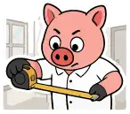 <code>montage</code> | `/integration/house/`  Предлагается оставить: отдельного основания для замены по теме страницы и канонической семантике не найдено. |  <code>montage</code> |
|  <code>investments-stock</code> | `/integration/investment/`  Предлагается оставить: отдельного основания для замены по теме страницы и канонической семантике не найдено. |  <code>investments-stock</code> |
|  <code>letter-list</code> | `/integration/law_changes_2024/`  Предлагается оставить: отдельного основания для замены по теме страницы и канонической семантике не найдено. |  <code>letter-list</code> |
|  <code>passport</code> | `/integration/passport/`  Страница посвящена гражданству и сербскому паспорту; используем канонический `citizenship`. |  <code>citizenship</code> |
|  <code>smartphone</code> | `/integration/prijavastranca/`  Онлайн-регистрация иностранца идёт через электронный государственный сервис; по ревью используем `eid`. |  <code>eid</code> |
|  <code>house-keys</code> | `/integration/properties/`  Предлагается оставить: отдельного основания для замены по теме страницы и канонической семантике не найдено. |  <code>house-keys</code> |
|  <code>letter-list</code> | `/integration/social/`  Раздел посвящён социальной поддержке и пенсионному обеспечению; `penzioner` — канонический стикер для пенсий и соцобеспечения. |  <code>penzioner</code> |
|  <code>passport</code> | `/integration/stalni/`  Предлагается оставить: отдельного основания для замены по теме страницы и канонической семантике не найдено. |  <code>passport</code> |
|  <code>map</code> | `/integration/stalni/change-address/`  Для смены адреса ПМЖ по ревью выбран `move-stuff`: стикер с вещами и коробками передаёт сам переезд на новый адрес. |  <code>move-stuff</code> |
|  <code>passport</code> | `/integration/visas/`  Для визового раздела по ревью выбран `travel` как прямой образ поездок и визовых перемещений. |  <code>travel</code> |
|  <code>logo</code> | `/intro/`  Предлагается оставить: отдельного основания для замены по теме страницы и канонической семантике не найдено. |  <code>logo</code> |
|  <code>kafa-coffee</code> | `/lifestyle/`  Для корня раздела «Жизнь» по ревью выбран `white-coat-snob` как характерный редакционный образ lifestyle-раздела. |  <code>white-coat-snob</code> |
|  <code>fallback → giant-book</code> | `/lifestyle/coffee-bakeries-desserts/`  Кофейни, пекарни и десерты; `kafa-coffee` даёт прямой тематический образ вместо fallback. |  <code>kafa-coffee</code> |
|  <code>kafana</code> | `/lifestyle/culture/`  Предлагается оставить: отдельного основания для замены по теме страницы и канонической семантике не найдено. |  <code>kafana</code> |
|  <code>fallback → giant-book</code> | `/lifestyle/culture/belgrade-neighborhoods/`  Для районов Белграда по ревью выбран `white-coat-snob` как городской lifestyle-образ вместо общей карты. |  <code>white-coat-snob</code> |
|  <code>fallback → giant-book</code> | `/lifestyle/culture/books/`  Книги и чтение; `book-reader` — прямой канонический сюжет. |  <code>book-reader</code> |
|  <code>fallback → giant-book</code> | `/lifestyle/culture/events/`  Культурные события завязаны на даты; `calendar` точнее fallback. |  <code>calendar</code> |
|  <code>godfather</code> | `/lifestyle/culture/kum/`  Предлагается оставить: отдельного основания для замены по теме страницы и канонической семантике не найдено. |  <code>godfather</code> |
|  <code>fallback → giant-book</code> | `/lifestyle/culture/museums/`  Музеи — культурно-образовательная тема; `book-reader` ближе generic fallback. |  <code>book-reader</code> |
|  <code>uskrs</code> | `/lifestyle/culture/slava/`  Для славы по ревью выбран `fireworks`: праздничный образ вместо пасхального стикера. |  <code>fireworks</code> |
|  <code>volunteer-ecology</code> | `/lifestyle/ecology/`  Предлагается оставить: отдельного основания для замены по теме страницы и канонической семантике не найдено. |  <code>volunteer-ecology</code> |
|  <code>fallback → giant-book</code> | `/lifestyle/ecology/recycling/`  Переработка — экологическая тема; `volunteer-ecology` точнее generic fallback. |  <code>volunteer-ecology</code> |
|  <code>fallback → giant-book</code> | `/lifestyle/familiar-foods/`  Привычные русскоязычной аудитории продукты напрямую соответствуют `russian-food`. |  <code>russian-food</code> |
|  <code>map</code> | `/lifestyle/fishing/`  Предлагается оставить: отдельного основания для замены по теме страницы и канонической семантике не найдено. |  <code>map</code> |
|  <code>party</code> | `/lifestyle/fun/`  Для общего раздела развлечений по ревью выбран `karaoke` как более характерный образ досуга. |  <code>karaoke</code> |
|  <code>party</code> | `/lifestyle/fun/dance/`  Предлагается оставить: отдельного основания для замены по теме страницы и канонической семантике не найдено. |  <code>party</code> |
| 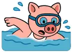 <code>swimming</code> | `/lifestyle/fun/pools/`  Предлагается оставить: отдельного основания для замены по теме страницы и канонической семантике не найдено. |  <code>swimming</code> |
|  <code>giant-book</code> | `/lifestyle/history/`  Предлагается оставить: отдельного основания для замены по теме страницы и канонической семантике не найдено. |  <code>giant-book</code> |
|  <code>giant-book</code> | `/lifestyle/history/nato/`  Предлагается оставить: отдельного основания для замены по теме страницы и канонической семантике не найдено. |  <code>giant-book</code> |
|  <code>giant-book</code> | `/lifestyle/history/oluja/`  Предлагается оставить: отдельного основания для замены по теме страницы и канонической семантике не найдено. |  <code>giant-book</code> |
|  <code>map</code> | `/lifestyle/history/raska/`  Предлагается оставить: отдельного основания для замены по теме страницы и канонической семантике не найдено. |  <code>map</code> |
|  <code>giant-book</code> | `/lifestyle/history/srebrenica/`  Предлагается оставить: отдельного основания для замены по теме страницы и канонической семантике не найдено. |  <code>giant-book</code> |
|  <code>giant-book</code> | `/lifestyle/history/yugoslavia/`  Предлагается оставить: отдельного основания для замены по теме страницы и канонической семантике не найдено. |  <code>giant-book</code> |
|  <code>fallback → giant-book</code> | `/lifestyle/holidays/`  Для общего раздела праздников выбран `fireworks` как прямой праздничный образ. |  <code>fireworks</code> |
|  <code>fallback → giant-book</code> | `/lifestyle/local-goods/`  Страница о покупке местных товаров; `checkout` обозначает покупки без привязки к конкретной сети. |  <code>checkout</code> |
|  <code>willy-wonka</code> | `/lifestyle/proscons/`  Предлагается оставить: отдельного основания для замены по теме страницы и канонической семантике не найдено. |  <code>willy-wonka</code> |
| 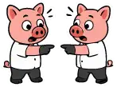 <code>spiderman-not-me-scam</code> | `/lifestyle/second-hand/`  Предлагается оставить: отдельного основания для замены по теме страницы и канонической семантике не найдено. |  <code>spiderman-not-me-scam</code> |
|  <code>fallback → giant-book</code> | `/lifestyle/serbian-food/`  Сербская еда; `pecenje` — узнаваемый канонический гастрономический образ. |  <code>pecenje</code> |
|  <code>map</code> | `/lifestyle/travel/`  Для корня раздела путешествий по Сербии выбран канонический `travel`. |  <code>travel</code> |
|  <code>map</code> | `/lifestyle/travel/banje/`  Для поездок по сербским баням по ревью выбран `bara-luzha` — намеренно шуточный водный образ. |  <code>bara-luzha</code> |
|  <code>fallback → giant-book</code> | `/lifestyle/travel/events-calendar/`  Это календарь событий; `calendar` точнее fallback. |  <code>calendar</code> |
|  <code>map</code> | `/lifestyle/travel/fortresses/`  Для туристического маршрута по крепостям выбран `sava-selfie`: поросёнок с фотоаппаратом у достопримечательности используется как общий образ поездок по местам Сербии. |  <code>sava-selfie</code> |
|  <code>map</code> | `/lifestyle/travel/fruska-gora-sremski-karlovci/`  Для конкретного туристического маршрута выбран `sava-selfie` как общий образ поездки по достопримечательностям Сербии. |  <code>sava-selfie</code> |
|  <code>map</code> | `/lifestyle/travel/ovcar-kablar-cacak/`  Для конкретного туристического маршрута выбран `sava-selfie` как общий образ поездки по достопримечательностям Сербии. |  <code>sava-selfie</code> |
|  <code>map</code> | `/lifestyle/travel/resava/`  Для конкретного туристического маршрута выбран `sava-selfie` как общий образ поездки по достопримечательностям Сербии. |  <code>sava-selfie</code> |
|  <code>map</code> | `/lifestyle/travel/rtanj/`  Для конкретного туристического маршрута выбран `sava-selfie` как общий образ поездки по достопримечательностям Сербии. |  <code>sava-selfie</code> |
|  <code>map</code> | `/lifestyle/travel/short-nature-trips/`  Для подборки коротких поездок выбран `sava-selfie` как общий образ туриста с фотоаппаратом. |  <code>sava-selfie</code> |
|  <code>map</code> | `/lifestyle/travel/south-banate/`  Для конкретного туристического маршрута выбран `sava-selfie` как общий образ поездки по достопримечательностям Сербии. |  <code>sava-selfie</code> |
|  <code>map</code> | `/lifestyle/travel/stari-ras-novi-pazar/`  Для конкретного туристического маршрута выбран `sava-selfie` как общий образ поездки по достопримечательностям Сербии. |  <code>sava-selfie</code> |
|  <code>map</code> | `/lifestyle/travel/vojvodina-cities/`  Для маршрута по городам Воеводины выбран `sava-selfie` как общий туристический образ. |  <code>sava-selfie</code> |
|  <code>map</code> | `/lifestyle/travel/wine-regions/`  Для маршрута по винным регионам выбран `sava-selfie` как общий образ туристической поездки. |  <code>sava-selfie</code> |
|  <code>map</code> | `/lifestyle/travel/winter-serbia/`  Для зимних поездок по Сербии выбран `cold-weather`, прямо соответствующий сезонной теме. |  <code>cold-weather</code> |
|  <code>map</code> | `/lifestyle/travel/yugoslav-spomenici/`  Для спомеников Югославии выбран `mir-trud-maj`: стикер прямо отсылает к общему социалистическому прошлому. |  <code>mir-trud-maj</code> |
|  <code>fallback → giant-book</code> | `/lifestyle/world-cuisines-belgrade/`  Рестораны и кухни мира; `menu-restorant` передаёт ресторанную тему. |  <code>menu-restorant</code> |
|  <code>map</code> | `/list/`  Предлагается оставить: отдельного основания для замены по теме страницы и канонической семантике не найдено. |  <code>map</code> |
|  <code>pecenje</code> | `/m25/`  Для страницы `/m25/` по ревью выбран `joker`. |  <code>joker</code> |
|  <code>giant-book</code> | `/m26/`  Для страницы `/m26/` по ревью выбран `joker`. |  <code>joker</code> |
|  <code>map</code> | `/map/`  Предлагается оставить: отдельного основания для замены по теме страницы и канонической семантике не найдено. |  <code>map</code> |
|  <code>map</code> | `/map/banje/`  Предлагается оставить: отдельного основания для замены по теме страницы и канонической семантике не найдено. |  <code>map</code> |
|  <code>map</code> | `/map/blacklist/`  Предлагается оставить: отдельного основания для замены по теме страницы и канонической семантике не найдено. |  <code>map</code> |
|  <code>fallback → giant-book</code> | `/map/cuisine/`  Для карты заведений и кухонь используем `kafana`: поросёнок в кафане сразу задаёт гастрономический контекст лучше generic `map`. |  <code>kafana</code> |
|  <code>party</code> | `/map/dance/`  Для карты танцевальных мест выбран `disco` — канонический стикер с диско-тематикой. |  <code>disco</code> |
|  <code>fallback → giant-book</code> | `/map/familiar-foods/`  Хотя это карта, её предмет — привычные русские продукты; тематический `russian-food` полезнее generic `map`. |  <code>russian-food</code> |
|  <code>no-drinking</code> | `/map/nosmoke/`  `no-drinking` семантически про алкоголь; канонический `gas-smoke-gray` прямо предназначен для дыма и некурящих мест. |  <code>gas-smoke-gray</code> |
|  <code>map</code> | `/map/prevodioci/`  Предлагается оставить: отдельного основания для замены по теме страницы и канонической семантике не найдено. |  <code>map</code> |
|  <code>id</code> | `/map/ruska_ambasada/`  Для карты российского посольства выбран `passport` как паспортно-консульский образ. |  <code>passport</code> |
|  <code>kafana</code> | `/map/ruskadusa/`  Предлагается оставить: отдельного основания для замены по теме страницы и канонической семантике не найдено. |  <code>kafana</code> |
|  <code>map</code> | `/map/smallrf/`  Для карты мест русского сообщества выбран `russian-flag`. |  <code>russian-flag</code> |
|  <code>judge-court</code> | `/map/sud/`  Предлагается оставить: отдельного основания для замены по теме страницы и канонической семантике не найдено. |  <code>judge-court</code> |
|  <code>passport</code> | `/map/upravazastrance/`  Предлагается оставить: отдельного основания для замены по теме страницы и канонической семантике не найдено. |  <code>passport</code> |
|  <code>id</code> | `/med/`  Корневой медицинский раздел; `doctor` точнее идентификационного `id`. |  <code>doctor</code> |
|  <code>id</code> | `/med/blood-donation/`  Донорство крови — медицинская тема; `doctor` точнее `id`. |  <code>doctor</code> |
|  <code>payment-card</code> | `/med/dms/`  Для раздела ДМС выбран `doctor`: это медицинская страховка, поэтому медицинский образ точнее банковской карты. |  <code>doctor</code> |
|  <code>payment-card</code> | `/med/dms/ddor/`  Для страницы ДМС страховщика выбран `doctor` как общий медицинский образ раздела. |  <code>doctor</code> |
|  <code>payment-card</code> | `/med/dms/dunav/`  Для страницы ДМС страховщика выбран `doctor` как общий медицинский образ раздела. |  <code>doctor</code> |
|  <code>payment-card</code> | `/med/dms/triglav/`  Для страницы ДМС страховщика выбран `doctor` как общий медицинский образ раздела. |  <code>doctor</code> |
|  <code>payment-card</code> | `/med/dms/uniqa/`  Для страницы ДМС страховщика выбран `doctor` как общий медицинский образ раздела. |  <code>doctor</code> |
|  <code>payment-card</code> | `/med/dms/wiener/`  Для страницы ДМС страховщика выбран `doctor` как общий медицинский образ раздела. |  <code>doctor</code> |
|  <code>doctor</code> | `/med/doctors/`  Предлагается оставить: отдельного основания для замены по теме страницы и канонической семантике не найдено. |  <code>doctor</code> |
|  <code>doctor</code> | `/med/doctors/phrases/`  Предлагается оставить: отдельного основания для замены по теме страницы и канонической семантике не найдено. |  <code>doctor</code> |
|  <code>doctor</code> | `/med/familiar-medicines/`  Для страницы привычных лекарств выбран `medical-morpheus`: канонический стикер предназначен для медикаментов и выбора лечения. |  <code>medical-morpheus</code> |
|  <code>doctor</code> | `/med/medications/`  Для раздела лекарств выбран `medical-morpheus`: канонический стикер предназначен для медикаментов и выбора лечения. |  <code>medical-morpheus</code> |
|  <code>id</code> | `/med/oms/`  Предлагается оставить: отдельного основания для замены по теме страницы и канонической семантике не найдено. |  <code>id</code> |
|  <code>map</code> | `/move/`  Для корня раздела переезда выбран `serbian-flag` как прямой образ переезда именно в Сербию. |  <code>serbian-flag</code> |
|  <code>letter-list</code> | `/move/army/`  Для страницы о военной обязанности и связанных вопросах выбран `russia-is-hearing` как тематический российский образ. |  <code>russia-is-hearing</code> |
|  <code>payment-card</code> | `/move/exchange/`  `exchange` прямо обозначает обмен валюты и обменные пункты; точнее общего `payment-card`. |  <code>exchange</code> |
|  <code>atm-fee</code> | `/move/finance/`  Предлагается оставить: отдельного основания для замены по теме страницы и канонической семантике не найдено. |  <code>atm-fee</code> |
|  <code>small-font-contract</code> | `/move/housing/`  Предлагается оставить: отдельного основания для замены по теме страницы и канонической семантике не найдено. |  <code>small-font-contract</code> |
|  <code>fallback → giant-book</code> | `/move/housing/electricity/`  Электричество в жилье связано с коммунальными начислениями и оплатой; `uplatnica` точнее generic fallback. |  <code>uplatnica</code> |
|  <code>fallback → giant-book</code> | `/move/housing/handover/`  Приём-передача жилья и ключей; `house-keys` — прямой сюжет. |  <code>house-keys</code> |
|  <code>fallback → giant-book</code> | `/move/housing/quiet-hours/`  Для статьи о кућном реду и тихих часах по ревью выбран `jebote` как характерный сербский бытовой образ. |  <code>jebote</code> |
|  <code>fallback → giant-book</code> | `/move/housing/utilities/`  Коммунальные услуги и счета; `uplatnica` точнее generic fallback. |  <code>uplatnica</code> |
|  <code>paperwork</code> | `/move/legal/`  Предлагается оставить: отдельного основания для замены по теме страницы и канонической семантике не найдено. |  <code>paperwork</code> |
|  <code>map</code> | `/move/myths/`  Для разбора мифов выбран `willy-wonka`: саркастический образ недоверия точнее общего исследовательского стикера. |  <code>willy-wonka</code> |
|  <code>auto</code> | `/move/pdd/`  Предлагается оставить: отдельного основания для замены по теме страницы и канонической семантике не найдено. |  <code>auto</code> |
| 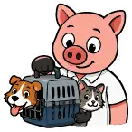 <code>pets</code> | `/move/pets/`  Предлагается оставить: отдельного основания для замены по теме страницы и канонической семантике не найдено. |  <code>pets</code> |
|  <code>move-stuff</code> | `/move/prepare/`  Предлагается оставить: отдельного основания для замены по теме страницы и канонической семантике не найдено. |  <code>move-stuff</code> |
|  <code>internet-research</code> | `/move/risks/`  Для страницы «Риски для уехавших из РФ» выбран `russia-is-hearing` как тематический российский риск/наблюдение-образ. |  <code>russia-is-hearing</code> |
|  <code>plane</code> | `/move/travel/`  Предлагается оставить: отдельного основания для замены по теме страницы и канонической семантике не найдено. |  <code>plane</code> |
|  <code>plane</code> | `/move/travel/turkey/`  Предлагается оставить: отдельного основания для замены по теме страницы и канонической семантике не найдено. |  <code>plane</code> |
|  <code>passport</code> | `/move/visa/`  Предлагается оставить: отдельного основания для замены по теме страницы и канонической семантике не найдено. |  <code>passport</code> |
|  <code>passport</code> | `/move/visa/other-countries/`  Для виз в другие страны выбран `travel` как прямой образ международных поездок. |  <code>travel</code> |
|  <code>giant-book</code> | `/ru/`  Предлагается оставить: отдельного основания для замены по теме страницы и канонической семантике не найдено. |  <code>giant-book</code> |
|  <code>fallback → giant-book</code> | `/sources/`  Страница источников и проверки информации; `internet-research` — прямой канонический сюжет. |  <code>internet-research</code> |
|  <code>giant-book</code> | `/sr/`  Предлагается оставить: отдельного основания для замены по теме страницы и канонической семантике не найдено. |  <code>giant-book</code> |
|  <code>logo</code> | `/sr/about/`  Предлагается оставить: отдельного основания для замены по теме страницы и канонической семантике не найдено. |  <code>logo</code> |
|  <code>fallback → giant-book</code> | `/sr/about/advertising/`  Сербская версия страницы о рекламе RSLive; `logo` логично связывает её с проектом. |  <code>logo</code> |
|  <code>letter-list</code> | `/sr/about/privacy/`  Српска верзија политике приватности прати избор руске странице: `investigation`. |  <code>investigation</code> |
|  <code>petar</code> | `/sr/about/stickers/`  Предлагается оставить: отдельного основания для замены по теме страницы и канонической семантике не найдено. |  <code>petar</code> |
|  <code>petar</code> | `/sr/prase-petar/`  Предлагается оставить: отдельного основания для замены по теме страницы и канонической семантике не найдено. |  <code>petar</code> |
|  <code>smartphone</code> | `/sr/prijava-boravista-stranca/`  Для сербской инструкции по электронной регистрации иностранца выбран `eid`: статья прямо построена вокруг eID, ConsentID и квалифицированного электронного сертификата. |  <code>eid</code> |
|  <code>small-font-contract</code> | `/sr/provera-stana-pre-najma/`  Предлагается оставить: отдельного основания для замены по теме страницы и канонической семантике не найдено. |  <code>small-font-contract</code> |
|  <code>party</code> | `/sr/rusi-u-srbiji/`  Энциклопедический раздел о русских в Сербии; `russian-flag` точнее `party`, который означает вечеринку. |  <code>russian-flag</code> |
|  <code>internet-research</code> | `/sr/rusi-u-srbiji/demografija/`  Српски пандан `/adaptation/russians/count/` прати руски избор: `calculation`. |  <code>calculation</code> |
|  <code>giant-book</code> | `/sr/rusi-u-srbiji/ksors/`  Српска страница КСОРС-а прати руски избор: `balalajka`. |  <code>balalajka</code> |
|  <code>letter-list</code> | `/sr/rusi-u-srbiji/nacionalni-savet/`  Српска страница Националног савета прати руски избор: `russian-flag`. |  <code>russian-flag</code> |
|  <code>solid-house</code> | `/sr/rusi-u-srbiji/ruski-dom/`  Српска страница Руског дома прати руски избор: `russian-flag`. |  <code>russian-flag</code> |
|  <code>giant-book</code> | `/sr/user/petro/`  Предлагается оставить: отдельного основания для замены по теме страницы и канонической семантике не найдено. |  <code>giant-book</code> |
|  <code>uplatnica</code> | `/uplatnica/`  Предлагается оставить: отдельного основания для замены по теме страницы и канонической семантике не найдено. |  <code>uplatnica</code> |

## Как комментировать

Оставляйте комментарий к конкретной строке: какой стикер выбрать вместо предложенного или почему текущий лучше. После согласования изменения `ogSticker` будут сделаны отдельным проходом.

## Ограничения

- Инвентарь MD/MDX и текущие значения `ogSticker` собраны автоматически из snapshot выше.
- Engine-owned маршруты без MDX помечены отдельно: этот файл не приписывает им выдуманный frontmatter.
- Семантика предложений сверяется с каноническим `astro/config/sticker-semantics.mjs` в `Antiokh/rslive.ru`.
