# Сверка смысла стикеров RSLive

Это временный review-файл для проверки семантики стикеров перед переносом описаний в канонический классификатор.

Оставляйте inline-комментарий прямо на строке нужного стикера в PR: что понял правильно, что неверно, какая там отсылка и где стикер уместно использовать. Здесь намеренно фиксируется не только буквальный сюжет, но и предполагаемый смысл. Это **не** финальный accessibility-alt.

Обозначение `⚠️` означает, что я вижу картинку, но не уверен в авторской отсылке или intended use.

| Стикер | Как я его понимаю сейчас |
| --- | --- |
| 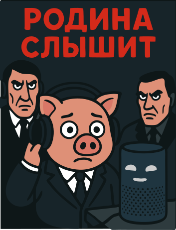 `state-spies` | Умная колонка выглядит безобидно, но за ней ФСБ-поросёнок слушает разговоры. Технофобия, цифровая слежка, недоверие к устройствам и умным колонкам. |
| 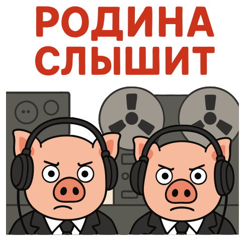 `russia-is-hearing` | «Родина слышит»: политическая активность, осторожность в высказываниях, ощущение наблюдения и самоцензура. |
| 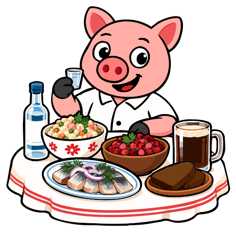 `russian-food` | Русская еда и привычные продукты: русская кухня, гастрономическая диаспора, ностальгия по знакомым продуктам. |
| 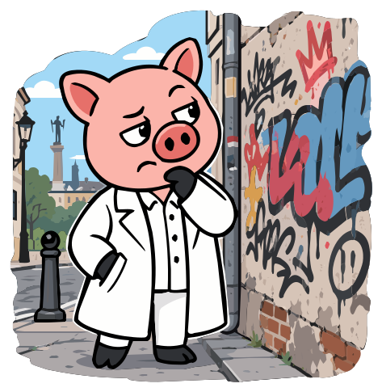 `white-coat-snob` | Мем про «белое пальто»: русские, уехавшие от проблем, но свысока критикующие Белград, местный быт и культурный облик. |
| 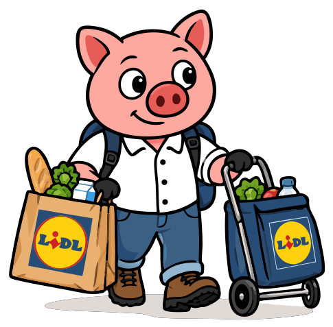 `shopping-lidl` | Повседневные покупки в супермаркете, экономия и поиск привычных продуктов. Не про люксовый шопинг. |
| 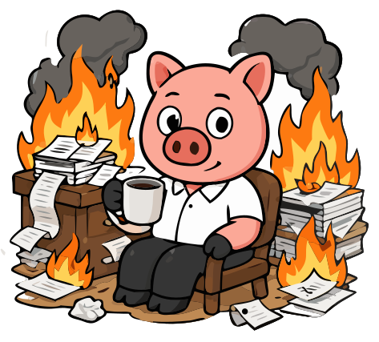 `its-ok-on-fire` | `This is fine`: всё горит, но сил переживать уже нет. Переезд, аврал, кризис, подготовка в условиях хаоса. |
|  `book-reader` | Книги, чтение и образование в целом; преподаватели, профессора, обучение и самостоятельное изучение. Не основной образ школьника или студента. |
| 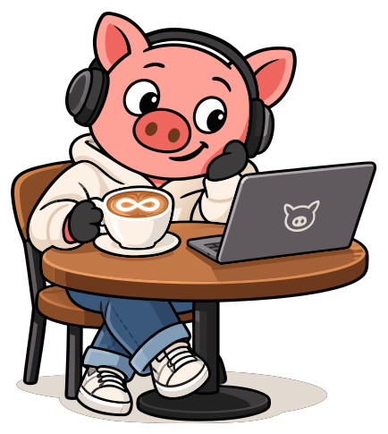 `freelancer` | Русский удалёнщик в сербском кафе: часами сидит с ноутбуком над одной чашкой кофе; наушники набекрень и простые кеды усиливают узнаваемый для сербов образ русских эмигрантов. Культурный контраст, фриланс, удалённая работа. |
| 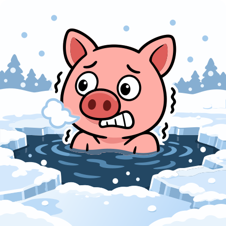 `cold-water` | Купание в ледяной воде: закаливание, зимнее купание и Крещение. Не просто зимняя погода. |
| 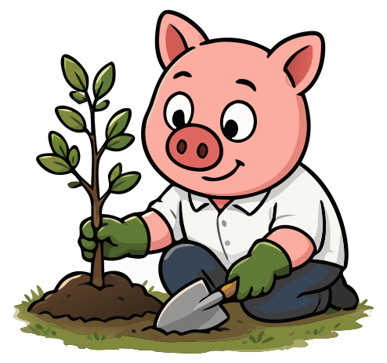 `volunteer-ecology` | Посадка дерева, эковолонтёрство, озеленение и экологические акции. |
| 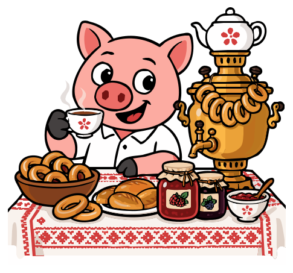 `samovar-tea` | Самовар и русское чаепитие: русские традиции, чай, тематические заведения и культурный контекст. |
| 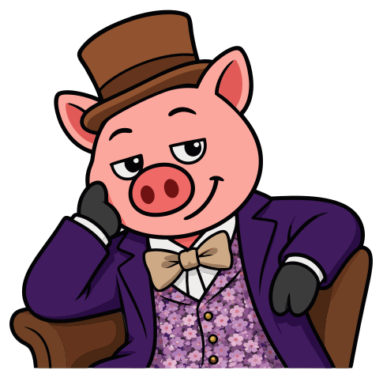 `willy-wonka` | Condescending Wonka: «ну расскажи мне ещё». Снисходительный сарказм, недоверие, реакция в духе `Curb Your Enthusiasm`. |
| 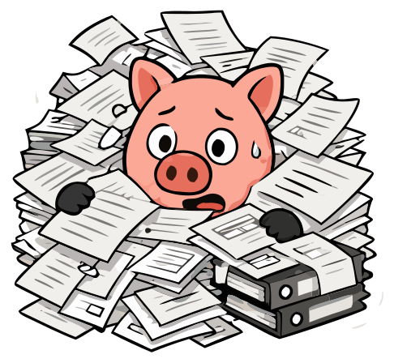 `paperwork` | Человек завален бумагами: документы, административная нагрузка, бюрократия, оформление множества справок. |
| 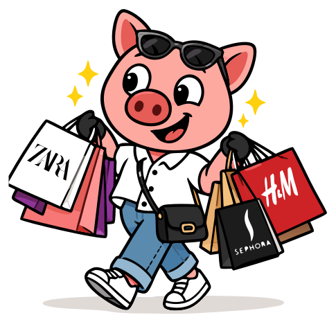 `lux-shopping` | Брендовый шопинг и «санкционочка»: ушедшие из России бренды доступны в Сербии, которая в этом смысле воспринимается как Европа «где всё есть». |
| 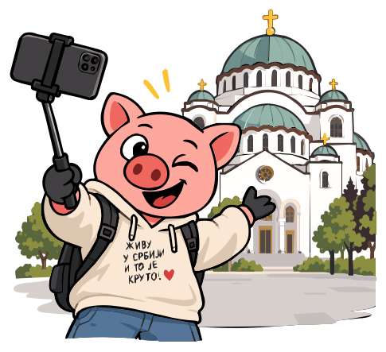 `sava-selfie` | Блогер-турист на фоне храма Святого Саввы: три дня в Белграде, восторг от первой заграничной поездки и непонимание того, что эмиграция — не лёгкая туристическая прогулка. На худи намеренно смешаны русский и сербский. |
| 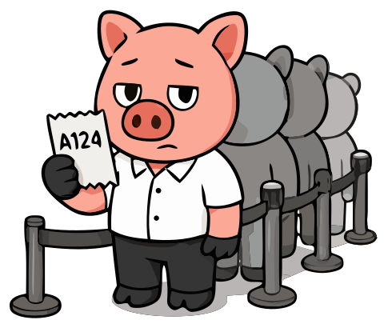 `queue` | Очередь и ожидание: учреждения, документы, госуслуги и ситуации «надо постоять». |
| 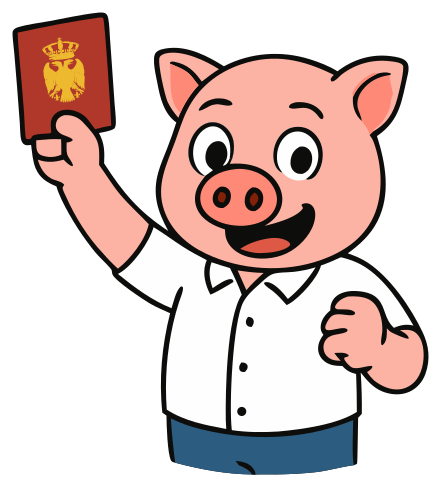 `russian-passport` | Российский паспорт как конкретный документ: гражданство РФ, паспортные вопросы и российский контекст. Не нейтральный миграционный паспорт вообще. |
| 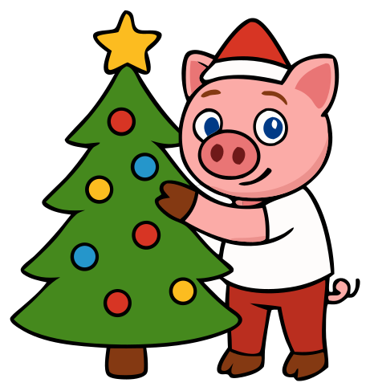 `christmas-tree` | Ёлка, Новый год и зимние праздники. |
| 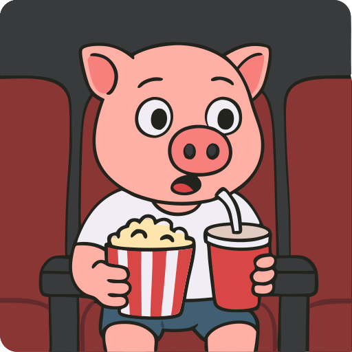 `cinema` | Кинотеатр, фильмы, кинопоказы, попкорн и поход в кино. |
| 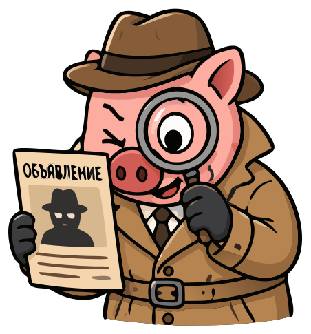 `investigation` | Детективное расследование: проверка фактов, поиск доказательств, разбор подозрительной ситуации. |
| 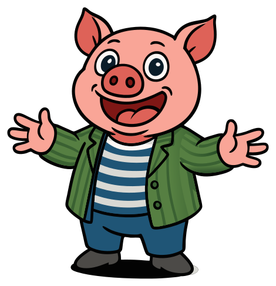 `hryun` | Хрюн Моржов из «Тушите свет»: наглость, простецкий циничный оптимизм и ностальгический триггер для взрослой аудитории. |
| 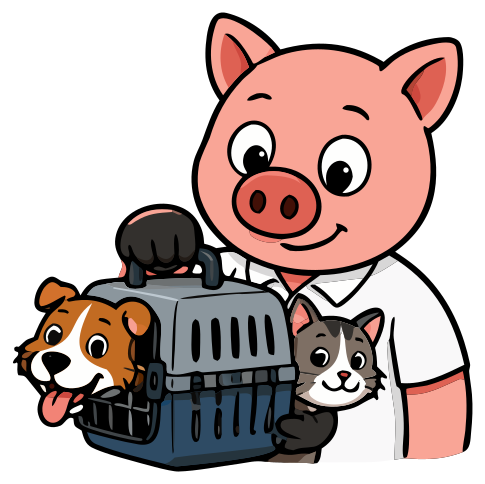 `pets` | Домашние животные: питомцы, перевозка животных, ветеринария и бытовые вопросы с ними. |
| 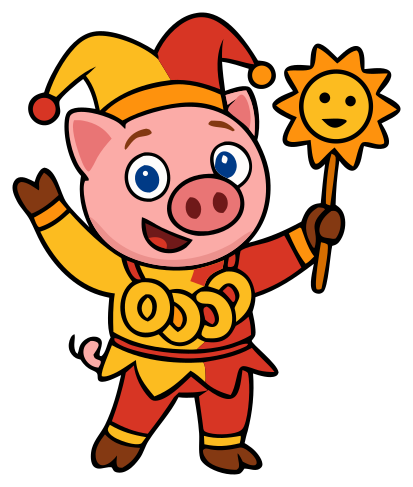 `joker` | Шутовской/карнавальный образ. В проекте — Масленица и увеселительные мероприятия, праздники и развлечения. |
| 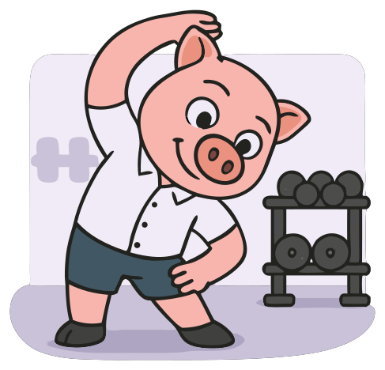 `workout` | Общая физическая тренировка, упражнения и спортзал. |
| 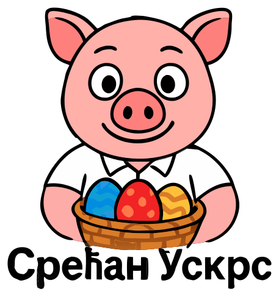 `uskrs` | Сербское пасхальное поздравление и православная Пасха в Сербии. |
| 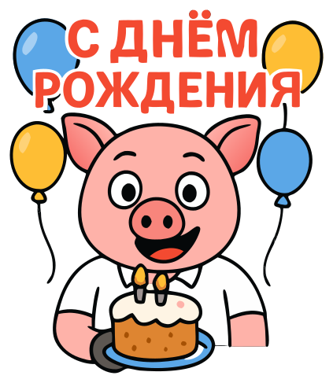 `happy-birthday` | Русское поздравление «С днём рождения», торт и праздничные шарики. |
| 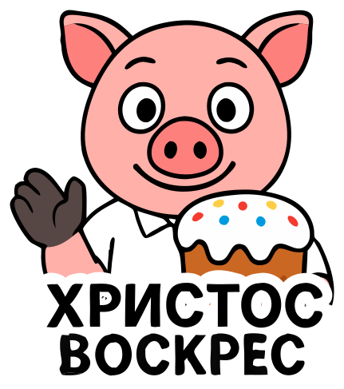 `kulic` | Русская православная Пасха: кулич, пасхальное застолье и «Христос воскресе». |
| 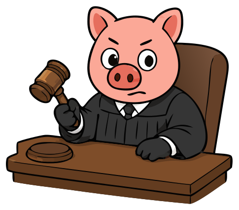 `judge-court` | Судья, суд, судебное разбирательство и правовые споры. |
| 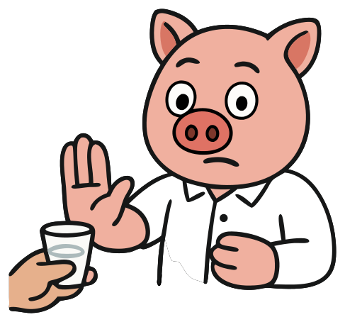 `no-drinking` | Запрет или отказ от алкоголя: не пить, трезвость, ограничения на употребление. |
| 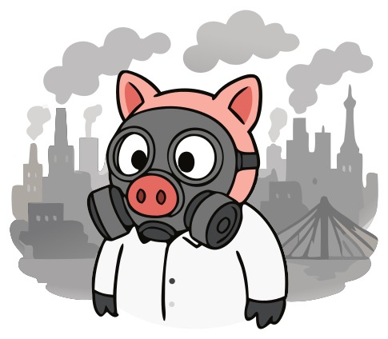 `gas-smoke-gray` | Загрязнённый воздух, дым, смог и необходимость защищаться от плохого воздуха. |
| 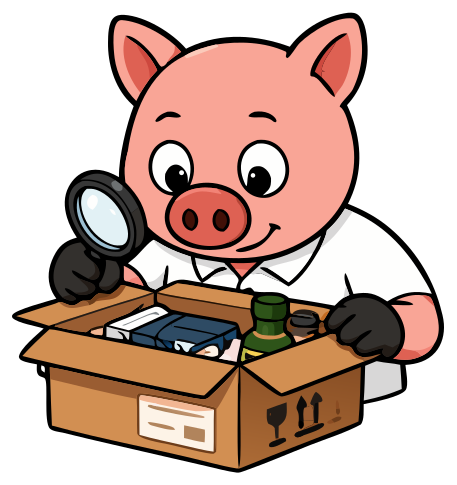 `delivery-unpacking` | Получение и распаковка посылки или заказа. |
| 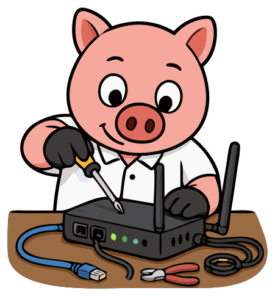 `repair` | Ремонт техники или бытового оборудования, мастерская, инструменты. |
| 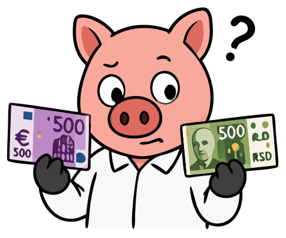 `exchange` | Обмен валюты, евро и динары, обменники и курс. |
| 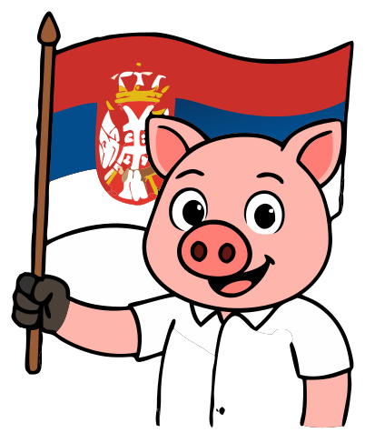 `serbian-flag` | Сербия, сербская государственная символика и общий национальный контекст. |
| 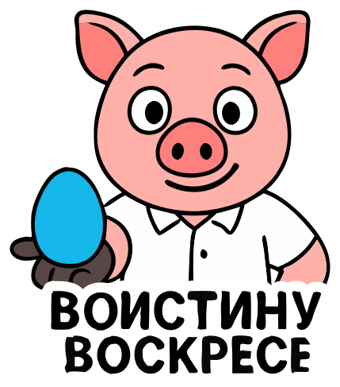 `vaskrs` | Православная пасхальная коммуникация на сербском, ответ/поздравление с Пасхой. |
| 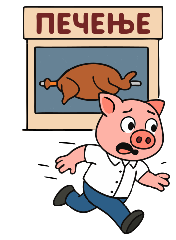 `pecenje` | Сербское `pečenje`: жареное мясо, застолье, гриль и гастрономия. |
| 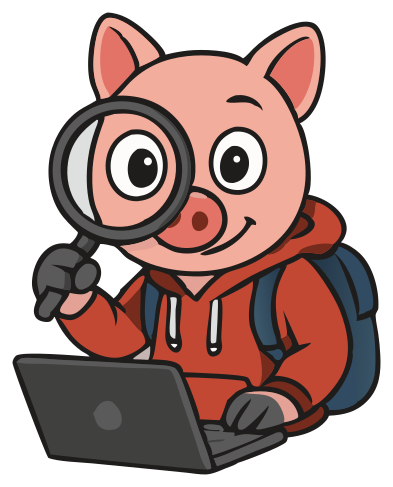 `internet-research` | Поиск и проверка информации в интернете, исследование источников, фактчекинг. |
| 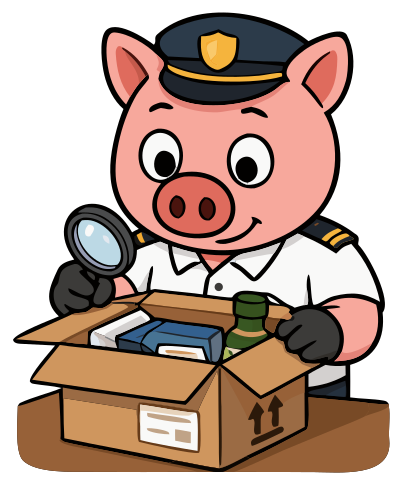 `carina-customs` | Таможня: ввоз, посылки, граница, таможенное оформление и `carina`. |
| 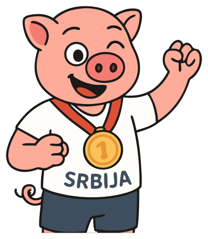 `medal` | Награда, достижение, признание, Сербия плюс медаль. ⚠️ Конкретную скрытую отсылку не вижу. |
| 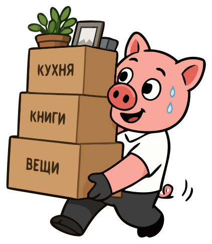 `move-stuff` | Переезд с коробками и вещами, перевозка имущества и упаковка. |
| 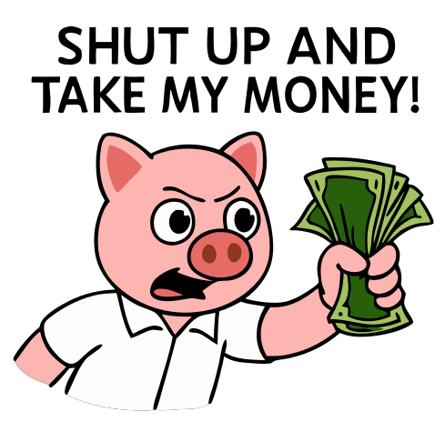 `shut-up-and-take-my-money` | Фрай «Shut up and take my money»: желание немедленно купить, заплатить или воспользоваться предложением. |
| 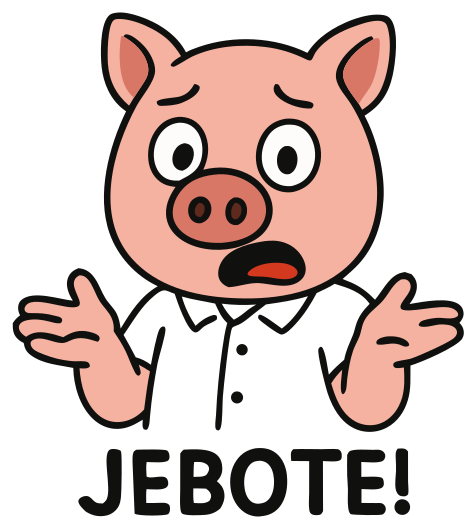 `jebote` | Сербское эмоциональное `jebote`: удивление, раздражение или усилитель эмоции; языковой и бытовой контекст. |
| 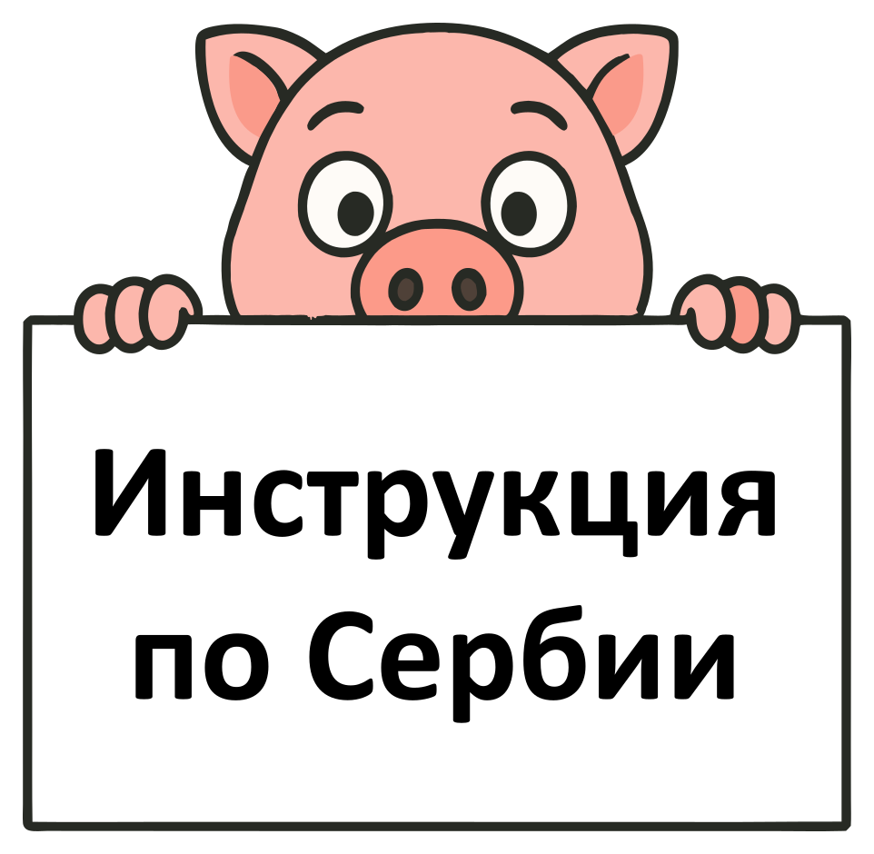 `logo` | Петар с табличкой «Инструкция по Сербии»: сам проект, бренд RSLive и материалы о проекте. |
| 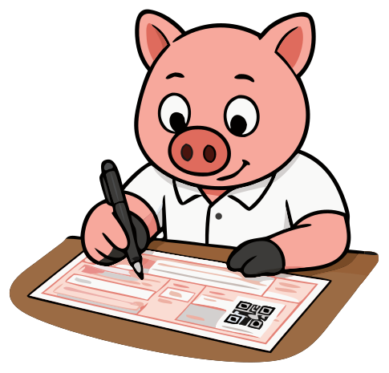 `uplatnica` | Сербская платёжная квитанция: заполнение и оплата `uplatnica`. |
| 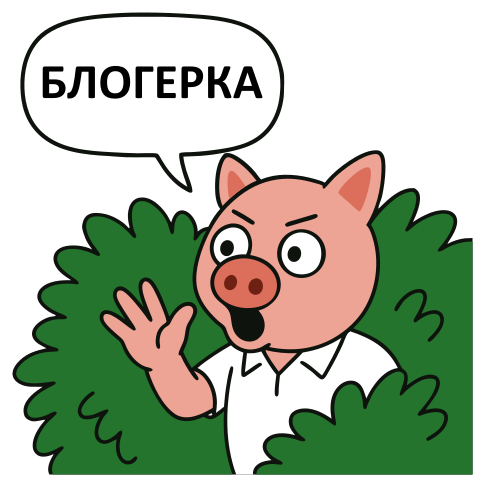 `blogerka` | Миллениальская переработка мема про персонажа, вылезающего из кустов и грубо оценивающего женщину; здесь — эвфемистическая сатира на Instagram-блогерок, которые пытаются заработать друг на друге и своей аудитории. |
| 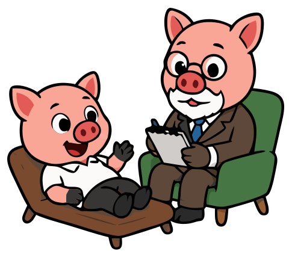 `psychology` | Психолог и клиент на диване: психотерапия, психологическая помощь и адаптация. |
| 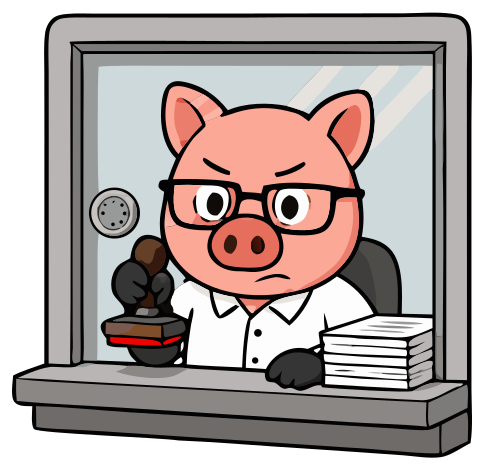 `bureaucracy` | Чиновник за окошком: бюрократия, учреждения, административные процедуры и формальный подход. |
| 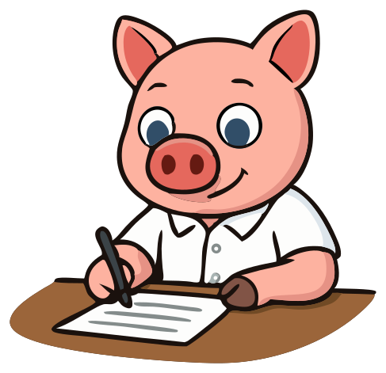 `letter-list` | Письмо, список или заявление от руки: составление документа, перечень дел или письменное обращение. |
| 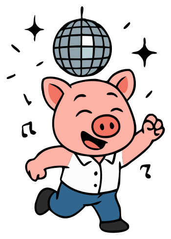 `disco` | Дискотека, клуб, музыка, танцы и ночная жизнь. |
|  `eid` | Электронная идентификация, eID и государственные онлайн-сервисы. |
| 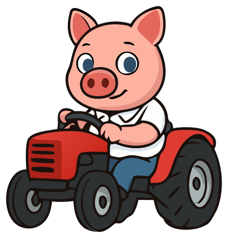 `tractor` | Петар на тракторе: отсылка к Поросёнку Петру и старому эмиграционному мему про отъезд. |
| 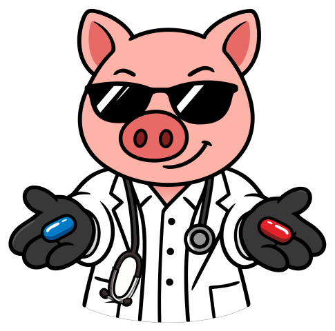 `medical-morpheus` | Врач в образе Морфеуса предлагает красную и синюю таблетки из «Матрицы»: лекарства, психиатрия и ситуация выбора. Не нейтральный «доктор». |
| 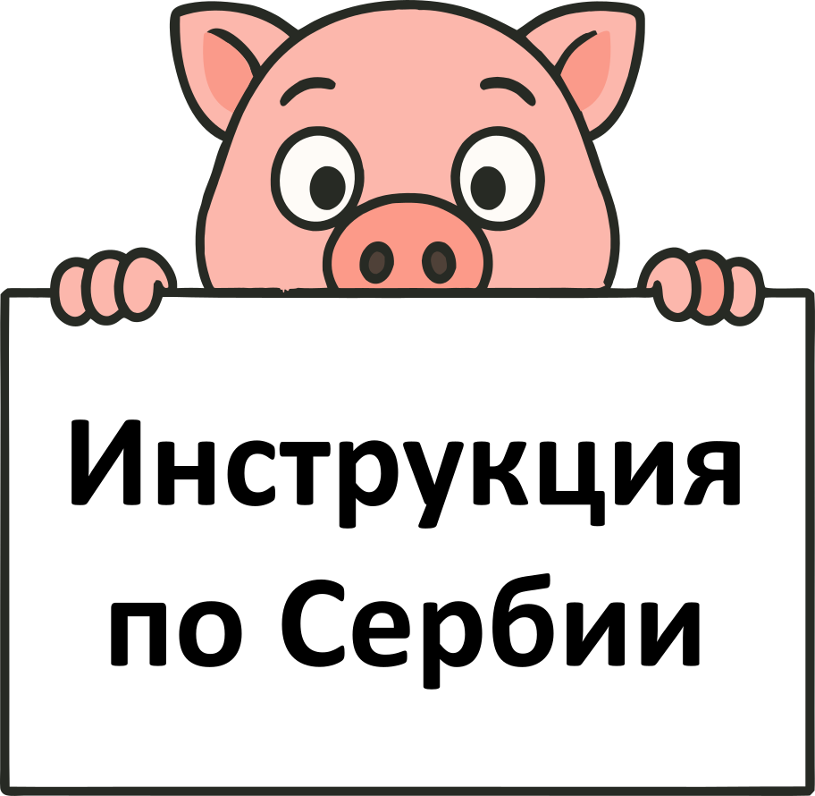 `og_image_default` | Служебная OG-иллюстрация. Отдельной пользовательской семантики не предполагаю; должна оставаться скрытой с витрины. |
| 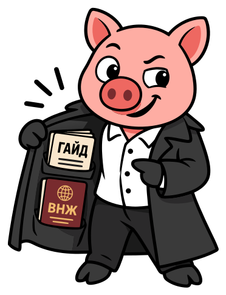 `helper-dealer` | Советский фарцовщик, торгующий из-под полы. В проекте — «помогалы», которые упаковывают бесплатные гайды и сведения и пытаются продать их за немыслимые деньги. |
| 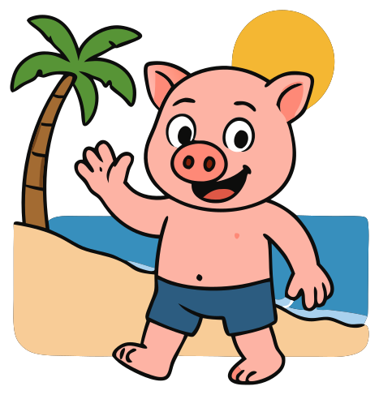 `beach` | Пляж, летний отдых, море и отпуск. |
| 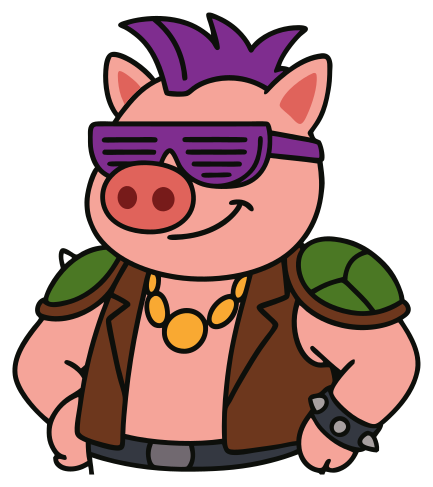 `bebop` | Бибоп из «Черепашек-ниндзя»: поп-культурная отсылка к персонажу. |
| 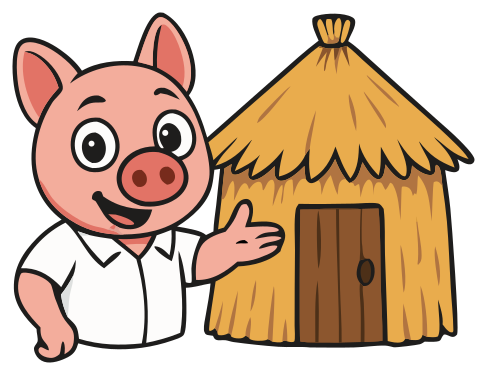 `cheap-house` | Очень дешёвое, простое или неблагоустроенное жильё; нижний ценовой сегмент. |
| 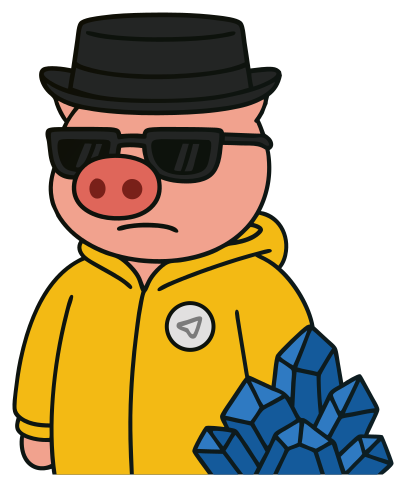 `breaking-bad-crystals` | Хайзенберг с кристаллами из Breaking Bad. В проекте — бизнес и предпринимательство с ироническим оттенком. |
|  `curwa` | Грубая обсценная реплика и кустовой мем. ⚠️ Считаю скорее legacy/мемным активом, точную роль в публичном каталоге надо подтвердить. |
| 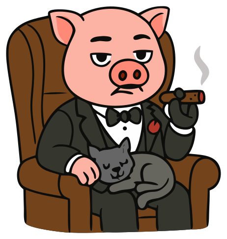 `don-carleone` | «Ты просишь меня об услуге, но говоришь без уважения»: личные услуги, связи, кумовство и просьбы «по знакомству». |
| 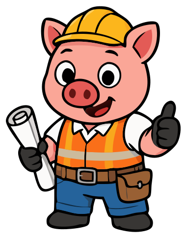 `builder-master` | Строитель или мастер: строительные и ремонтные работы. |
|  `student-graduation` | Выпускник: университет, окончание учёбы, дипломирование и студенческое образование. |
| 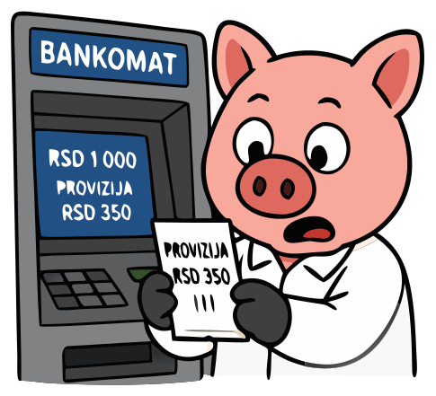 `atm-fee` | Комиссия банкомата, снятие наличных и банковские расходы. |
| 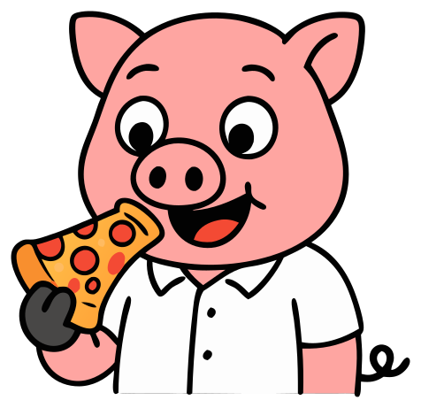 `pizza` | Пицца, доставка еды и итальянская/повседневная кухня. |
| 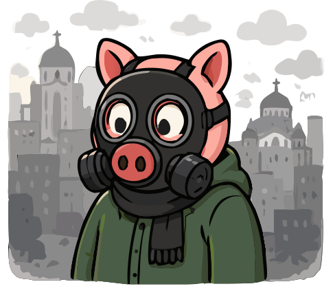 `winter-belgrade-gasmask` | Зимний Белград в смоге, противогаз и загрязнение воздуха. Не общий стикер про холодную погоду. |
| 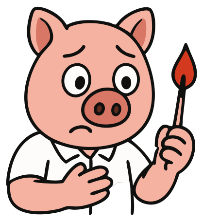 `spichka` | Спичка и огонь: бытовой огонь, поджечь, маленький источник пламени. ⚠️ Дополнительную отсылку не вижу. |
| 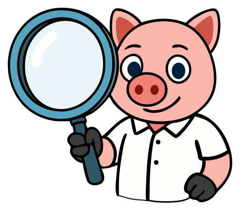 `magnify` | Лупа: поиск, проверка, изучение деталей и исследование. |
| 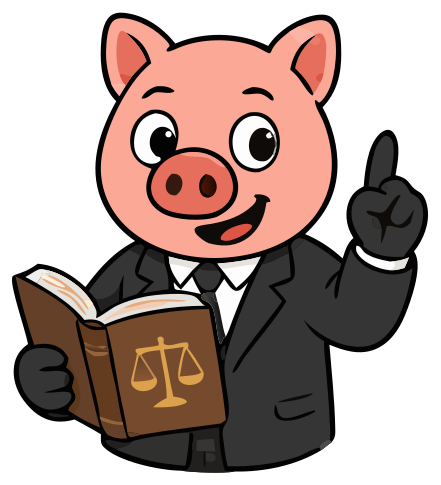 `lawyer` | Юрист или адвокат: правовая помощь, законы, юридические процедуры. |
| 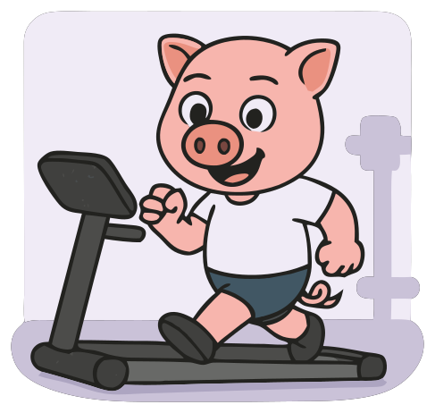 `treadmill` | Беговая дорожка, кардиотренировка и фитнес. |
| 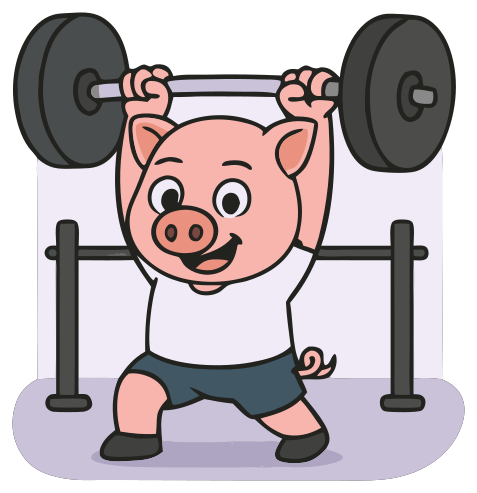 `lifting` | Силовая тренировка, штанга и тяжёлая атлетика. |
| 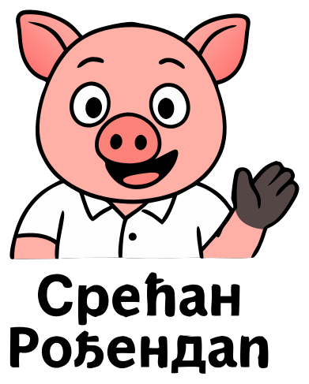 `rodjendan` | Сербское поздравление с днём рождения: `Srećan rođendan`. |
| 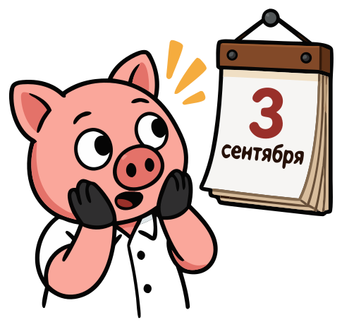 `calendar` | Календарь, даты и любые дедлайны. «3 сентября» — намеренная отсылка к Шуфутинскому. |
| 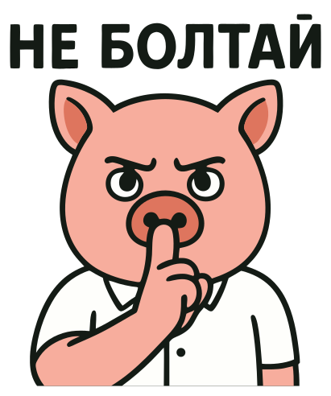 `dont-talk` | «Не болтай»: осторожность, секретность, не разглашать лишнего, следить за тем, что говоришь. |
| 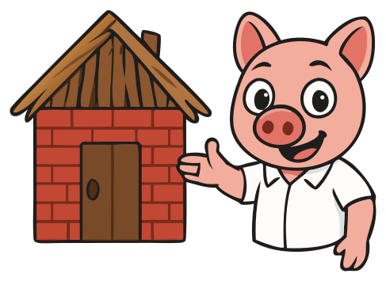 `solid-house` | Добротный, капитальный дом; более качественное или дорогое жильё. |
| 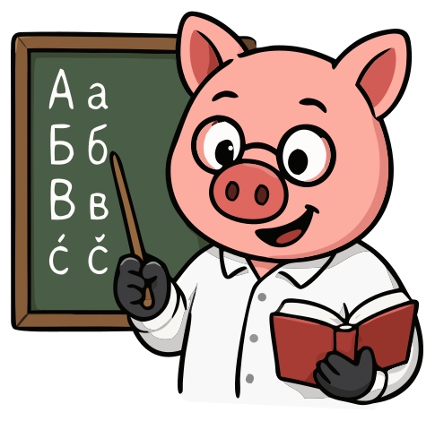 `srpski-teacher` | Преподаватель сербского: язык, курсы, обучение сербскому, кириллица и латиница. |
| 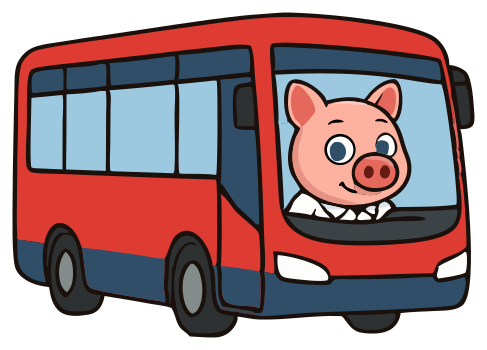 `bus` | Автобус и автобусные поездки. |
| 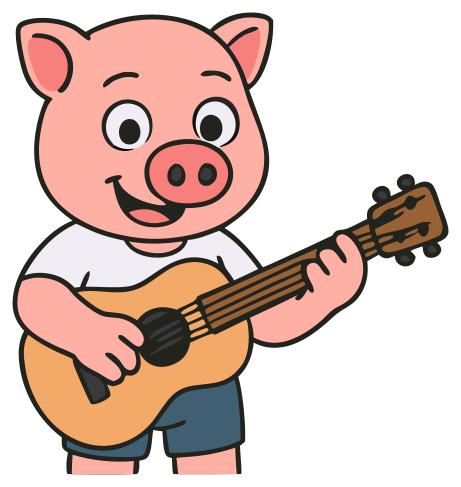 `guitar` | Гитара, музыка, музыканты и выступления. |
| 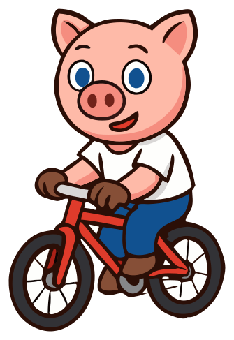 `bike` | Велосипед, велотранспорт и велоспорт. |
| 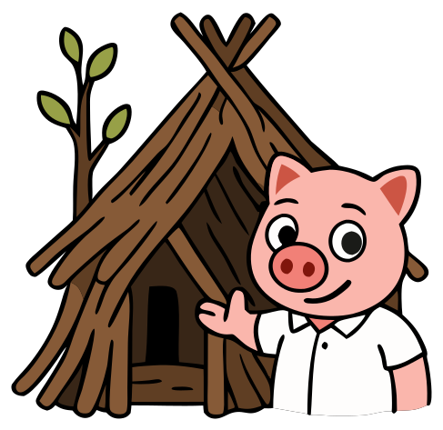 `middle-house` | Обычное жильё среднего уровня между дешёвым и капитальным/дорогим вариантом. |
| 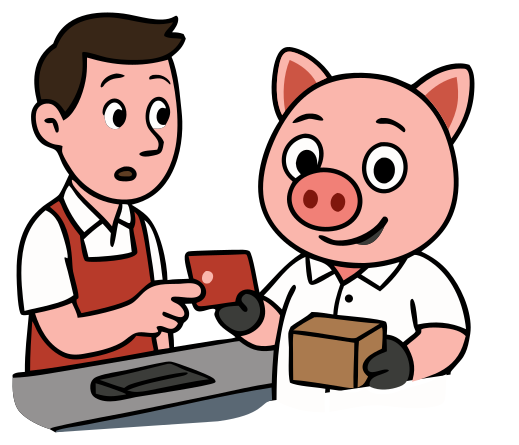 `checkout` | Касса магазина, покупки и оплата товаров. |
| 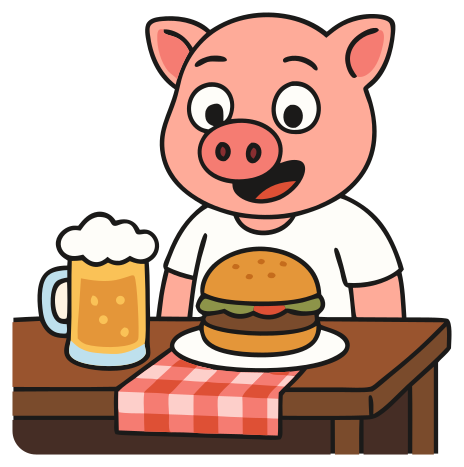 `kafana` | Кафана, сербское застолье, ресторанная и кафанная культура. |
| 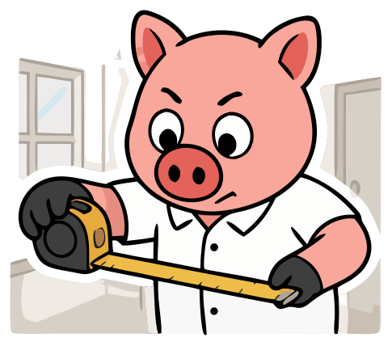 `montage` | Монтаж и установка, работа домашнего мастера, сборка/подключение. |
| 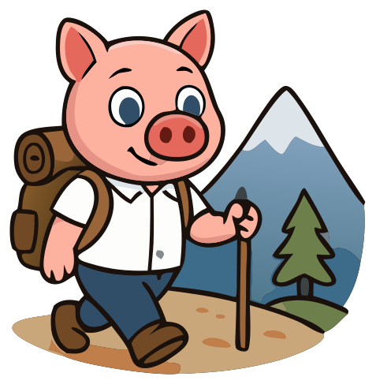 `hiking` | Пеший туризм, горы, походы и природа. |
| 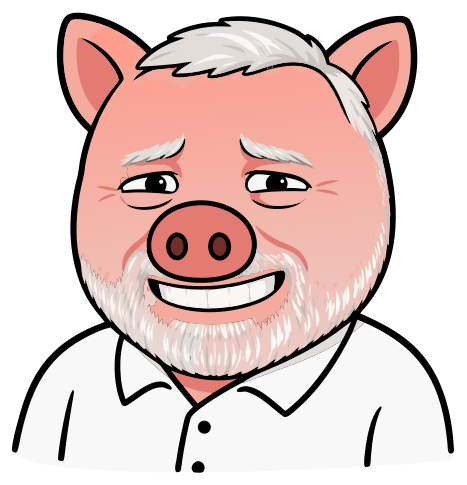 `hide-the-pain-harold` | Hide the Pain Harold: скрытая боль, улыбка через стресс. Подходит для адаптации и состояния «с вами всё хорошо», когда человеку на самом деле тяжело. |
| 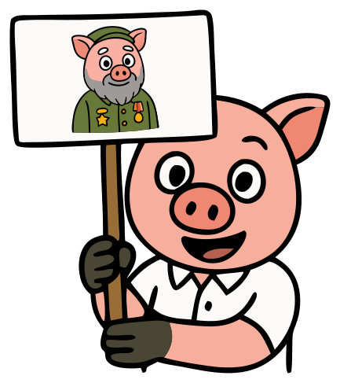 `grandpa` | Петар держит портрет пожилого мужчины. ⚠️ Буквальный сюжет вижу, но конкретную культурную/историческую отсылку не распознал. |
| 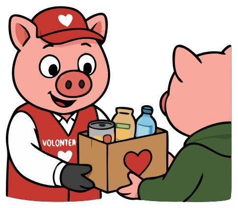 `volunteer-help` | Волонтёрская помощь, благотворительность, пожертвования и помощь другим. |
| 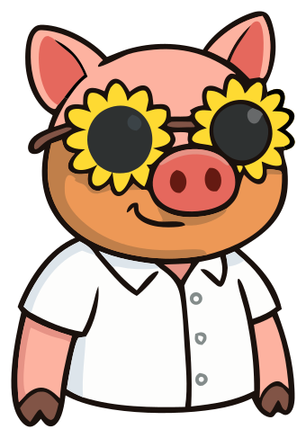 `sunglasses` | Яркие декоративные очки: лето, веселье, нарочито несерьёзный или праздничный образ. |
| 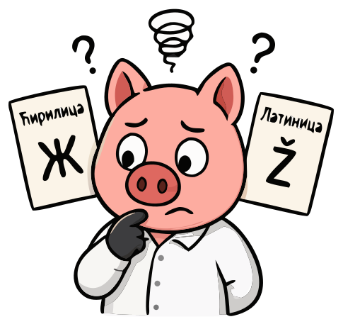 `alphabets-mess` | Путаница кириллицы и латиницы при изучении сербского; смешение двух алфавитов. |
| 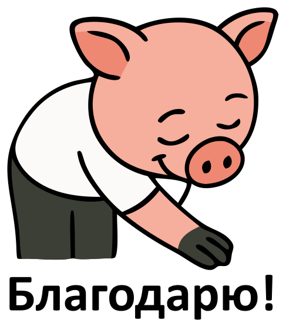 `hvala` | Благодарность, `hvala`, «спасибо». |
| 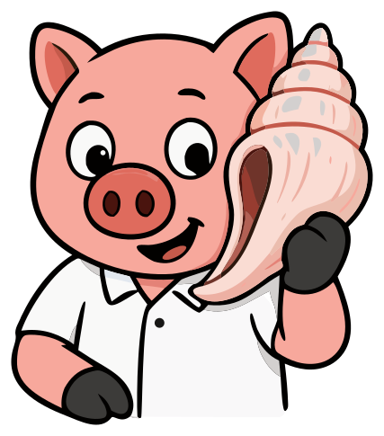 `telephone` | Телефонный разговор, звонок и связь. |
| 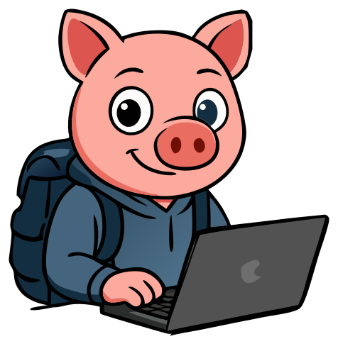 `it-pro` | IT-специалист за ноутбуком: программирование, айти и техническая работа. |
| 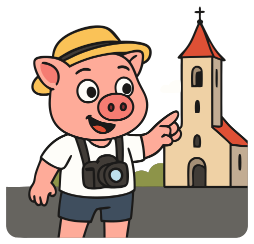 `travelling` | Турист с камерой у достопримечательности: sightseeing, экскурсии и туристическая поездка. |
| 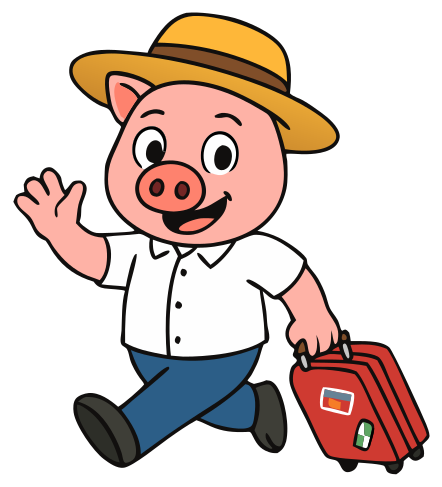 `travel` | Человек с чемоданом: дорога, путешествие, отъезд и перемещение между странами/городами. |
| 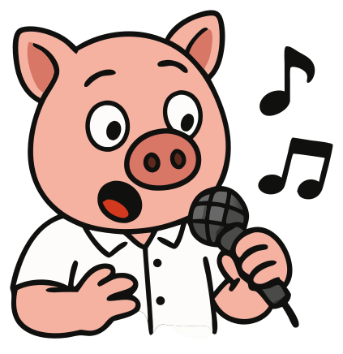 `karaoke` | Караоке, пение и вечерние развлечения. |
| 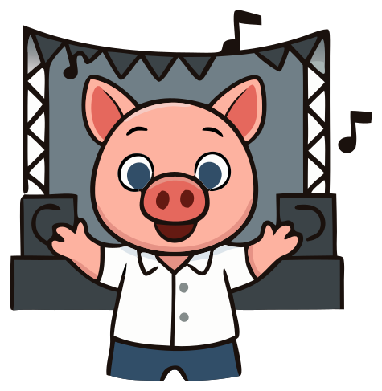 `party` | Шумная вечеринка, музыка, гости и домашние развлечения. |
| 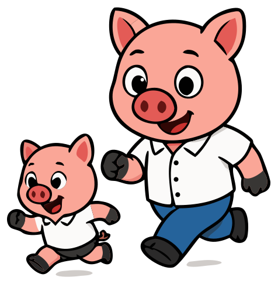 `parenting` | Родитель и ребёнок: воспитание, семья и уход за детьми. |
| 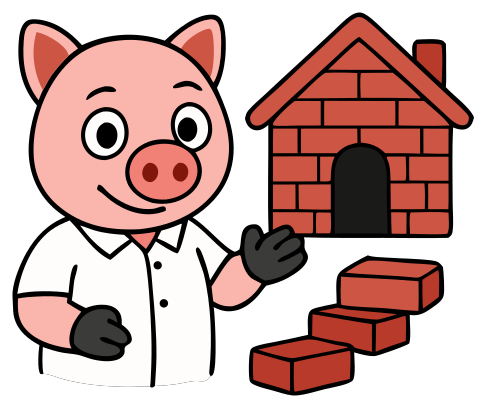 `building-a-house` | Строительство или обустройство дома; жильё и недвижимость в широком смысле. |
| 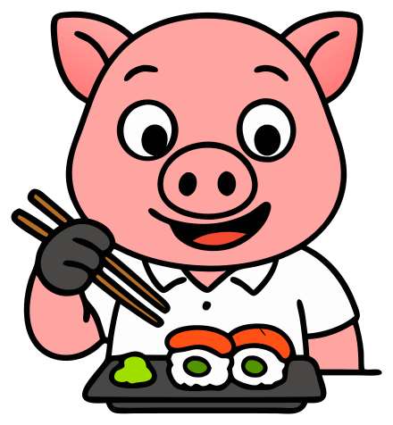 `sushi` | Суши и японская кухня. |
| 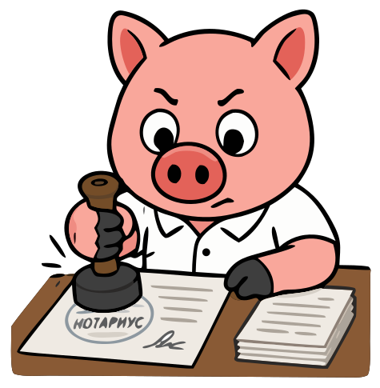 `notarius` | Нотариус, заверение документов и нотариальные процедуры. |
| 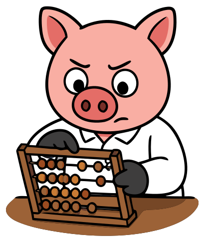 `calculation` | Расчёты, калькулятор, налоги, деньги и вычисление сумм. |
| 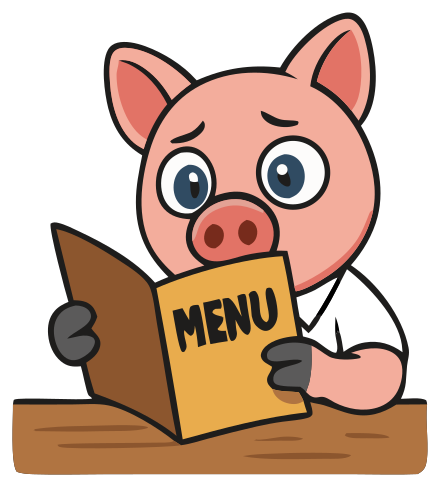 `menu-restorant` | Ресторанное меню, выбор блюд и заказ еды. |
| 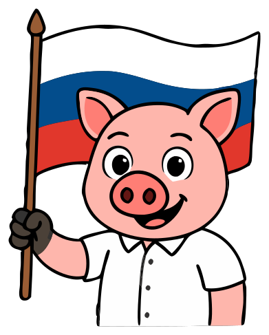 `russian-flag` | Россия, российская символика и русский/российский контекст. |
| 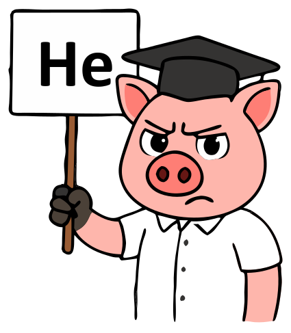 `students-no` | Студенческие блокады и протесты в Сербии; несогласие, оппозиция и гражданский протест. |
| 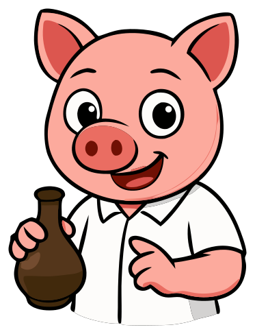 `rakija` | Ракия, алкоголь и сербские застольные традиции. |
| 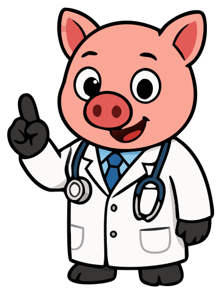 `doctor` | Нейтральный врач: медицина, клиники, обследования и лечение без отдельной мемной отсылки. |
| 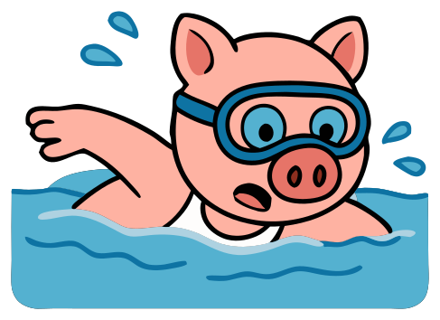 `swimming` | Плавание, бассейн и водный спорт. |
| 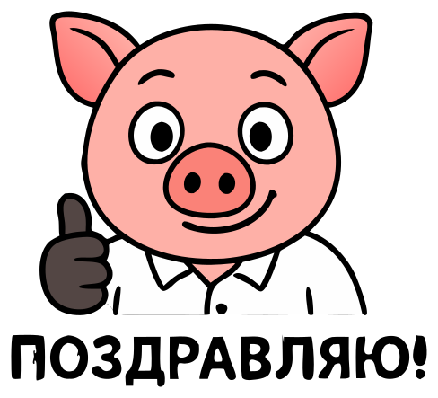 `cheers` | Поздравление, успех, одобрительный жест и хорошая новость. |
| 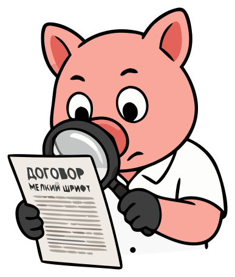 `small-font-contract` | Договор с мелким шрифтом: скрытые условия, договорные ловушки и необходимость внимательно читать документы. |
| 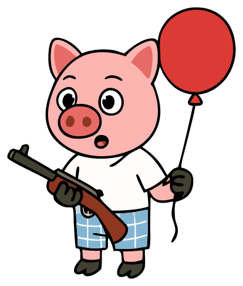 `pyatachok` | Пятачок из советского «Винни-Пуха»: наивность. Синий и зелёный шарики отсылают к мультфильму, а композиция дополнительно играет с образом из «Оно». |
| 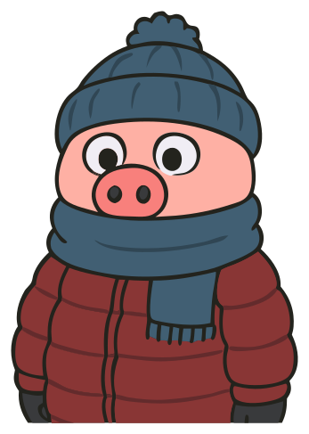 `cold-weather` | Просто холодная или зимняя погода; без темы купания и без обязательного загрязнения воздуха. |
| 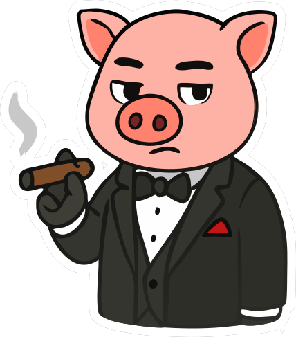 `godfather` | Образ «Крёстного отца»: жёсткий бизнес, традиции, авторитет или курение. |
| 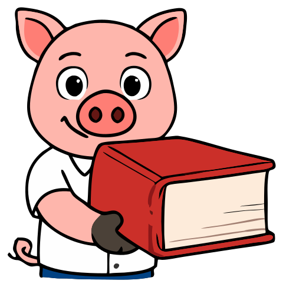 `giant-book` | Большая книга: учёба, образование, большой объём знаний или сложный материал. |
| 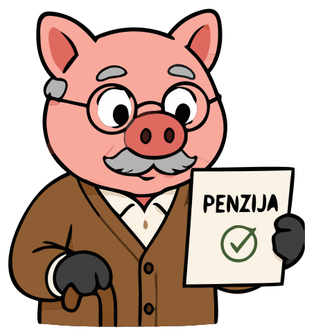 `penzioner` | Пенсионер, пенсия, пожилой возраст и социальное обеспечение. |
| 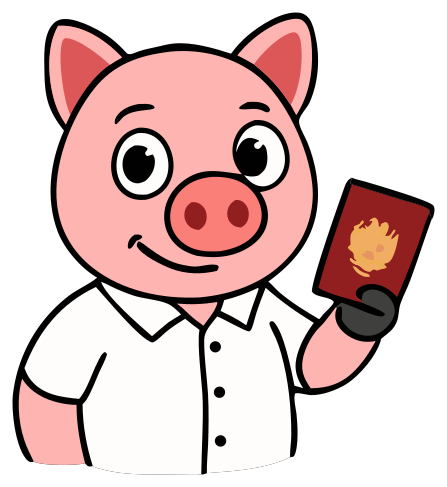 `passport` | Нейтральный паспорт и миграционные документы: переезд, легализация, ВНЖ/боравак. Не обязательно российский паспорт. |
| 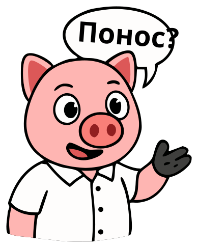 `funny-serbian` | «Понос?» — языковая шутка на сербском `ponos` («гордость»), которое для русского глаза выглядит как другое слово. Ложные друзья переводчика. |
| 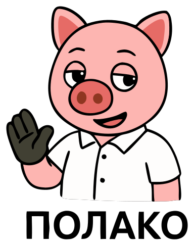 `polako` | Сербское `polako`: спокойно, не спеши, делай постепенно; бытовая сербская установка. |
| 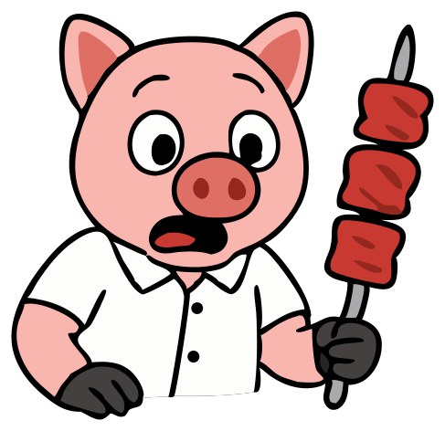 `shashlik-rostil` | Шашлык, `roštilj`, гриль и мясо на огне. |
| 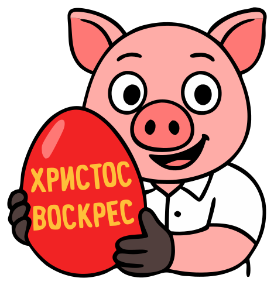 `uskrs-jaje` | Пасхальное яйцо и сербская/православная Пасха. |
| 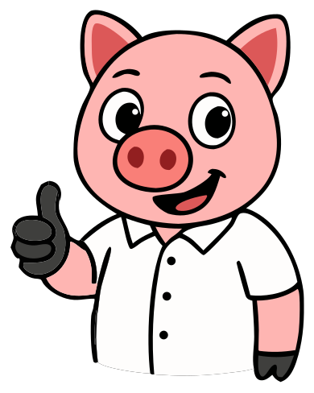 `approve` | Одобрение, разрешение, успешное заявление или получение положительного решения. |
|  `diploma` | Диплом, высшее образование, признание/нострификация диплома. |
| 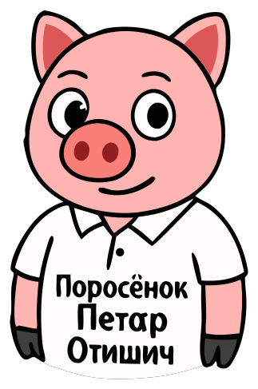 `petar` | Сам Петар Отишић, маскот RSLive. Нейтральный образ проекта без узкой темы. |
| 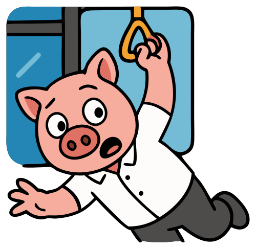 `javni-prevoz` | Общественный транспорт в Сербии: автобус/трамвай, поездка по городу, билеты и проезд. |
| 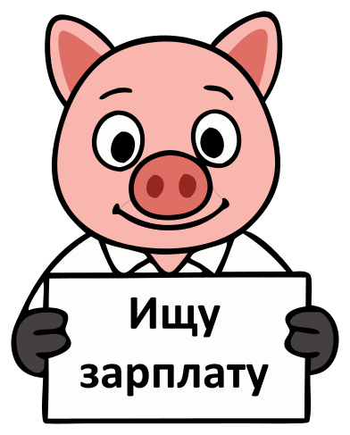 `looking-for-salary` | «Ищу зарплату»: работа, трудоустройство, поиск дохода и вопрос «где здесь деньги». |
| 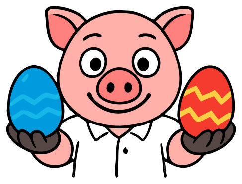 `jaje` | Яйцо/яйца: пищевой или языковой контекст вокруг сербского `jaje`. |
| 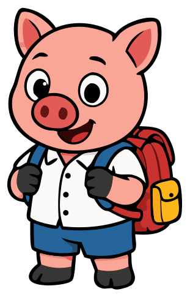 `schoolchild` | Школьник с рюкзаком: школа, ученики, школьное образование и дети школьного возраста. |
| 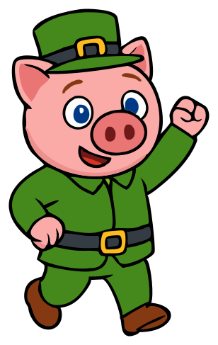 `saint-patrick` | День святого Патрика и тематические празднования. |
| 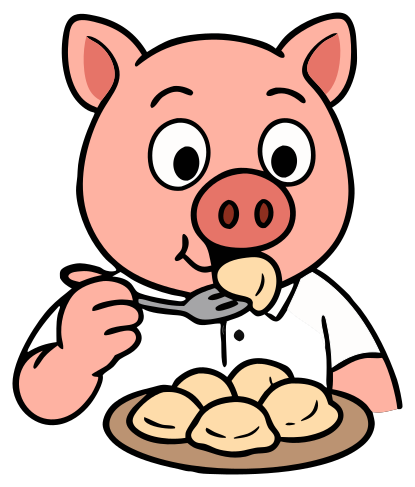 `pelmeni` | Пельмени и русская кухня. |
| 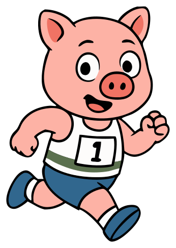 `running` | Бег, пробежка и беговой спорт. |
| 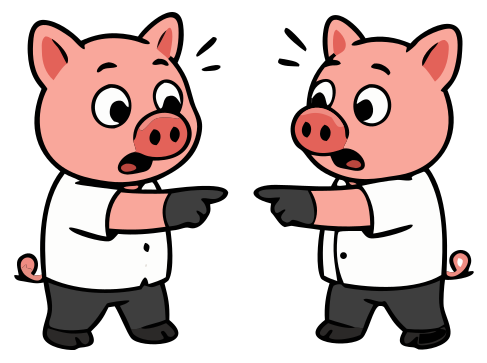 `spiderman-not-me-scam` | Два Спайдермена указывают друг на друга: неоднозначная идентификация, мягкий конфликт, скам и взаимное «это не я, это он». |
| 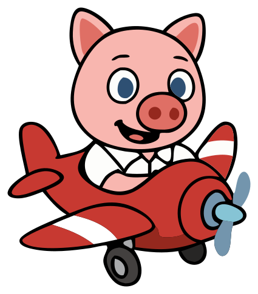 `plane` | Самолёт, перелёт, аэропорт и авиапутешествие. |
| 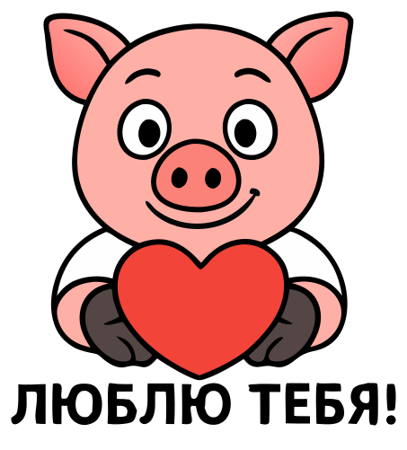 `loveyou` | Любовь, симпатия, «люблю тебя» и тёплое поздравление. |
| 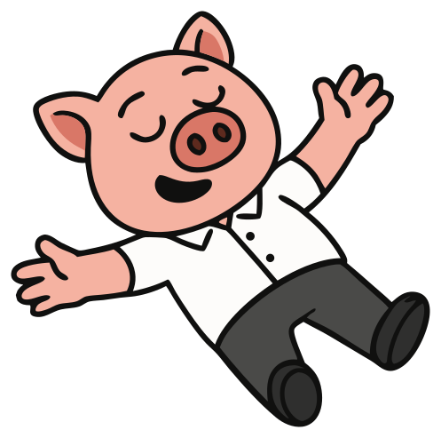 `relax` | Расслабиться, отдыхать, успокоиться и не торопиться. |
| 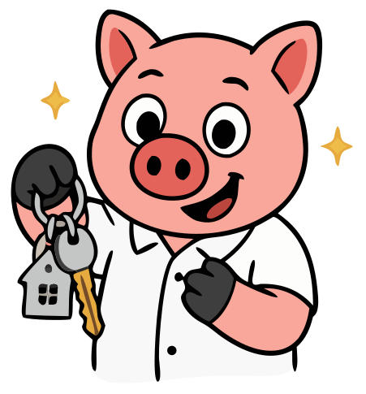 `house-keys` | Ключи от жилья: аренда, покупка, получение квартиры/дома и заселение. |
| 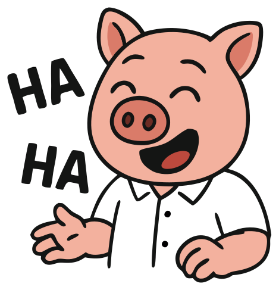 `lol` | Смех, шутка, нелепая или комичная ситуация. |
| 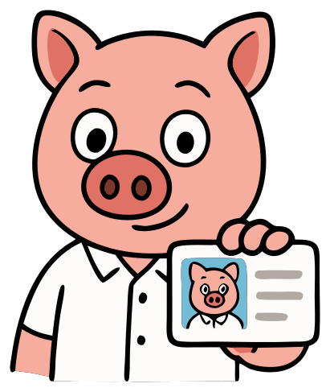 `id` | Удостоверение личности, ID-карта, личный документ. |
| 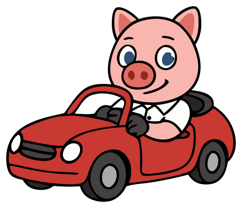 `auto` | Автомобиль: вождение, регистрация машины, права, парковка и транспорт. |
| 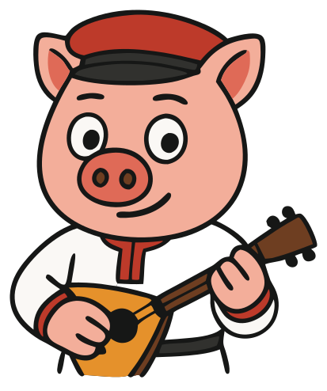 `balalajka` | Балалайка, русская музыкальная культура и стереотипно-русский образ. |
| 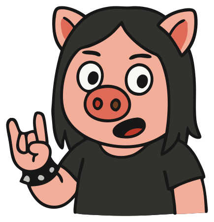 `heavy-metal-guy` | Металлист, тяжёлая музыка, концерты и музыкальная субкультура. |
| 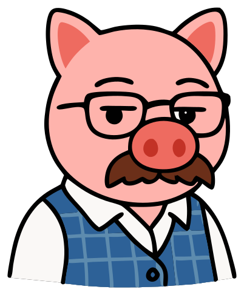 `haisenberg` | Уолтер Уайт / Хайзенберг. В проекте основной смысл — пенсия, старость и возраст с иронией; нужен вариант с белой обводкой. |
| 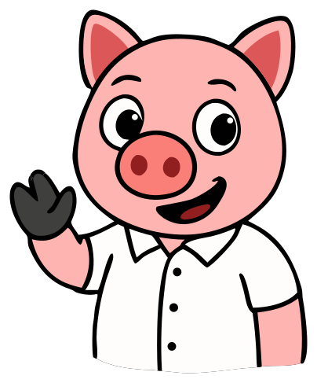 `hi` | Приветствие, «привет», начало общения. |
| 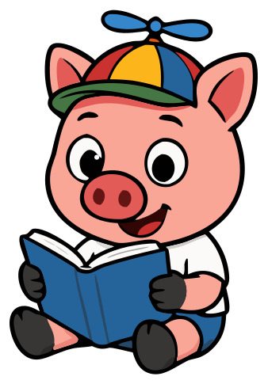 `child` | Ребёнок и общая детская тематика без школьной специализации. |
| 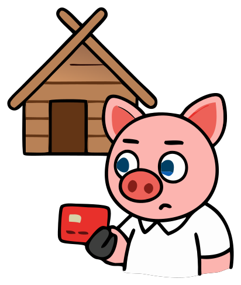 `overpriced-rent` | Слишком дорогая аренда, завышенные цены на жильё и недовольство стоимостью. |
| 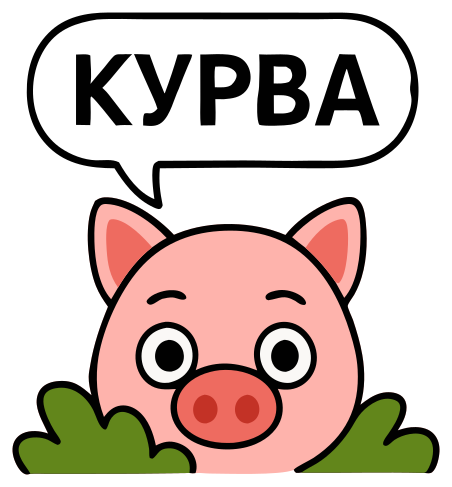 `curva` | Межславянский обсценный/провокационный языковой юмор вокруг слова `kurva/curva`. ⚠️ Точную авторскую роль в каталоге лучше подтвердить. |
| 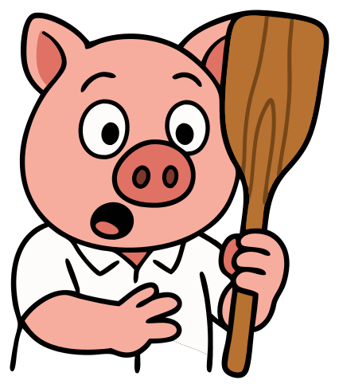 `veslo` | Весло, гребля, лодки и водный отдых. |
| 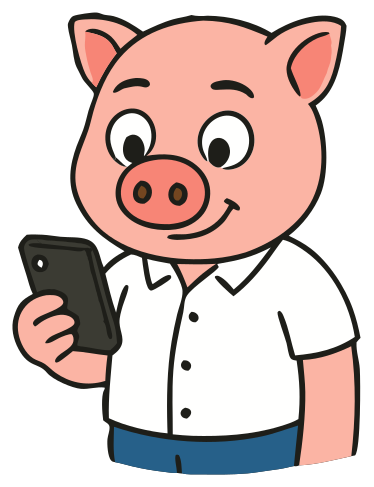 `smartphone` | Смартфон, мобильные приложения, связь и цифровые сервисы. |
| 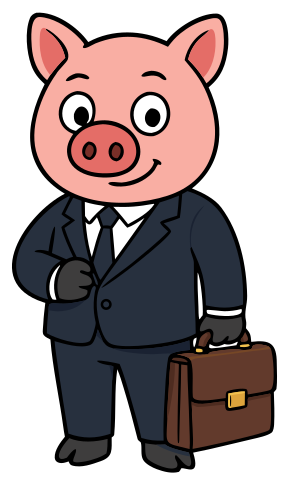 `businessman` | Нейтральный бизнесмен: предпринимательство, компания, деловая деятельность. |
| 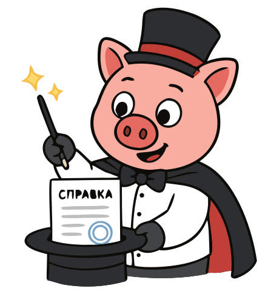 `wizard` | Иронический «консул прайм»: доплатите денег — волшебным образом получите справку. Также осторожный намёк на сомнительных посредников и недостоверные/поддельные документы, без утверждения о конкретных лицах. |
| 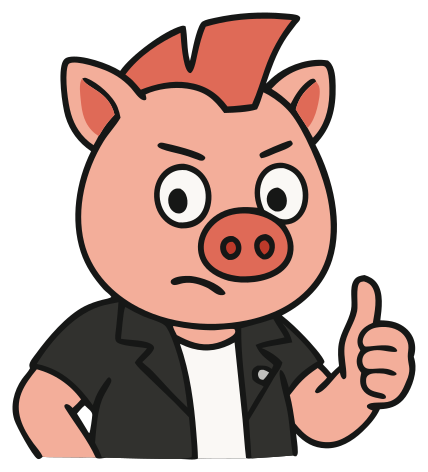 `punk` | Панк, панк-музыка, протестная субкультура и контркультурный образ. |
| 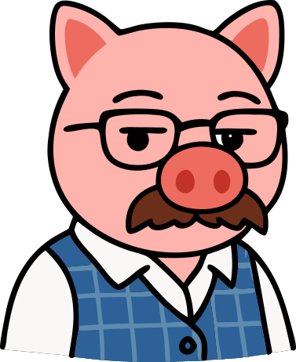 `breaking-bad` | Уолтер Уайт / Breaking Bad. С учётом авторского контекста — старость и пенсия с мемным оттенком; для бизнеса точнее `breaking-bad-crystals`. |
| 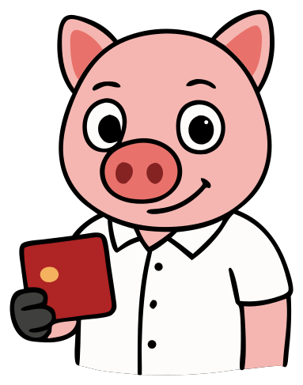 `payment-card` | Банковская карта, безналичные платежи, банковский счёт и оплата. |
| 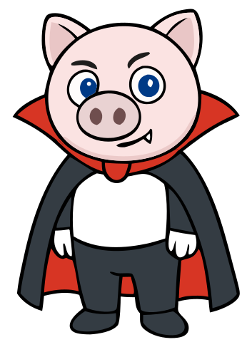 `dracula` | Дракула/вампир: хоррор, Хэллоуин и тематические развлечения. |
| 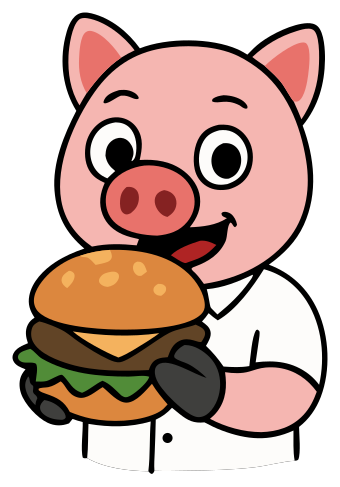 `burger` | Бургер, фастфуд и повседневная еда. |
| 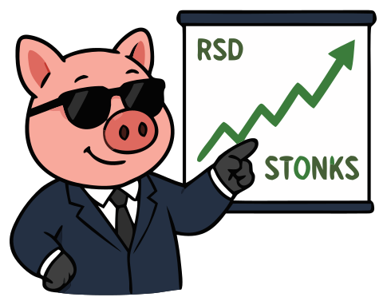 `investments-stock` | STONKS: инвестиции и биржа как серьёзно, так и иронично; «успешный успех», инфобизнес и консалтинг. |
| 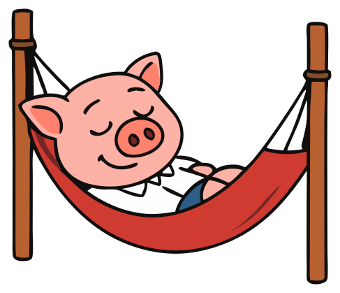 `gamak` | Гамак, отдых, отпуск и расслабление. |
| 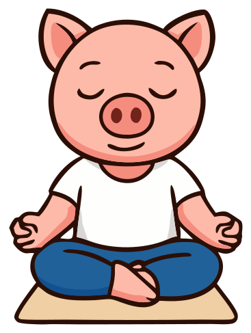 `yoga` | Йога, растяжка, wellness и спокойные тренировки. |
| 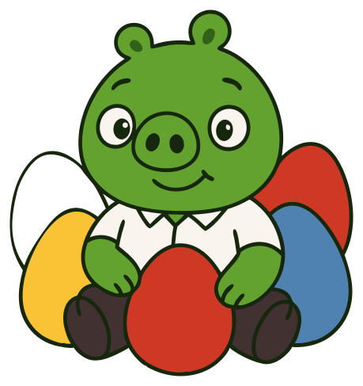 `angry-pig` | Сердитый зелёный поросёнок. ⚠️ Вижу возможную отсылку к свиньям из Angry Birds; использовать для злости, раздражения и конфликтной реакции, если референс подтверждается. |
| 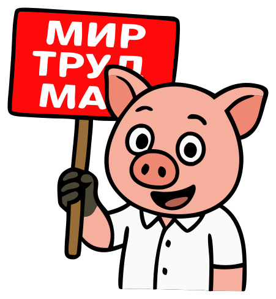 `mir-trud-maj` | Советское «Мир! Труд! Май!»: Первомай, 1 мая, труд и советская культурная символика. ⚠️ Дополнительную авторскую иронию не знаю. |
| 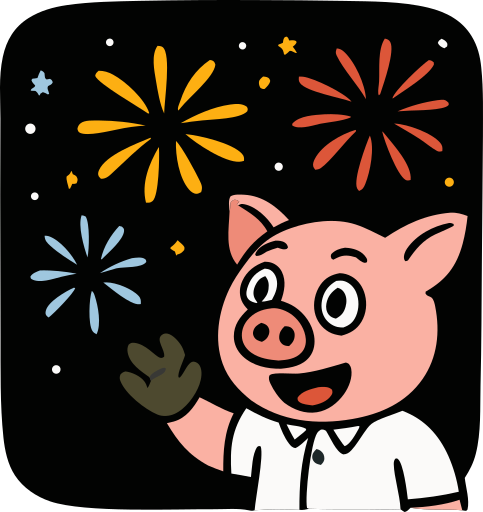 `fireworks` | Фейерверк, Новый год, праздник и торжество. |
| 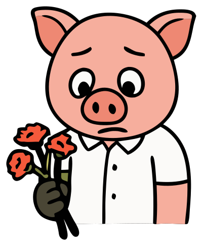 `sad-flowers` | Грустный Петар с цветами. Возможные смыслы: сочувствие, извинение, печальное событие или соболезнование. ⚠️ Intended use нужно уточнить. |
| 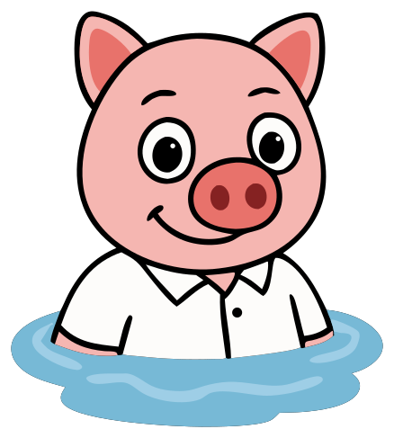 `bara-luzha` | Лужа, дождь, мокрая погода и городская слякоть. |
| 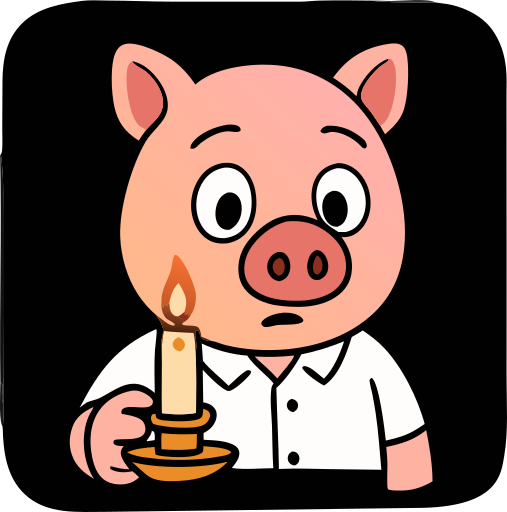 `candle` | Свеча: память, религиозный контекст, тишина или ритуал. ⚠️ Если есть конкретный мем/сюжет, я его не распознал. |
| 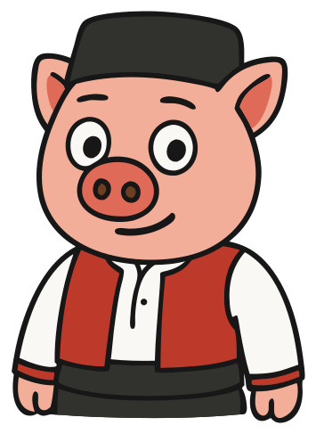 `seljak` | `Seljak`: деревня, сельская жизнь, крестьянин или нарочито простоватый сельский образ. |
| 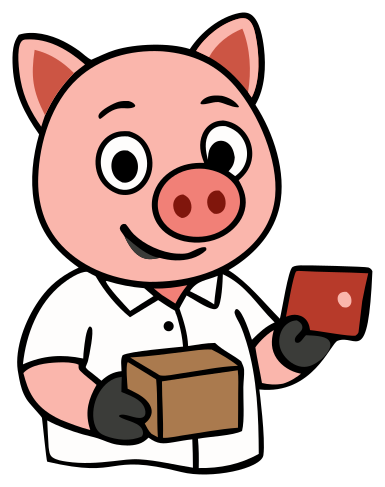 `delivery` | Курьерская доставка, заказ, посылка и получение товаров. |
| 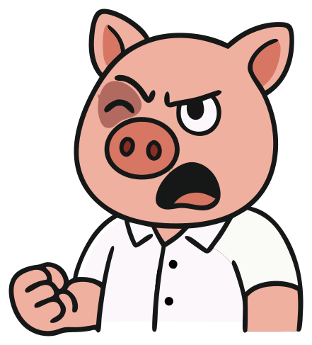 `beaten` | Потрёпанный/побитый Петар: конфликт, неприятности, ситуация «досталось». ⚠️ Возможную конкретную отсылку не распознал. |
| 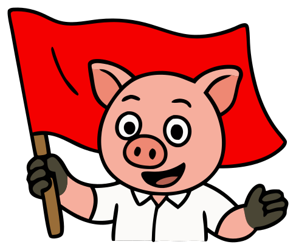 `red-flag` | Большой красный флаг. ⚠️ Может означать warning/red flag, протестный или левый/революционный образ; канонический смысл нужно выбрать. |
| 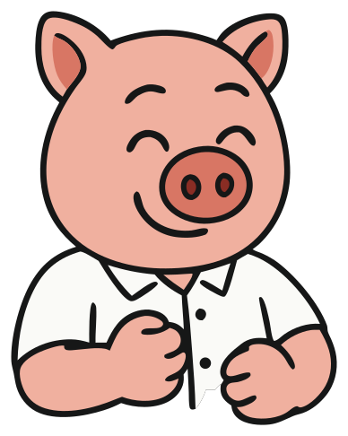 `happy` | Радость, удовлетворение и хорошее настроение. |
| 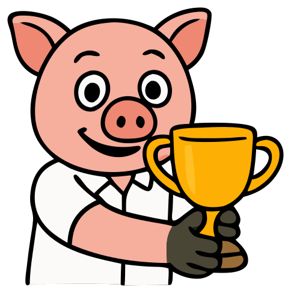 `trophy` | Кубок, победа, достижение, награда и первое место. |
| 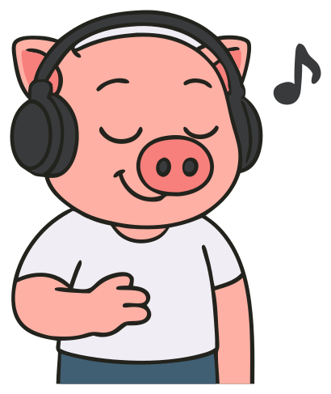 `headphones` | Наушники, музыка, аудио, подкасты или прослушивание. |
| 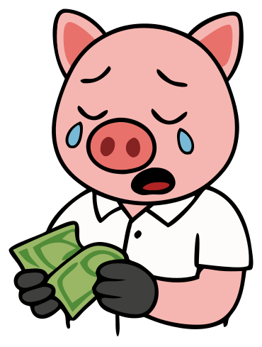 `expensive-crying` | Плач из-за денег: дорого, рост цен, большие расходы и болезненная стоимость. |
| 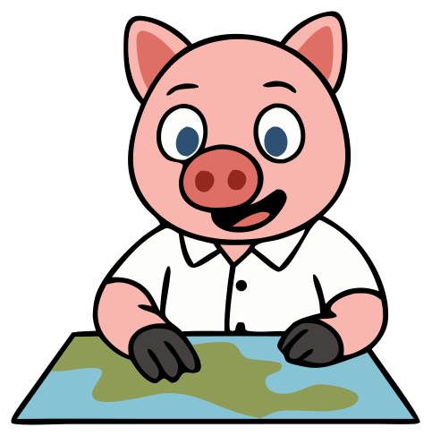 `map` | Карта, маршруты, адреса, навигация и поиск места. |
| 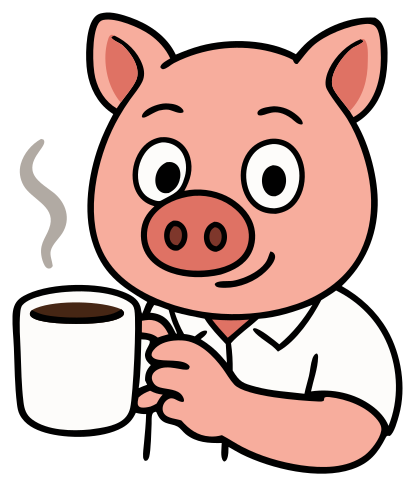 `kafa-coffee` | Кофе и сербская `kafa`: кафе, кофейная культура и напиток. |
| 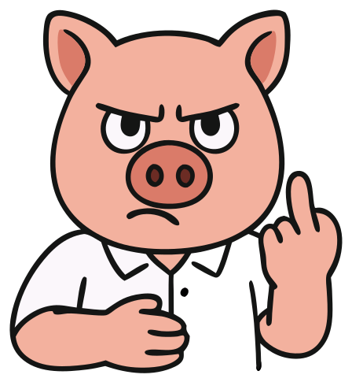 `fuckoff` | Жёсткое отторжение: «отвали», отказ и резко негативная реакция. |
| 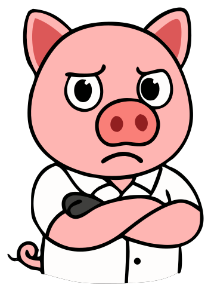 `sad-annoyed` | Раздражение, недовольство, усталое «мне это не нравится». |
| 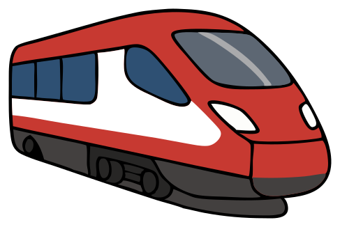 `train` | Поезд, железная дорога, вокзал и железнодорожное путешествие. |
| 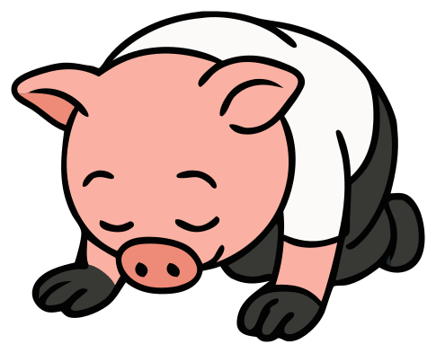 `sleeping-pig` | Сон, усталость, отдых и «ничего не происходит». |
| 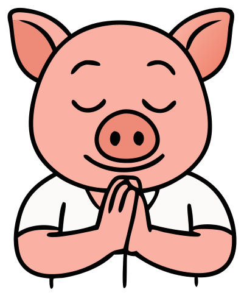 `pray` | Молитва, религия, надежда или ситуация «остаётся только молиться». |
| 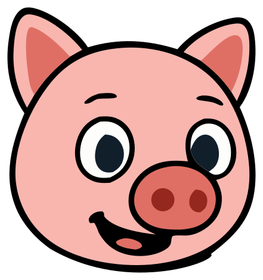 `favicon` | Голова Петара: компактный нейтральный брендинг и технический fallback. |
| 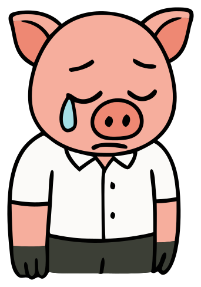 `crying` | Плач, грусть, расстройство и эмоционально тяжёлая ситуация. |

## Legacy, дубли и варианты, которые не считаю отдельным смыслом

Эти записи полезно проверить отдельно, потому что в исходных наборах встречаются старые имена или растровые варианты. Если какой-то из них на самом деле отличается по смыслу, оставьте комментарий.

| Вариант | Как я его понимаю |
| --- | --- |
| 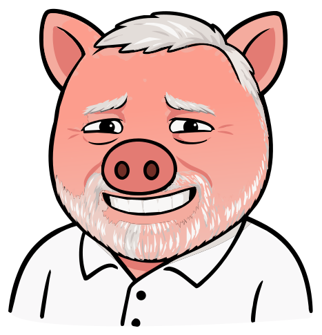 `herols-hiding-pain` | Старый/ошибочный вариант имени для `hide-the-pain-harold`; отдельной семантики не вижу. |
|  `villi-vonko` | Старый/ошибочный вариант имени для `willy-wonka`; отдельной семантики не вижу. |
|  `magnify-1.png` | Растровый вариант сюжета с лупой; считаю вариантом `magnify`, а не отдельным смыслом. |
| 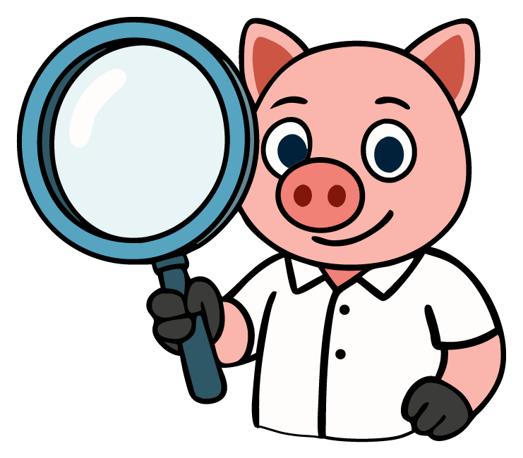 `magnify-2.png` | Второй растровый вариант сюжета с лупой; считаю вариантом `magnify`, а не отдельным смыслом. |
| 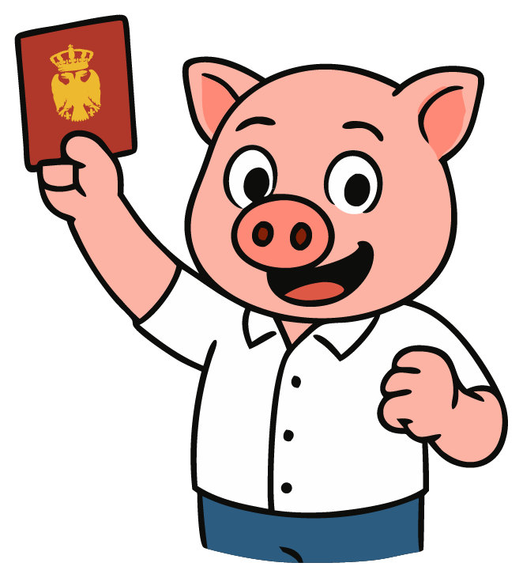 `passport-2.png` | Растровый вариант российского паспорта; смысл соответствует `russian-passport`. |
| 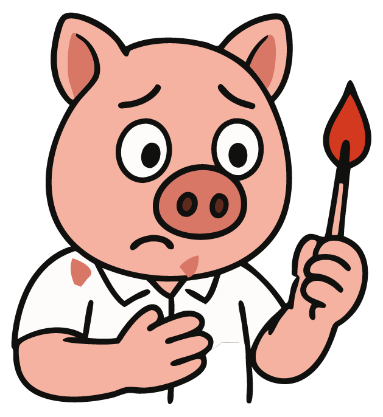 `shibice.png` | Растровый вариант спички; считаю дублем/вариантом `spichka`. |
| 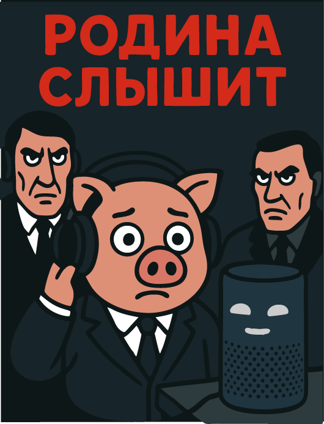 `state-spies-1.png` | Растровый вариант сюжета про умную колонку и прослушку; смысл `state-spies`. |
| 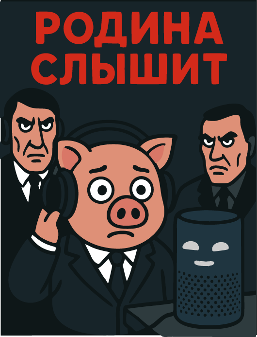 `state-spies-2.png` | Второй растровый вариант сюжета про умную колонку и прослушку; смысл `state-spies`. |

## Имена со старой сетки, которые не предлагаю возвращать отдельными canonical slug

- `about` → `petar`;
- `schoolar` → `schoolchild`;
- `herois-hiding-pains` / `herols-hiding-pain` → `hide-the-pain-harold`;
- `villi-vonko` → `willy-wonka`;
- `medical-merbius` → `medical-morpheus`;
- `passport (2)` → `russian-passport`;
- `shibice` → `spichka`;
- `funny-serbian-text` → `funny-serbian`;
- `car` → `auto` как близкий старый вариант;
- `plane (2)` → `plane` как близкий старый вариант;
- `_favicon` → служебный/старый вариант `favicon`;
- `og` → служебная иллюстрация, намеренно не включается в публичную смысловую витрину.
