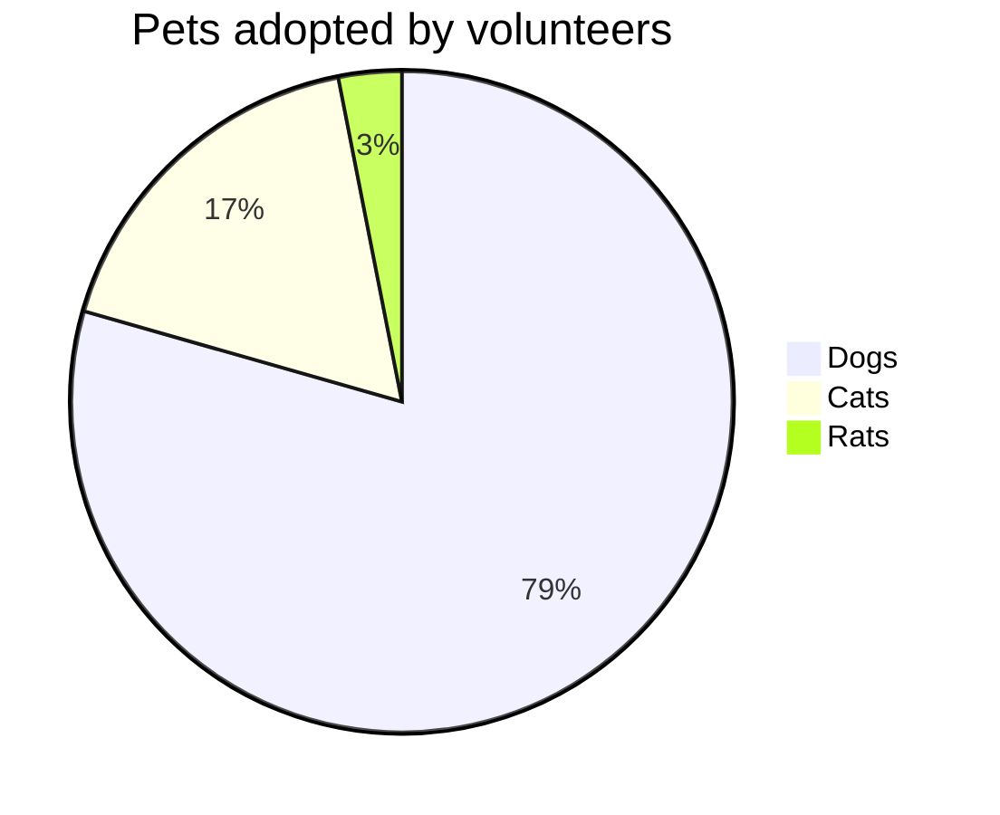
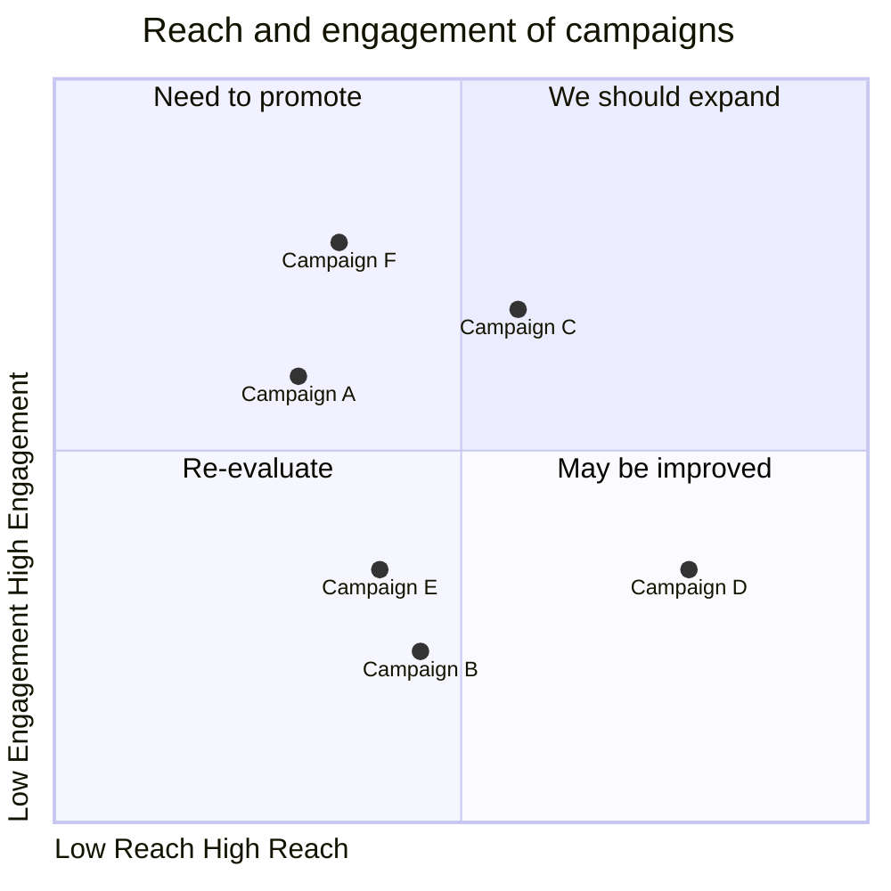

```mermaid
xychart-beta
    title "Sales Revenue"
    x-axis [jan, feb, mar, apr, may, jun, jul, aug, sep, oct, nov, dec]
    y-axis "Revenue (in $)" 4000  11000
    bar [5000, 6000, 7500, 8200, 9500, 10500, 11000, 10200, 9200, 8500, 7000, 6000]
    line [5000, 6000, 7500, 8200, 9500, 10500, 11000, 10200, 9200, 8500, 7000, 6000]
```



```json
{
          series: [{
          name: 'PRODUCT A',
          data: [44, 55, 41, 67, 22, 43]
        }, {
          name: 'PRODUCT B',
          data: [13, 23, 20, 8, 13, 27]
        }, {
          name: 'PRODUCT C',
          data: [11, 17, 15, 15, 21, 14]
        }, {
          name: 'PRODUCT D',
          data: [21, 7, 25, 13, 22, 8]
        }],
          chart: {
          type: 'bar',
          height: 350,
          stacked: true,
          toolbar: {
            show: true
          },
          zoom: {
            enabled: true
          }
        },
        responsive: [{
          breakpoint: 480,
          options: {
            legend: {
              position: 'bottom',
              offsetX: -10,
              offsetY: 0
            }
          }
        }],
        plotOptions: {
          bar: {
            horizontal: false,
            borderRadius: 10,
            borderRadiusApplication: 'end', // 'around', 'end'
            borderRadiusWhenStacked: 'last', // 'all', 'last'
            dataLabels: {
              total: {
                enabled: true,
                style: {
                  fontSize: '13px',
                  fontWeight: 900
                }
              }
            }
          },
        },
        xaxis: {
          type: 'datetime',
          categories: ['01/01/2011 GMT', '01/02/2011 GMT', '01/03/2011 GMT', '01/04/2011 GMT',
            '01/05/2011 GMT', '01/06/2011 GMT'
          ],
        },
        legend: {
          position: 'right',
          offsetY: 40
        },
        fill: {
          opacity: 1
        }
        }
```

```json
{
  series: [
    {
      name: 'ВНЖ',
      data: [1398, 1743, 2005, 2429, 3430, 2677, 2795, 2976, 4125, 3887, 3538, 22351, 41644]
    },
    {
      name: 'ПМЖ',
      data: [834, 806, 803, 562, 554, 620, 684, 785, 943, 824, 1264, 1355, 1749]
    },
    {
      name: 'Гражданство',
      data: [47, 166, 52, 89, 99, 67, 82, 145, 135, 174, 197, 275, 532]
    }
  ],
  chart: {
    type: 'bar',
    height: 400,
    stacked: true,
    toolbar: {
      show: true
    },
    zoom: {
      enabled: true
    }
  },
  plotOptions: {
    bar: {
      horizontal: false,
      borderRadius: 5,
      dataLabels: {
        total: {
          enabled: true,
          style: {
            fontSize: '12px',
            fontWeight: 600
          }
        }
      }
    }
  },
  xaxis: {
    type: 'category',
    categories: [
      '2011', '2012', '2013', '2014', '2015', '2016',
      '2017', '2018', '2019', '2020', '2021', '2022', '2023'
    ],
    title: {
      text: 'Год'
    }
  },
  legend: {
    position: 'top',
    offsetY: 20
  },
  fill: {
    opacity: 1
  },
  colors: ['#1E90FF', '#32CD32', '#FF4500'], // Цвета для ВНЖ, ПМЖ, Гражданства
  responsive: [
    {
      breakpoint: 480,
      options: {
        legend: {
          position: 'bottom',
          offsetX: -10,
          offsetY: 0
        }
      }
    }
  ]
}
```
