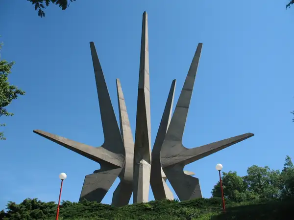

Авала и Космай подходят под один запрос — выбраться из Белграда на природу на полдня или день, — но требуют разного планирования. **Авала проще как первый выезд без машины:** в сезон линия 400 довозит к верхней части горы, а линия 401 — к началу маркированных маршрутов в Пиносаве. **Космай удобнее планировать как отдельный походный день:** до Сопота есть городской транспорт, но к лесной части нужен ещё один участок пути, а сами точки расположены менее компактно.[^1][^5]

## Быстрый выбор

| Критерий | Авала | Космай |
| --- | --- | --- |
| **Без машины** | В сезон проще: линия 400 идёт до Vrh Avale; вне сезона ориентируйтесь на 401 и пеший подъём из Пиносавы.[^1] | Реально, но с пересадкой: сначала до Sopot AS, затем местным транспортом в сторону Тресије или заранее спланированным последним участком.[^5] |
| **На машине** | У комплекса Avalski toranj есть официальный бесплатный паркинг.[^3] | Автомобиль упрощает доступ к верхней рекреационной зоне и сокращает зависимость от редких пригородных пересадок.[^6] |
| **Короткая прогулка** | Есть маркированный маршрут PSS 3,34 км от Пиносавы к Споменику Незнаном јунаку.[^2] | Для короткого формата удобнее выбрать мемориальную и рекреационную часть, не пытаясь обязательно пройти большой круг.[^6] |
| **Несколько часов ходьбы** | Кольцо PSS 9,13 км с набором 582 м и возвращением к той же остановке.[^2] | PSS публикует два официальных GPX — Kosmaj vrhovi и Kosmaj trek; параметры конкретного трека проверяйте в файле перед выходом.[^7] |
| **С детьми** | У башни есть детская площадка и другие наземные активности; для пешего маршрута всё равно учитывайте длину и набор.[^3] | Муниципалитет указывает оборудованные места отдыха со столами, скамейками и детской площадкой вдоль дороги к верхней части Космая.[^6] |
| **История и мемориалы** | Споменик Незнаном јунаку, мемориал советским ветеранам, средневековый Жрнов в историческом контексте места.[^4] | Мемориал Космайско-посавского партизанского отряда и костница сербских воинов Первой мировой войны на Белом камне.[^6] |
| **Видовая точка** | Платный видиковац Avalski toranj на высоте 122 м над основанием башни.[^3] | Деревянный видиковац в верхней части Космая; настоящий главный пик не является доступной туристической целью.[^6][^7] |
| **Сколько закладывать** | Полдня достаточно для верхней части; для маршрута 9,13 км лучше выделить большую часть дня. | Практичнее закладывать день целиком, особенно без машины и с пересадкой в Сопоте. |

## Авала

*Фото: [Vladimir Stanković](https://commons.wikimedia.org/wiki/File:Avala_Tower.jpg).*[^8]

### Как добраться без машины

Линия **400** Voždovac — Vrh Avale — сезонная. В 2026 году её расписание действует с **1 мая**, рейсы опубликованы на субботу и воскресенье, а с переходом на зимний режим **1 сентября линия прекратила работу**. То есть для поездки ориентируйтесь на сезон **май–август** и всё равно проверяйте расписание на конкретную дату. Маршрут проходит через остановки Avala, Podnožje, Spomenik sovjetskim veteranima и Hotel Avala и доходит до верхней части горы.[^1]

Для пешего подъёма удобна линия **401** Slavija /Birčaninova/ — Pinosava. Она проходит через остановку Avala в Пиносаве — именно эту остановку PSS указывает как старт двух маршрутов ниже.[^1]

Общие правила белградского транспорта и ссылки на официальные сервисы собраны в статье [«Общественный транспорт в Белграде и Нови-Саде»](/arrival/prevoz/).

### Два проверенных пеших формата

Planinarski savez Srbije публикует параметры, маркировку и GPX для обоих маршрутов.[^2]

| Маршрут | Длина | Время PSS | Набор / сброс | Формат |
| --- | ---: | ---: | ---: | --- |
| **Avala, staza 2** | 3,34 км | 1:20 | +376 / −145 м | От остановки Avala в Пиносаве к Споменику Незнаном јунаку |
| **Avala, staza 1** | 9,13 км | 3:45 | +582 / −582 м | Кольцо от той же остановки с возвращением в Пиносаву |

Обе трассы PSS классифицирует как laka, описывает как хорошо обустроенные и отмеченные стандартной красно-белой планинарской маркировкой. Но laka не означает прогулку без нагрузки: кольцо 9,13 км набирает суммарно 582 м высоты.[^2]

<Aside type="tip" title="Скачайте официальный GPX до выхода">
  На страницах PSS для Avala, staza 1 и Avala, staza 2 есть кнопка Preuzmi для GPX. Используйте этот файл вместе с маркировкой на местности, а не случайный пользовательский трек без понятного происхождения.
</Aside>

PSS публикует и другие размеченные варианты со стартом в Белом Потоке и у Čarapićev brest. Если основной план — именно ходьба, сначала выберите трассу на сайте PSS, а уже затем подбирайте транспорт к её старту.

### Башня и мемориальная часть

**Avalski toranj** можно посещать отдельно от пешего маршрута. Оператор публикует разные часы работы для периода апрель–октябрь и ноябрь–март, подтверждает бесплатную парковку у комплекса и предупреждает, что при экстремально сильном ветре видиковац временно закрывают. Перед выездом проверяйте текущий режим на официальном сайте, а не по старому скриншоту.[^3]

Споменик Незнаном јунаку на вершине построен в 1938 году по проекту Ивана Мештровича на месте средневекового Жрнова; с 1979 года он имеет статус памятника культуры исключительного значения.[^4] Подробный исторический контекст мемориалов собран отдельно в статье [«Споменики Югославии»](/lifestyle/travel/yugoslav-spomenici/); более широкий фон — в разделе [«История Сербии»](/lifestyle/history/).

<Spoiler title="Что здесь происходило: Авала, Жрнов и мемориалы">
  Авала была не только местом прогулок. Город Белград указывает, что вершина использовалась как стратегическая точка ещё в римское время; в Средние века здесь стоял город-крепость Жрнов, контролировавший подход к Белграду. Османская империя заняла его в XV веке, а к XVIII веку крепость утратила прежнее значение.[^4]

  После Первой мировой войны местные жители поставили в 1922 году первый памятник у могилы неизвестного сербского солдата, погибшего здесь в 1915 году. Современный мавзолей Ивана Мештровича строили в 1934–1938 годах; ради строительства в 1934 году были разрушены остатки Жрнова.[^4]

  Ниже находится памятник советским военным ветеранам. Он связан с авиакатастрофой 19 октября 1964 года, в которой погибла советская военная делегация, летевшая на празднование двадцатилетия освобождения Белграда; памятник установили в 1965 году.[^4]

  Телебашня — уже послевоенный слой истории Авалы. Первый Avalski toranj открылся в 1965 году, был разрушен 29 апреля 1999 года во время бомбардировок НАТО, а восстановленная башня открылась для посетителей 21 апреля 2010 года.[^3]
</Spoiler>

## Космай

*Фото: [CrniBombarder!!!](https://commons.wikimedia.org/wiki/File:Kosmaj_spomenik2.jpg).*[^9]

Космай — охраняемая природная территория категории predeo izuzetnih odlika с режимами защиты II и III степени. Муниципалитет Сопот указывает высоту 626 м, лесные прогулочные тропы, места отдыха вдоль дороги к верхней части, детскую площадку и деревянный видиковац.[^6]

### Как добраться без машины

Практичная схема состоит из двух этапов:

1. доехать до **Sopot AS**: например, линия **465a** идёт от BAS через Mali Požarevac до автостанции Сопота;[^5]
2. проверить локальный рейс в сторону Тресије: линия **4408** Sopot — Tresije — Rogača проходит через остановку Tresije — Raskrsnica.[^5]

<Aside type="caution" title="Остановка в Тресије — ещё не начало похода">
  Tresije — Raskrsnica — транспортная остановка на маршруте, а не обещание высадки прямо у выбранного GPX или монастыря. До поездки сопоставьте остановку с началом официального трека и обязательно проверьте обратный рейс. Для Космая транспортная логистика важнее, чем для Авалы.
</Aside>

Не переносите сохранённое расписание на будущую дату: пригородные и локальные рейсы проверяйте непосредственно перед поездкой на сайте городского транспорта.

### Какой маршрут брать

У PSS есть отдельная страница Космая с двумя официальными GPX: **Kosmaj vrhovi** и **Kosmaj trek**.[^7] Это надёжнее, чем строить основной маршрут по анонимной записи из приложения с пользовательскими треками.

Важная особенность: PSS прямо указывает, что **главный пик Космая высотой 626 м огорожен и недоступен для граждан**. Практической исходной точкой для планинаров служит мемориал на отметке 576 м, расположенный менее чем в километре восточнее главного пика. Beli kamen PSS указывает как отдельную точку высотой 546 м.[^7]

Поэтому не стройте маршрут вокруг цели «обязательно взойти на вершину 626 м». Выберите официальный GPX и доступные мемориальные/видовые точки.

### Что смотреть кроме леса

Муниципалитет Сопот выделяет на Космае:

- мемориал павшим бойцам Космайско-посавского партизанского отряда;
- костницу сербских воинов Первой мировой войны на Белом камне;
- средневековый монастырь Кастељан и другие объекты культурного наследия в районе горы;
- оборудованные места отдыха и деревянный видиковац.[^6]

<Spoiler title="Что здесь происходило: Космай, Белый камень и партизанский мемориал">
  На Космае есть следы поселений и присутствия римского времени; среди средневековых объектов муниципалитет Сопот выделяет монастырь Святого Георгия — Кастељан.[^6]

  Спомен-костурница на Белом камне была построена в 1935 году в память о сербских воинах, погибших при обороне Белграда в 1914 году. Муниципальные источники связывают это место с Космайско-Варовницкой битвой Первой мировой войны.[^6]

  Космайско-посавский партизанский отряд сформировали 2 июля 1941 года. Мемориал павшим бойцам открыли ровно через 30 лет — 2 июля 1971 года. Его авторы — скульптор Воин Стоич и архитектор Градимир Медакович; пять бетонных лучей высотой 30 м образуют главный визуальный знак комплекса.[^6]
</Spoiler>

Если едете прежде всего ради мемориальной архитектуры, заранее прочитайте [гайд по споменикам](/lifestyle/travel/yugoslav-spomenici/), а на месте относитесь к мемориалам как к историческим объектам, а не только как к фототочкам.

## Если едете на машине

На **Авале** самый простой автомобильный сценарий — ехать к комплексу Avalski toranj: оператор подтверждает бесплатный паркинг рядом со входом.[^3] После этого верхнюю часть можно совместить с мемориалом и короткой прогулкой.

На **Космае** машина снимает проблему пересадки в Сопоте. Муниципалитет описывает автомобильную дорогу к верхней части и оборудованные места отдыха вдоль неё.[^6] Это не означает, что нужно заезжать на лесные дорожки, которые показывает навигатор: оставляйте автомобиль на явно предназначенной для подъезда территории и продолжайте по пешеходному маршруту.

## Перед поездкой

<Steps>
1. Сначала выберите формат: верхняя часть и короткая прогулка или полноценный пеший маршрут.
2. Если едете на Авалу без машины, сначала проверьте сезон: линия 400 работает только в тёплый период; вне сезона планируйте 401 и пеший маршрут из Пиносавы.
3. Если едете на Космай без машины, сначала убедитесь, что сходятся рейс до Sopot AS, локальный участок и обратный транспорт.
4. Скачайте официальный GPX PSS заранее, если планируете идти по маршруту, а не только посетить рекреационную зону.
5. Проверьте прогноз, световой день и текущий режим Avalski toranj; при сильном ветре видиковац может временно закрываться.[^3]
6. Возьмите воду с запасом. Наличие источников или объектов питания на карте не гарантирует, что они будут доступны именно в день поездки.
7. На Космае не пытайтесь пройти к огороженному главному пику 626 м: используйте доступные точки и официальный трек PSS.[^7]
</Steps>

Другие направления собраны в разделе [«Путешествия по Сербии»](/lifestyle/travel/).

[^1]: Секретариат общественного транспорта Белграда: [линия 400 Voždovac — Vrh Avale](https://www.bgprevoz.rs/linije/red-voznje/smer-a/400), [расписание линии 400](https://www.bgprevoz.rs/linije/red-voznje/linija/400/prikaz) и [линия 401 Slavija /Birčaninova/ — Pinosava](https://www.bgprevoz.rs/linije/red-voznje/smer-a/401) — трассы, остановки и действующее с 01.05.2026 расписание 400; о прекращении работы сезонной линии 400 с 01.09.2026 сообщил Секретариат через [Tanjug/B92](https://www.b92.net/lokal/beograd/servisne-informacije/263837/zimski-red-voznje-u-beogradu-od-danas-vise-vozila-ukidaju-se-sezonske-linije/vest). Проверено 19.09.2026.
[^2]: Planinarski savez Srbije: [Avala, staza 1](https://pss.rs/terenipp/avala-staza-1/) и [Avala, staza 2](https://pss.rs/terenipp/avala-staza-2/) — длина, время, набор высоты, сложность, маркировка и официальный GPX; проверено 19.09.2026.
[^3]: Avalski toranj / Emisiona tehnika i veze: [официальный сайт](https://avalskitoranj.rs/), [история башни](https://avalskitoranj.rs/o-tornju/) и [контакты и режим работы](https://avalskitoranj.rs/kontakt/) — сезонные часы, видиковац, парковка, история башни и погодные ограничения; проверено 19.09.2026.
[^4]: Город Белград: [история Авалы](https://www.beograd.rs/cir/zivot-u-beogradu/beogradska-riznica/a86577/Planina-Avala-omiljena-destinacija-za-predah-medju-Beogradjanima.html), [Споменик Незнаном јунаку](https://www.beograd.rs/lat/zivot-u-beogradu/beogradska-riznica/a86592/SPOMENIK-NEZNANOM-JUNAKU-Pleni-svojom-monumentalnoscu-a-nosi-jaku-simboliku.html) и [памятник погибшим советским ветеранам](https://www.beograd.rs/lat/beoinfo-vesti/a19689/Venci-na-Spomenik-poginulim-sovjetskim-veteranima-na-Avali.html); Туристическая организация Белграда: [Avalski toranj](https://www.tob.rs/sr/razgledanja/ostala-razgledanja/avalski-toranj) — Жрнов, памятник Неизвестному герою и мемориальные объекты Авалы.
[^5]: Секретариат общественного транспорта Белграда: [линия 465a BAS — Mali Požarevac — Sopot](https://www.bgprevoz.rs/linije/red-voznje/smer-a/60465) и [линия 4408 Sopot — Tresije — Rogača](https://www.bgprevoz.rs/linije/red-voznje/smer-a/60201) — Sopot AS и остановка Tresije — Raskrsnica; проверено 19.09.2026.
[^6]: Городская община Сопот: [Космай](https://www.sopot.org.rs/directory/kosmaj/) и [история мемориала Космайско-посавского партизанского отряда](https://www.sopot.org.rs/obelezena-godisnjica-osnivanja-kosmajsko-posavskog-partizanskog-odreda-3/) — природный и культурный контекст, мемориал 1971 года, его авторы и параметры; Городская община Младеновац: [исторические точки Космая](https://www.mladenovac.rs/sr/vesti/aktuelnosti/10-mladenovac/o-mladenovcu) — Белый камень и память о событиях 1914 года; Город Белград: [защита природного добра «Космай»](https://www.beograd.rs/lat/beoinfo-vesti/a15260/Prirodno-dobro-Kosmaj-pod-zastitom.html).
[^7]: Planinarski savez Srbije: [Космай](https://pss.rs/planine-srbije/sumadija/kosmaj/) — высоты Космая и Белого камня, недоступность огороженного главного пика и два официальных GPX Kosmaj vrhovi / Kosmaj trek; проверено 19.09.2026.

[^8]: Изображение Avala Tower — Vladimir Stanković, Wikimedia Commons, [CC BY-SA 2.0](https://creativecommons.org/licenses/by-sa/2.0/). Условия лицензии изображения действуют отдельно от лицензии редакционного текста RSLive.
[^9]: Изображение Kosmaj spomenik2 — CrniBombarder!!!, Wikimedia Commons; автор передал изображение в общественное достояние.
