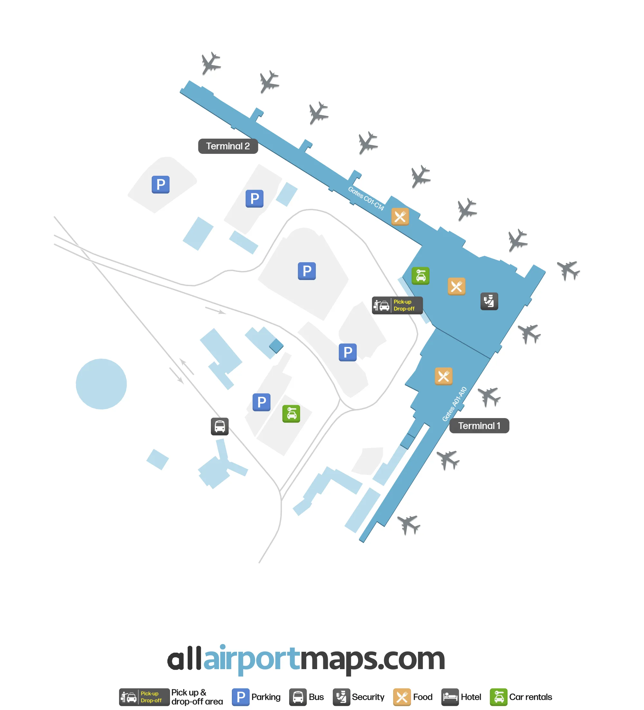

Стамбул — один из основных пересадочных узлов по дороге из России в Сербию. Эта инструкция рассчитана прежде всего на ситуацию, когда **мобильного интернета нет, иностранная карта не работает, SMS не приходит, а английский и турецкий вы не знаете**.

До вылета включите **полную офлайн-копию RSLive** и дождитесь статуса готовности. Тогда вместе со статьёй останутся локальные схемы `IST`, `SAW` и `BEG`.

Сначала определите три вещи: **код аэропорта**, **куда зарегистрирован багаж** и **один у вас билет или отдельные бронирования**. Всё остальное решается после этого.

<Aside type="danger" title="IST и SAW — два разных аэропорта">
  **IST** — Istanbul Airport (`İstanbul Havalimanı`) на европейской стороне Стамбула. **SAW** — Sabiha Gökçen International Airport (`Sabiha Gökçen Havalimanı`) на азиатской стороне. Это не два терминала одного аэропорта. Если один билет заканчивается в IST, а следующий начинается в SAW, вам нужно въехать в Турцию, получить багаж, пересечь значительную часть города и снова пройти регистрацию и контроль.
</Aside>

Из двух действующих крупных аэропортов Стамбула **SAW старше**: Sabiha Gökçen открыли 8 января 2001 года, а нынешний Istanbul Airport (IST) — 29 октября 2018 года.[^1] Но SAW — не бывший аэропорт Ататюрка: регулярные рейсы Turkish Airlines из Atatürk переносили в новый IST в апреле 2019 года.[^1] Для водителя, кассира или сотрудника всегда показывайте код `SAW` или полное название аэропорта.

## Три аэропорта на одном экране

| Код | Аэропорт | Главное |
| --- | --- | --- |
| **IST** | Istanbul Airport | европейская сторона; огромный единый терминал; M11; Havaist на уровне `Arriving Passenger -2`[^1] |
| **SAW** | Sabiha Gökçen | азиатская сторона; M4; возможны перронные автобусы между самолётом и терминалом[^2] |
| **BEG** | Belgrade Nikola Tesla Airport | конечный аэропорт для большинства рейсов в Белград; бесплатный Wi-Fi в пассажирских зонах[^20] |

С июня 2026 года M11 проходит через Istanbul Airport между **Gayrettepe и Halkalı**. На Halkalı можно пересесть на Marmaray. Это даёт полностью рельсовый запасной маршрут между IST и SAW, который не зависит от автомобильных пробок.[^3]

<Aside type="caution" title="В SAW заложите время на перронный автобус даже при пересадке в том же аэропорту">
  В SAW используются **перронные автобусы** (`apron bus`): Pegasus в феврале 2025 года отдельно сообщала о вводе шести новых автобусов для перевозки пассажиров **между самолётом и терминалом**.[^2] Публичной статистики о доле таких рейсов нет, поэтому нельзя обещать, что автобус будет — или что его не будет.

  Для короткой пересадки безопаснее считать возможным длинный сценарий: **самолёт → ожидание высадки → автобус до терминала → переход и очереди → gate → при удалённой стоянке второго рейса ещё один автобус → самолёт**. Здесь речь именно о терминале: перронный автобус не вывозит пассажиров в город.
</Aside>

## Что сохранить до вылета

Пока интернет ещё есть, сохраните на телефон:

- полную офлайн-копию RSLive и дождитесь статуса готовности;
- оба посадочных талона и маршрут-квитанции;
- `PNR` каждого бронирования;
- скриншот, где крупно видны коды **IST**, **SAW** и **BEG**;
- багажную бирку: на ней важен конечный код аэропорта;
- адрес и телефон гостиницы;
- контакты авиакомпании;
- несколько способов оплаты и небольшой запас турецких лир;
- турецкие фразы из этой статьи.

Схемы IST, SAW и BEG уже встроены ниже как локальные WebP-файлы. После завершённой офлайн-загрузки отдельная интернет-карта для аварийного сценария не нужна.

Если у вас есть сербская SIM-карта, заранее проверьте, регистрируется ли она в роуминге в Турции. Для получения SMS **не нужно включать мобильную передачу данных**: data roaming можно оставить выключенным.

## Схемы аэропортов для офлайна

Интерактивные карты полезны **до поездки**, чтобы проверить актуальное расположение стойки или сервиса.[^2][^4] Но аварийная инструкция не зависит от внешней страницы. Ниже — три локальные схемы. Указание источника `allairportmaps.com` сохранено непосредственно на изображениях.

<Aside type="note" title="Схемы — для ориентации">
  Номер конкретного gate, стойка авиакомпании или магазин могут измениться. Для текущей информации в день полёта ориентируйтесь на табло и указатели аэропорта.
</Aside>

### IST: схема терминала

В IST сначала определите: вы идёте в `International Transfer / Aktarma` или должны выйти через паспортный контроль и получить багаж.

### SAW: схема терминала

В SAW международная и внутренняя части находятся в одном терминальном комплексе. При удалённой стоянке к схеме добавляется перронный автобус: сначала вас доставят к терминалу, и только после этого имеет смысл искать `Transfer`, выход или M4.

### BEG: схема аэропорта Белграда

После прилёта ориентир простой: `Passport Control` → `Baggage Claim` → `Customs / Exit`. Если связь не появилась сразу, аэропорт предоставляет бесплатный Wi-Fi в пассажирских зонах.[^20]

### IST: схема действий

<MermaidGraph code={`flowchart LR
  A[Самолёт] --> B{Тип пересадки}
  B -->|Один билет, багаж дальше| T[International Transfer / Aktarma]
  T --> S[Transfer Security]
  S --> G[Departures / Gate]
  B -->|Получить багаж или выйти| P[Passport Control]
  P --> L[Baggage Claim]
  L --> C[Customs / Gümrük]
  C --> H[Arrivals Hall]
  H --> BUS[Havaist: Arrivals -2]
  H --> TAXI[Taxi / Taksi]
  H --> METRO[M11 по указателям Metro]
  H --> BAG[Emanet Bagaj / Left Luggage]
  H --> D[Departures для нового check-in]`} />

Если у вас обычный международный транзит одним билетом и багаж летит дальше, **не идите автоматически к Passport Control и Baggage Claim**. Ищите `International Transfer / Aktarma`.

### SAW: схема действий

<MermaidGraph code={`flowchart LR
  A[Самолёт] --> R{Стоянка}
  R -->|Телетрап / пеший выход| B{Тип пересадки}
  R -->|Удалённая стоянка| AB[Apron bus до терминала]
  AB --> B
  B -->|Транзит без багажа| T[Transfer / Transit / Aktarma]
  T --> G[Departures / Gate]
  G --> D{Посадка на следующий рейс}
  D -->|Обычный gate| PL[Самолёт]
  D -->|Bus gate| DB[Apron bus к самолёту]
  DB --> PL
  B -->|Нужен выход| P[Passport Control]
  P --> L[Baggage Claim]
  L --> C[Customs / Gümrük]
  C --> H[Arrivals]
  H --> M[M4: вход Terminal]
  H --> BUS[Havaist: open car park напротив Arrivals]
  H --> TAXI[Taxi / Taksi]
  H --> BAG[Emanet Bagaj: International Arrivals]
  H --> CH[Departures для нового check-in]`} />

Официальная страница SAW подтверждает три входа станции M4, включая вход непосредственно у **Terminal**.[^2] Для Havaist между SAW и IST аэропорт указывает открытую парковку напротив Arrivals.[^5]

## Определите тип пересадки

### Один билет и багаж зарегистрирован до Сербии

Если оба сегмента оформлены одним билетом и при регистрации подтвердили, что багаж летит до Белграда или другого конечного пункта, обычно схема такая:

**самолёт → `International Transfer / Aktarma` → трансферный контроль → зона вылета → gate.**

В SAW к этой схеме может добавиться перронный автобус до терминала после прилёта и/или от gate к самолёту перед вылетом.[^2] Не считайте время между посадкой самолёта и попаданием внутрь терминала нулевым.

Посмотрите на багажную бирку. Для Белграда конечным кодом должен быть `BEG`, для Кралево — `KVO`.

<Aside type="tip" title="Спросите о багаже ещё при вылете">
  Покажите багажную квитанцию и спросите: **`Is my baggage checked through to Belgrade?`** Если английский не подходит, просто покажите бирку и слово **`BEG?`**.
</Aside>

### Отдельные билеты, self-transfer или ночёвка с выходом

При отдельных билетах безопасно исходить из длинной схемы:

**самолёт → паспортный контроль → багаж → таможня → выход → новый check-in / bag drop → паспортный контроль → досмотр → gate.**

Граждане России с обычным загранпаспортом освобождены от турецкой визы для туристических и деловых поездок до **60 дней**.[^6] Перед поездкой всё равно проверьте остаточный срок действия паспорта.[^6]

## Если нужно переехать IST ↔ SAW

Не существует одного «правильного» способа. Выбирайте маршрут по запасу времени, состоянию транспорта, количеству багажа и времени суток.

### Все практические семейства маршрутов

| Вариант | Схема | Когда полезен | Главный риск |
| --- | --- | --- | --- |
| **Прямой Havaist** | IST ↔ SAW | минимум пересадок, тяжёлый багаж | расписание и пробки[^5][^7] |
| **Такси / заранее заказанный трансфер** | IST ↔ SAW по дороге | ночь, много багажа, группа | цена и те же дорожные пробки |
| **Рельсы через Halkalı** | M11 → Marmaray → M4 | основной запасной маршрут без пробок | две пересадки, длинные переходы[^2][^3] |
| **Рельсы через Gayrettepe и Yenikapı** | M11 → M2 → Marmaray → M4 | второй независимый рельсовый коридор | три пересадки[^3][^8] |
| **M11 не работает** | автобус к Halkalı или Mecidiyeköy → рельсы | реальный резерв, применявшийся при закрытии M11 | автобусный участок; номера линий меняются[^9] |
| **M4 не работает** | MR60 через Pendik; E-3 через 4.Levent; SG-2 через Taksim | обход M4 | автобусный участок и пробки[^2] |
| **Ночь / метро закрыто** | Havaist, официальное такси, трансфер/шаттл гостиницы | когда рельсы недоступны | цена, пробки, наличие конкретного рейса |

IETT также показывает линии **SG-1 и E-10 между SAW и Kadıköy**.[^2] Для именно аэропортовой пересадки они обычно сложнее вариантов через Pendik, 4.Levent или Taksim: после Kadıköy остаётся отдельный переход к рельсам и длинный путь через город.

### План A: прямой Havaist

Havaist показывает направление Sabiha Gökçen среди аэропортовых маршрутов, а SAW отдельно подтверждает прямую связь с Istanbul Airport.[^1][^5]

Плюсы: без пересадок и удобно с чемоданами. Но **автобус не является надёжным таймером для короткой пересадки**: оператор предупреждает, что пробки, ДТП и другие обстоятельства меняют маршрут, расписание и фактическое время прибытия.[^7]

<Aside type="caution" title="Не считайте Havaist гарантированным">
  Если автобус отменён, долго не приходит или дорога стоит, не ждите до последнего. Переходите к рельсовому маршруту. Если времени уже критически мало, помните: такси едет по тем же дорогам и тоже попадает в пробки.
</Aside>

У **IST** Havaist указывает посадку на уровне `Arriving Passenger -2`.[^1] У **SAW** — на открытой парковке напротив Arrivals.[^5]

### План B: рельсы через Halkalı

После открытия участка до Halkalı в июне 2026 года понятный маршрут из IST в SAW выглядит так:[^2][^3]

<Steps>
1. В **IST** найдите M11 и садитесь **в сторону `Halkalı`**.
2. На **Halkalı** пересядьте на **Marmaray** в сторону `Gebze`.
3. Выйдите на **Ayrılık Çeşmesi**.
4. Пересядьте на **M4** в сторону `Sabiha Gökçen Havalimanı`.
5. Выйдите на станции аэропорта SAW и следуйте указателю `Terminal`.
</Steps>

Обратно: **SAW → M4 до Ayrılık Çeşmesi → Marmaray в сторону Halkalı → Halkalı → M11 → IST.**

M4 официально работает примерно **06:00–00:00**, поездка по всей линии Kadıköy–SAW занимает около 52 минут.[^8] Для M11 и Marmaray проверяйте последний поезд на конкретную дату.

### План B2: второй рельсовый коридор через Gayrettepe и Yenikapı

M2 связывает **Gayrettepe** с **Yenikapı**; на Gayrettepe есть пересадка M2 ↔ M11, а на Yenikapı — M2 ↔ Marmaray.[^3]

Из IST в SAW:

<Steps>
1. В IST сядьте на **M11 в сторону `Gayrettepe`**.
2. На **Gayrettepe** пересядьте на **M2 в сторону `Yenikapı`**.
3. На **Yenikapı** пересядьте на **Marmaray в сторону `Gebze`**.
4. На **Ayrılık Çeşmesi** пересядьте на **M4 в сторону `Sabiha Gökçen Havalimanı`**.
5. Выйдите на станции аэропорта SAW.
</Steps>

Обратно: **SAW → M4 → Ayrılık Çeşmesi → Marmaray до Yenikapı → M2 до Gayrettepe → M11 → IST.**[^3][^8]

Этот вариант тоже не зависит от дорожных пробок, но в нём три пересадки. Его ценность — как независимого запасного коридора.

### План C: M11 не работает

Это не теоретический случай: **14–18 июня 2026 года M11 временно полностью закрывали** для интеграционных работ. Тогда IETT усилила `H-2 Mecidiyeköy – İstanbul Havalimanı`, а `H3 Halkalı Marmaray – İstanbul Havalimanı` и `H1 Mahmutbey Metro – İstanbul Havalimanı` продолжали работу.[^9]

Если подобное повторится:

1. **через Halkalı:** IST → актуальный автобус к `Halkalı Marmaray` (в июне 2026 — H3) → Marmaray до Ayrılık Çeşmesi → M4 → SAW;
2. **через Mecidiyeköy/Yenikapı:** IST → актуальный автобус к `Mecidiyeköy` (в июне 2026 — H-2) → M2 до Yenikapı → Marmaray до Ayrılık Çeşmesi → M4 → SAW.[^9]

В обратную сторону используйте те же узлы в обратном порядке.

<Aside type="note" title="Запоминайте узел, а не номер автобуса">
  Номера и трассы автобусных линий меняются. Офлайн полезнее сохранить слова **`Halkalı Marmaray`** и **`Mecidiyeköy Metro`**. Если M11 закрыта, покажите сотруднику один из этих узлов и спросите, какой автобус идёт туда сейчас.
</Aside>

### План D: M4 не работает или станция SAW недоступна

По текущему поиску маршрутов IETT полезны, в частности, **MR60 Pendik/Pendik YHT – SAW**, **E-3 4.Levent Metro – SAW** и **SG-2 Taksim – SAW**.[^2]

#### D1: через Pendik

**SAW → MR60 до Pendik / Pendik YHT → Marmaray в сторону Halkalı → Halkalı → M11 → IST.**[^2][^3]

Обратно: **IST → M11 до Halkalı → Marmaray до Pendik → MR60 → SAW.**

#### D2: через 4.Levent

**SAW → E-3 до 4.Levent Metro → M2, выйти на Gayrettepe → M11 → IST.**[^2][^3]

Обратно: **IST → M11 до Gayrettepe → M2 до 4.Levent → E-3 → SAW.**

#### D3: через Taksim

**SAW → SG-2 до Taksim → M2 до Gayrettepe → M11 → IST.**[^2][^3]

Обратно: **IST → M11 до Gayrettepe → M2 до Taksim → SG-2 → SAW.**

<Aside type="caution" title="Автобусный обход M4 не защищает от пробки">
  Эти варианты нужны, когда M4 недоступна, но они возвращают автомобильный участок. Если интернет не работает, покажите: `Pendik Marmaray?`, `4.Levent Metro?` или `Taksim Metro?`.
</Aside>

### План E: всё ломается и времени почти нет

Сначала выясните, **реально ли успеть пройти check-in/bag drop и контроль**. Если закрытие регистрации уже близко, подойдите к стойке авиакомпании и одновременно проверяйте следующий рейс. Дорогая поездка на такси бессмысленна, если перевозчик уже не примет багаж.

Для отдельных билетов между IST и SAW не покупайте короткую стыковку. Даже при идеальном транспорте остаются паспортный контроль, выдача багажа, путь до транспорта, повторная регистрация и досмотр. Чемоданы, дети, ночь, плохая погода и праздничные дни требуют дополнительного запаса.

## Wi-Fi: что делать, когда всё пошло не по инструкции

### IST: `iGA WiFi`

С ноября 2024 года iGA объявила в Istanbul Airport **бесплатный безлимитный Wi-Fi**. Для обычного пассажира опубликованы два способа идентификации:[^10]

1. номер телефона → код по SMS;
2. access code из терминального киоска → киоск считывает паспорт или ID.

Для пассажиров Turkish Airlines есть отдельная сеть `TK WiFi`; авиакомпания разрешает вход по Miles&Smiles или данным рейса, то есть SMS не является единственным вариантом.[^11]

### Где в IST искать Wi-Fi kiosk

Официальное сообщение подтверждает наличие киосков по терминалу, но не даёт стабильный список каждой точки. По практическим схемам и свежим инструкциям киоски встречаются на transfer/departures/arrivals, в international baggage claim и других пассажирских зонах.[^12]

Ищите автомат с надписью **`Free Wi-Fi` / `Wi-Fi`**. Если рядом киоска нет, покажите сотруднику фразу `Wi-Fi kiosku nerede?`.

### Если страница авторизации не открылась

<Steps>
1. Подключитесь к `iGA WiFi`.
2. Отключите и снова включите Wi-Fi.
3. Откройте обычную незашифрованную страницу, например `http://neverssl.com`, чтобы вызвать captive portal.
4. Если портал не появился — забудьте сеть (`Forget network`) и подключитесь заново.
5. Если времени мало — сразу переходите к киоску или стойке информации.
</Steps>

### Если SMS не приходит

Официального правила «российские номера запрещены» нет. Но иностранная SIM может не зарегистрироваться или SMS может не прийти. Не зависайте на одном способе.

<Steps>
1. Проверьте, зарегистрировалась ли SIM в турецкой сети.
2. Не включайте передачу данных только ради SMS.
3. Проверьте код страны и номер.
4. Если есть сербская SIM, попробуйте её.
5. Перейдите на **passport/access-code kiosk**.
6. Если летите Turkish Airlines, попробуйте `TK WiFi` и вход по данным рейса.[^11]
7. Если ничего не работает — идите к `Information / Danışma`.
</Steps>

### Если киоск не читает паспорт

1. снимите обложку;
2. полностью раскройте страницу с фотографией и машиночитаемыми строками;
3. приложите паспорт так, как показано на экране;
4. попробуйте второй киоск;
5. покажите сотруднику: `Pasaportum okunmuyor. İnternete bağlanmak için yardım eder misiniz?`;
6. если интернет нужен только для gate — используйте табло и не тратьте время на Wi-Fi.

### SAW: Wi-Fi есть, но нужен резерв

Официальный сайт SAW подтверждает бесплатный Wi-Fi.[^2] Пользовательский опыт 2025–2026 годов показывает, что отдельные стойки могут не считать паспорт или выдать неработающий код; это практика, а не официальная гарантия расположения конкретного киоска.[^13]

Алгоритм: **SMS → паспортный киоск → другой киоск → Information / Danışma.** Если получили код — сфотографируйте или запишите его.

### Если интернета нет вообще

Без интернета доступны табло, `Information / Danışma`, стойка авиакомпании, касса транспорта, банкомат/обменник, официальный taxi rank и сохранённый адрес гостиницы.

## Если не работает банковская карта

Российские Visa и Mastercard, выпущенные российскими банками, **не работают за пределами России**.[^14] Поэтому их нельзя считать резервом для метро, Havaist, такси, гостиницы или еды.

Держите резерв:

- наличные **TRY**;
- рабочую иностранную карту;
- `İstanbulkart`, если успели купить и пополнить;
- доступный на конкретной станции разовый билет.

На автоматах полезны слова:

| На экране | Значение |
| --- | --- |
| `Biletmatik` | автомат билетов и Istanbulkart |
| `Bakiye yükle` | пополнить баланс |
| `Nakit` | наличные |
| `Kredi kartı` | кредитная карта |
| `Banka kartı` | дебетовая карта |
| `Tek kullanımlık` | одноразовый |

### Если везёте крупную сумму наличных через Турцию

Министерство культуры и туризма Турции публикует валютные правила: верхнего лимита на ввоз иностранной и турецкой валюты не указано; **до эквивалента 5 000 USD иностранной валюты можно вывезти**, а более крупные суммы должны переводиться через банки. Для части случаев вывоза 5 000 USD наличными действует требование документировать покупку валюты у уполномоченного банка.[^19] Если везёте значительную сумму транзитом, перед вылетом повторно сверяйте актуальное правило и сохраняйте подтверждения происхождения или ввоза денег, когда они применимы.

### Если не получается оплатить Havaist

Havaist указывает поддержку банковских карт, но российская Visa/Mastercard не подойдёт.[^1][^14]

Если оплата не проходит:

1. покажите `Kartım çalışmıyor.`;
2. спросите `İstanbulkart ile ödeyebilir miyim?`;
3. спросите, где официальная точка продажи билета;
4. **не рассчитывайте, что наличные обязательно примут в салоне** — уточните до посадки;
5. если автобус уходит и времени мало, переходите к метро или официальному такси.

## IST: куда идти без карты и приложения

### Транзит без получения багажа

Ищите `International Transfer` / `Transfer` / `Aktarma`. После контроля смотрите рейс на табло. IST очень большой: когда gate появился, не откладывайте переход.

### Получить багаж и выйти

`Passport Control` → `Baggage Claim / Bagaj Alım` → `Customs / Gümrük` → `Exit / Çıkış`.

Для нового вылета поднимайтесь в `Departures / Giden Yolcu`, найдите check-in zone своей авиакомпании, сдайте багаж и проходите международные формальности.

### Нужен Havaist

Ищите уровень **`Arriving Passenger -2` / `Gelen Yolcu -2`**.[^1]

### Нужен M11

Для основного маршрута в SAW удобнее направление **Halkalı**; второй рельсовый вариант начинается в направлении **Gayrettepe**.[^3]

## SAW: куда идти без карты и приложения

### Нужен M4

У станции три входа; один официально обозначен как **Terminal**.[^2] Ищите `Metro / M4 / Kadıköy`.

### Если вас везут автобусом от самолёта или к самолёту

Это **перронный автобус внутри аэропорта**, а не городской автобус. После прилёта он довозит до терминала; перед вылетом bus gate может вести к автобусу, который отвезёт к самолёту.[^2]

### Нужен Havaist до IST

Официальный SAW указывает посадку на **open car park level across terminal arrivals**.[^5]

### Нужно сдать багаж на новом рейсе

Смотрите авиакомпанию и check-in zone на табло. Например, Pegasus использует автоматические baggage kiosks в определённых зонах; если автомат отверг паспорт или билет, переходите к обычной стойке, а не повторяйте попытку до закрытия регистрации.[^15]

## Камера хранения и ночёвка

### IST

В Istanbul Airport есть staffed left-luggage и автоматические lockers. По опубликованному тарифу 2026 года на дату проверки 22.08.2026 ориентир за 24 часа составлял **210 TRY за небольшую сумку, 270 TRY за cabin-size, 550 TRY за большой чемодан, 690 TRY за XL и 860 TRY за XXL**.[^16]

Для семьи с несколькими большими чемоданами одна ночь хранения превращается в заметную статью расходов. До сдачи вещей посчитайте весь комплект.

### SAW

Официальный SAW указывает `Baggage Storage Office` на уровне **international arrivals**. Сервис работает **24/7**, плата дневная и зависит от размера багажа.[^17]

Если тариф непонятен, спросите: `Bir gün için ne kadar?` — «Сколько за один день?»

### Если нужна гостиница

Если ночёвка предсказуема, забронируйте гостиницу заранее и сохраните офлайн название, адрес, телефон, номер бронирования и правила позднего заселения. Выбирайте гостиницу около **аэропорта утреннего вылета**, а не просто «около аэропорта Стамбула».

Если ночёвка возникла из-за отмены или задержки, сначала проверьте обязанности перевозчика в общей статье [о перелётах](/move/travel/).

## Такси без приложения

Идите по указателям `Taxi / Taksi` к организованной стоянке у терминала. Не садитесь к человеку, который просто подходит в зале прилёта со словом «taxi».

Покажите водителю:

- `İstanbul Havalimanı (IST)`;
- `Sabiha Gökçen Havalimanı (SAW)`.

Такси может убрать пересадки, но **не защищено от дорожной пробки**.

## Если рейс в Белград сорвался

Проверяйте варианты одновременно:

- `IST → BEG`;
- `SAW → BEG`;
- если подходит география — `IST → KVO`.

Air Serbia продаёт рейсы между Стамбулом и Кралево (`KVO`, аэропорт Morava), но они выполняются значительно реже, чем рейсы в Белград: это **запасной маршрут на подходящую дату, а не гарантированный рейс в тот же день**.[^18]

<Aside type="caution" title="KVO — не второй аэропорт Белграда">
  `KVO` находится возле Кралево. Для Кралево, Чачака и части центральной/западной Сербии это может быть полезным вариантом. Если конечная цель — Белград, после прилёта остаётся отдельный наземный путь.
</Aside>

Если новый билет вылетает из другого аэропорта Стамбула, **сначала оцените возможность физически туда доехать**, а уже потом платите.

## После прилёта в Белград

Если конечный код на билете и багажной бирке — `BEG`, после паспортного контроля получите багаж и выходите через `Customs / Exit`. Схема `BEG` находится выше и входит в тот же офлайн-комплект.

Для связи используйте бесплатный Wi-Fi аэропорта.[^20] Дальнейший транспорт, SIM-карту, регистрацию и первые действия в Сербии смотрите в разделе [«Первые шаги после переезда»](/arrival/).

## Турецкий мини-словарь

### Что написано на указателях

| Турецкий | Русский |
| --- | --- |
| `Havalimanı` | аэропорт |
| `Dış Hatlar` | международные рейсы |
| `İç Hatlar` | внутренние рейсы |
| `Giden Yolcu / Gidiş` | вылет / отправление |
| `Gelen Yolcu / Geliş` | прилёт / прибытие |
| `Aktarma` | пересадка / трансфер |
| `Pasaport Kontrolü` | паспортный контроль |
| `Güvenlik Kontrolü` | досмотр |
| `Bagaj Teslim` | сдача багажа |
| `Bagaj Alım` | получение багажа |
| `Emanet Bagaj` | камера хранения |
| `Kayıp Bagaj` | потерянный багаж |
| `Çıkış` | выход |
| `Giriş` | вход |
| `Bilgi / Danışma` | информация / справочная |
| `Bilet` | билет |
| `Nakit` | наличные |
| `Taksi` | такси |
| `Metro` | метро |

### Фразы для Wi-Fi

| Турецкий | Русский |
| --- | --- |
| `Wi-Fi kiosku nerede?` | Где Wi-Fi-киоск? |
| `SMS gelmiyor.` | SMS не приходит. |
| `Rus telefon numaram var.` | У меня российский номер телефона. |
| `Sırp telefon numaram var.` | У меня сербский номер телефона. |
| `Pasaportum okunmuyor.` | Паспорт не считывается. |
| `İnternete bağlanamıyorum.` | Я не могу подключиться к интернету. |
| `İnternete bağlanmak için yardım eder misiniz?` | Поможете подключиться к интернету? |
| `Bilgi masası nerede?` | Где информационная стойка? |

### Фразы для транспорта и оплаты

| Турецкий | Русский |
| --- | --- |
| `Sabiha Gökçen Havalimanı'na gitmem gerekiyor.` | Мне нужно в аэропорт Sabiha Gökçen. |
| `İstanbul Havalimanı'na gitmem gerekiyor.` | Мне нужно в Istanbul Airport. |
| `Havaist nereden kalkıyor?` | Откуда отправляется Havaist? |
| `Metro çalışıyor mu?` | Метро работает? |
| `Bu hat bugün çalışıyor mu?` | Этот маршрут сегодня работает? |
| `Halkalı Marmaray'a nasıl gidebilirim?` | Как добраться до Halkalı Marmaray? |
| `Pendik Marmaray'a nasıl gidebilirim?` | Как добраться до Pendik Marmaray? |
| `Kartım çalışmıyor.` | Моя карта не работает. |
| `Nakit ödeyebilir miyim?` | Можно заплатить наличными? |
| `İstanbulkart ile ödeyebilir miyim?` | Можно заплатить Istanbulkart? |
| `Bilet nereden alabilirim?` | Где купить билет? |
| `Taksi durağı nerede?` | Где стоянка такси? |

### Фразы для рейса и багажа

| Турецкий | Русский |
| --- | --- |
| `Belgrad uçuşu nereden kalkıyor?` | Откуда вылетает рейс в Белград? |
| `Bu uçuş için nereye gitmeliyim?` | Куда мне идти на этот рейс? |
| `Uçağa otobüsle mi gideceğiz?` | К самолёту поедем на автобусе? |
| `Bagajım Belgrad'a kadar gönderiliyor mu?` | Мой багаж зарегистрирован до Белграда? |
| `Bagajımı nereden alabilirim?` | Где получить багаж? |
| `Emanet bagaj nerede?` | Где камера хранения? |
| `Bir gün için ne kadar?` | Сколько за один день? |

### Если вам показывают дорогу

| Турецкий | Русский |
| --- | --- |
| `sağ` | направо |
| `sol` | налево |
| `düz` | прямо |
| `yukarı` | наверх |
| `aşağı` | вниз |
| `kat` | этаж |
| `burada` | здесь |
| `orada` | там |
| `yakın` | близко |
| `uzak` | далеко |

## Аварийный алгоритм: прочитайте его до поездки

1. **Посмотрите код:** `IST`, `SAW` или уже `BEG`.
2. **Посмотрите багажную бирку:** где реально получите чемодан.
3. **Если пересадка внутри SAW:** закладывайте возможный перронный автобус до терминала и ещё один к следующему самолёту.[^2]
4. **Не работает интернет:** табло → `Information / Danışma` → SMS → паспортный киоск → другой киоск.
5. **Российская Visa/Mastercard:** не рассчитывайте на неё; переходите к TRY, рабочей иностранной карте или Istanbulkart.[^14]
6. **IST ↔ SAW:** Havaist удобен, но зависит от пробок и расписания.[^7]
7. **Основной рельсовый резерв:** M11 до Halkalı → Marmaray до Ayrılık Çeşmesi → M4 до SAW.[^2][^3]
8. **Второй рельсовый резерв:** M11 до Gayrettepe → M2 до Yenikapı → Marmaray до Ayrılık Çeşmesi → M4 до SAW.[^3][^8]
9. **M11 закрыта:** ищите автобус к Halkalı Marmaray или Mecidiyeköy; в июне 2026 такими резервами были H3 и H-2.[^9]
10. **M4 закрыта:** в первую очередь смотрите MR60 до Pendik/Pendik YHT и Marmaray; альтернативы — E-3 до 4.Levent или SG-2 до Taksim.[^2][^3]
11. **Времени мало:** сначала узнайте дедлайн check-in/bag drop, потом выбирайте транспорт.
12. **Рейс сорвался:** проверяйте `IST→BEG`, `SAW→BEG` и при подходящей географии `IST→KVO`.[^18]

## Примечания

[^1]: Turkish Airlines: [Istanbul flights / два действующих аэропорта](https://www.turkishairlines.com/en-int/flights/flights-to-istanbul) — IST находится на европейской стороне и официально открыт 29.10.2018, SAW находится в Pendik на азиатской стороне и открыт 08.01.2001; [FAQ о переносе из Atatürk](https://www.turkishairlines.com/ru-int/istanbul-airport/faq/) — регулярные рейсы Turkish Airlines были перенесены из Atatürk в новый IST 6 апреля 2019 года. [Havaist — официальный сайт](https://www.hava.ist/) показывает Sabiha Gökçen среди направлений, посадку в Istanbul Airport на `Arriving Passenger -2` и поддерживаемые банковские карты; актуальное расписание проверяйте перед поездкой.
[^2]: Istanbul Sabiha Gökçen International Airport: [Metro](https://www.sabihagokcen.aero/metro-en) — M4, три входа станции и пересадки на Marmaray/Metrobüs; [Passenger Guide](https://www.sabihagokcen.aero/passengers-and-visitors/transport-and-parking/transportation) — транспорт и Wireless Internet. Pegasus: [ввод шести BMC NEOPORT apron bus в SAW](https://www.flypgs.com/basin-bultenleri/pegasus-hava-yollari-yerli-uretim-bmc-neoport-apron-otobuslerini-kullanima-sundu), 28.02.2025 — автобусы предназначены для перевозки пассажиров между самолётом и терминалом. IETT: [поиск действующих линий](https://iett.istanbul/RouteSearch), проверено 22.08.2026 — среди маршрутов SAW доступны MR60, E-3, SG-1, SG-2 и E-10; расписание перепроверяйте на дату поездки.
[^3]: Министерство транспорта и инфраструктуры Турции: [завершение линии Gayrettepe–İstanbul Havalimanı–Halkalı](https://www.uab.gov.tr/haberler/tuerkiye-nin-en-yeni-metro-hatti-ilk-guenuende-10-bin-21-yolcu-tasidi/) — пассажирское движение на новом участке началось 20 июня 2026 года. Metro İstanbul: [M2 Yenikapı–Hacıosman](https://www.metro.istanbul/en/Hatlarimiz/HatDetay?hat=M2) — пересадка на M11 в Gayrettepe и на Marmaray в Yenikapı. TCDD Taşımacılık: [Marmaray](https://www.tcddtasimacilik.gov.tr/marmaray/tr/neredennereye) — линия включает Halkalı, Yenikapı, Ayrılıkçeşmesi, Pendik и Gebze.
[^4]: Istanbul Airport: [официальная интерактивная карта](https://www.istairport.com/en/airport/maps/airport-map?locale=en). Используйте её до поездки для проверки актуальных сервисов; аварийный сценарий статьи от неё не зависит.
[^5]: Istanbul Sabiha Gökçen International Airport: [Easy access to Istanbul Airport](https://www.sabihagokcen.aero/passengers-and-visitors/transport-and-parking/transportation/easy-access-to-istanbul-airport) — Havaist до Istanbul Airport и место посадки на открытой парковке напротив Arrivals.
[^6]: Министерство иностранных дел Турции: [визовая информация для иностранцев](https://www.mfa.gov.tr/visa-information-for-foreigners.en.mfa) — обычный паспорт РФ, безвизовые туристические и деловые поездки до 60 дней; [требования к сроку действия паспорта](https://www.mfa.gov.tr/passport-validity-requirements-while-entering-turkey-in-accordance-with-law-on-foreigners-and-international-protection.en.mfa).
[^7]: [Havaist — расписание](https://www.hava.ist/sefer-saatleri.php?lang=ru): оператор предупреждает, что пробки, ДТП и другие обстоятельства могут менять маршруты, расписание и фактическое время прибытия.
[^8]: [Metro İstanbul — M4 Kadıköy–Sabiha Gökçen Havalimanı](https://metro.istanbul/en/Hatlarimiz/HatDetay?hat=M4): 23 станции, около 52 минут по всей линии, опубликованные часы работы 06:00–00:00 и пересадка на Marmaray на Ayrılık Çeşmesi.
[^9]: IETT: [временное закрытие M11 14–18 июня 2026 года и усиление альтернативных линий](https://iett.istanbul/Announcement/Detail/3274), включая H-2 Mecidiyeköy–İstanbul Havalimanı, H3 Halkalı Marmaray–İstanbul Havalimanı и H1 Mahmutbey Metro–İstanbul Havalimanı. Это пример реально применённой схемы; номера маршрутов в будущих сбоях перепроверяйте.
[^10]: Anadolu Ajansı со ссылкой на объявление оператора iGA: [бесплатный безлимитный интернет в Istanbul Airport](https://www.aa.com.tr/tr/gundem/istanbul-havalimaninda-yolculara-ucretsiz-ve-sinirsiz-internet-erisimi/3397907), 19.11.2024 — вход по SMS либо access code, полученному в терминальном киоске после считывания паспорта/ID.
[^11]: Turkish Airlines: [TK WiFi в Istanbul Airport](https://www.turkishairlines.com/tr-se/duyurular/tk-wifi-ile-istanbul-havalimaninda-sinirsiz-ve-ucretsiz-internet-deneyimi/) — бесплатный доступ с входом по Miles&Smiles или данным рейса.
[^12]: Практические ориентиры Wi-Fi-киосков IST сверены по актуальным пассажирским инструкциям и картам: киоски размещаются в нескольких пассажирских зонах. Конкретная стойка может переехать; официальный механизм через kiosk подтверждён источником [^10].
[^13]: Пользовательский опыт SAW 2025–2026 годов: в терминале есть стойки получения Wi-Fi-кода, но отдельные автоматы могут не считать паспорт или выдать неработающий код; это наблюдаемая практика, а не официальная гарантия расположения конкретного киоска. Официальный сайт аэропорта подтверждает бесплатный Wi-Fi.[^2]
[^14]: [Visa](https://usa.visa.com/about-visa/newsroom/press-releases.releaseId.18871.html), [Mastercard](https://www.mastercard.com/news/press/2022/march/mastercard-statement-on-suspension-of-russian-operations) и [Банк России](https://www.cbr.ru/press/event/?id=12747): Visa/Mastercard российских банков не обслуживаются за рубежом; трансграничные операции по ним недоступны.
[^15]: Pegasus Airlines: [Express Baggage](https://www.flypgs.com/en/express-baggage) — автоматизированная сдача багажа в SAW и использование self-service kiosks; доступность зависит от направления и зоны.
[^16]: Istanbul Airport: [Left Luggage Offices and Storage Lockers](https://www.istairport.com/en/services/discover/airport-facilities/left-luggage-offices-and-storage-lockers?locale=en), тариф 2026 на дату проверки 22.08.2026; расположение staffed storage и lockers внутри терминала.
[^17]: Istanbul Sabiha Gökçen International Airport: [Baggage Deposit](https://www.sabihagokcen.aero/passengers-and-visitors/before-flight/baggage-deposit) — International Arrivals, работа 24/7, дневная плата по размеру багажа.
[^18]: [Air Serbia — Istanbul → Kraljevo](https://www.airserbia.com/en/flights-from-istanbul-to-kraljevo) и аэропорт Morava: направление `IST–KVO` существует, но выполняется значительно реже, чем рейсы в Белград; наличие проверяйте по конкретной дате.
[^19]: Министерство культуры и туризма Турции: [Foreign Exchange](https://www.ktb.gov.tr/EN-120418/foreign-exchange.html) — ограничение на ввоз иностранной и турецкой валюты не указано; до эквивалента 5 000 USD иностранной валюты можно вывезти, более крупные суммы переводятся через банки; страница отдельно описывает случаи, когда для вывоза 5 000 USD наличными требуется подтверждение покупки валюты у уполномоченного банка.
[^20]: Belgrade Nikola Tesla Airport: [Free Wi-Fi](https://beg.aero/eng/services/free-wifi) — бесплатный неограниченный Wi-Fi доступен в обоих терминалах, у check-in, в конкорсах, у gate и в arrivals.
